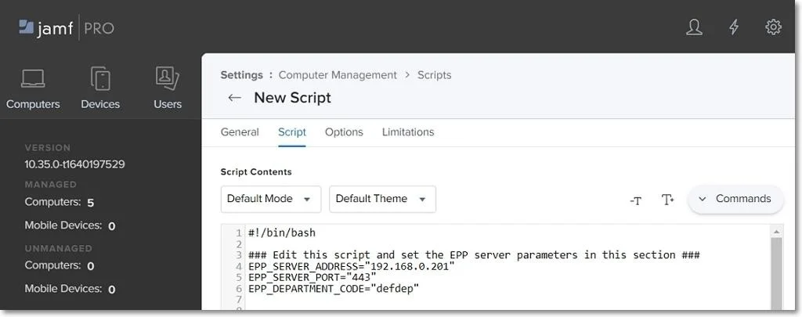
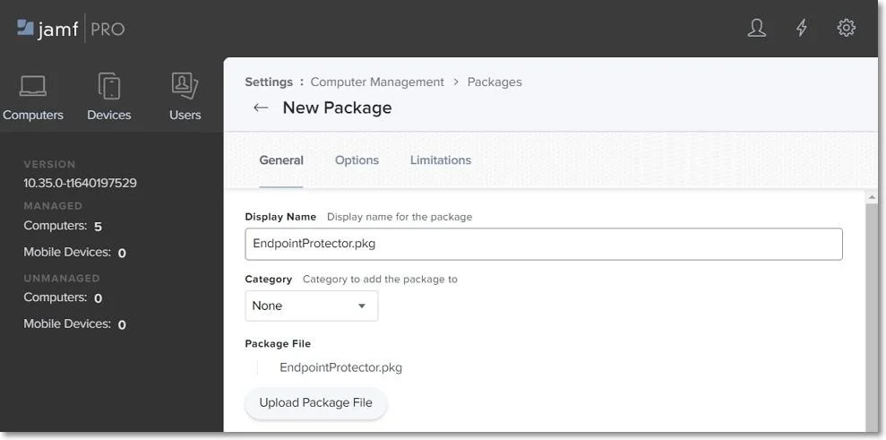

# Uploading the Script and Package

To deploy the Endpoint Protector Client, upload the `EndpointProtector.pkg` package along with the
`epp_change_ip.sh` script.

:::warning
To obtain the `epp_change_ip.sh script`, customers should submit a support ticket
through the [Netwrix Customer Portal](https://www.netwrix.com/sign_in.html?rf=my_products.html).
:::

To upload the script and package, follow these steps:

**Step 1 –** In your Jamf account, from the main navigation bar, click **Computer**, and then from
the left sidebar menu, select **Management Settings**.

**Step 2 –** From the Computer Management section, select **Scripts** and then, in the upper right,
click **+ New**.

**Step 3 –** On the General section, add a name for the profile, and then select the **Script tab**
and add the `epp_change_ip.sh` script.

**Step 4 –** Add your Server IP to the EPP_SERVER_ADDRESS field.

:::note
You can edit the EPP_DEPARTMET CODE and EPP_SERVER_PORT fields to deploy the Endpoint
Protector Client on specific departments or custom ports.
:::

**Step 5 –** From the Computer Management section, select **Package** and then, in the upper right,
click **+ New**.

**Step 6 –** On the General tab, add a name and then upload the package `EndpointProtector.pkg`.

