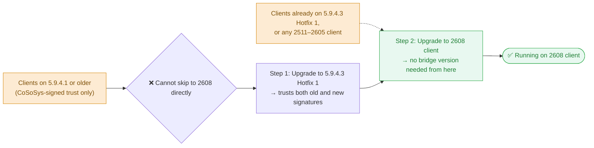
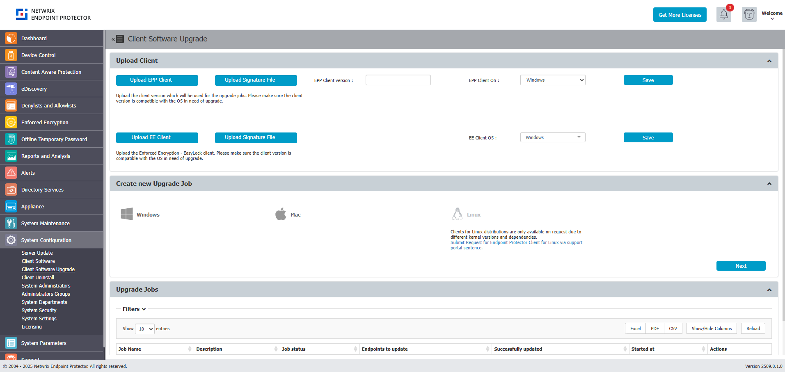

<small><em>Document version: 2.0</em></small>

---

:::note
This article is common to both migration paths — [Migrating from a Legacy 5.x Server to 2608](/docs/endpointprotector/install/migrationprocedure/migration-legacy-5x) and [Migrating from the Current Image Platform to 2608](/docs/endpointprotector/install/migrationprocedure/migration-current-image). Complete your server migration first, then follow this article to bring EPP and Enforced Encryption (EE) clients up to the 2608 release.
:::

## Overview

The 2608 server and its patches don't include client packages by default. You must upload EPP and EE client packages manually.

If you are using an external tool to manage your packages, you can ignore this article unless you are a Netwrix Enforced Encryption (EasyLock) customer — in that case, follow the instructions in this article.

Download the Endpoint Protector Clients from the [My Products portal on netwrix.com](https://customer.netwrix.com/sign_in.html?rf=my_products.html), or request them from your account team.

:::note
The EPP Server Client Upgrade feature doesn't support Linux client upgrades — administrators must upgrade Linux clients manually.
:::

The average update sizes are:

- Endpoint Protector Client for Windows ~ 50 MB
- Endpoint Protector Client for macOS ~ 50 MB
- Endpoint Protector Client for Linux ~ 15 MB (with no dependencies)
- Endpoint Protector Enforced Encryption Client ~ 15 MB
- Endpoint Protector Server ~ 30 MB

For environments where the payload of an update is a concern, you can save bandwidth by using Offline Patches. You can also deploy Endpoint Protector Clients manually, directly on each endpoint.

## Bridge Client Requirement for 2608 {#is-a-bridge-client-required-for-2608}

**No.** Unlike the earlier change of code signing certificates from CoSoSys to Netwrix (explained below), the 2608 client release doesn't introduce a new trust or signature requirement. Any client on **5.9.4.3 Hotfix 1** or on any **2511–2605** client version can upgrade directly to the 2608 client with no intermediate hop.

### Certificate Bridge — Historical Context

Netwrix acquired CoSoSys (the original developer of Endpoint Protector) and transitioned all code signing certificates from **CoSoSys signatures** to **Netwrix signatures**. This transition affects how endpoint clients verify server-pushed updates:

| Client Version | Trusted Signatures | Notes |
|---|---|---|
| 5.9.4.1 and older | CoSoSys only | Can't verify Netwrix-signed packages |
| 5.9.4.3 Hotfix 1 | **Both CoSoSys AND Netwrix** | ✅ The required bridge version |
| 2511 and newer (including 2608) | Netwrix only | The server can't push these to 5.9.4.1 clients directly |

This certificate bridge still applies to any endpoint **still running** an old CoSoSys-signed client (5.9.4.1 or older). If all your endpoints are already on 5.9.4.3 Hotfix 1 or later, you can skip the rest of this section.

Clients on 5.9.4.1 or older **can't** upgrade directly to 2608. They must first upgrade to **5.9.4.3 Hotfix 1** (which trusts both signature types), then proceed directly to 2608:

## Required Packages

The packages you need to upload depend on your current EPP client population and whether you use Enforced Encryption.

| Package | Notes |
|---|---|
| EPP Client 2608 (Windows) | Latest — primary target for all endpoints |
| EPP Client 2608 (macOS) | Latest — primary target for all endpoints |
| EPP Client 5.9.4.3 Hotfix 1 (Windows) | Bridge client — required only for endpoints still below 5.9.4.3 Hotfix 1 |
| EPP Client 5.9.4.3 Hotfix 1 (macOS) | Bridge client — required only for endpoints still below 5.9.4.3 Hotfix 1 |
| Checksum file for each client | Required for integrity verification |
| EE Client 2608 (Windows) | Latest — required if Enforced Encryption is in use |
| EE Client 2608 (macOS) | Latest — required if Enforced Encryption is in use |

## Upload Procedure

The client update mechanism controls how the server distributes and updates EPP clients. For a full description of available settings and options, see [Client Update Mechanism](/docs/endpointprotector/admin/systemconfiguration/systemsettings#client-update-mechanism).

1. Navigate to **System Configuration → Client Software**.
2. Use the upload function to add each client package and its corresponding checksum file.

:::warning
Upload **both** EE clients for Windows and macOS if your organization uses both operating systems. Missing even one platform's EE client can break encryption enforcement on that platform.
:::

### Enforced Encryption Client Requires Immediate Update

Starting with the **2509** release, Enforced Encryption changed its communication logic with the Endpoint Protector Server. Regular EPP clients can remain on an older supported version for a period after a server migration, but **you must update EE clients to the latest version immediately** after the server migration completes.

:::warning
Don't leave EE clients on an older version after migrating the server. Delaying the EE client upgrade can cause EE-protected drives to lose synchronization with the server or fail to communicate correctly.
:::

Upload the latest EE client packages as part of the same upload batch as the EPP client packages (see [Required Packages](#required-packages)), or enable the **Update EasyLock** toggle so EE clients update automatically (see [Automatic Updates (Update EasyLock)](/docs/endpointprotector/admin/ee_module/eemodule#automatic-updates-update-easylock)), or prioritize manually re-deploying them to every endpoint using Enforced Encryption immediately after migration completes — don't treat this as a lower-priority, staged rollout the way you might for regular EPP clients.

For the full reference on Enforced Encryption configuration and modes, see [Enforced Encryption](/docs/endpointprotector/admin/ee_module/eemodule).

## Client TLS Changes in 2608

Starting with the Windows 2608 client, Endpoint Protector uses a custom bundled OpenSSL package instead of Windows' built-in Schannel TLS engine, and both the 2608 Client and Server support Post-Quantum Cryptography (PQC) for Client-to-Server communication. Endpoint Protector negotiates PQC automatically as the highest available option when both sides support it; otherwise, it falls back to the highest TLS version both sides support. See [Endpoint Protector Client TLS](/docs/endpointprotector/requirements/components#endpoint-protector-client-tls) for details.

## Obsolete OS Limitations

As defined in the [Client Supportability Statement](/docs/endpointprotector/supportability/client-supportability.md), the latest EPP Client versions don't support obsolete and discontinued operating systems. If you must continue using the EPP Client on an unsupported operating system, use the last available Client version compatible with that operating system. While such Client versions may retain the ability to communicate with the EPP Server, the standard support agreement no longer covers them. Netwrix provides no warranty, guarantee, or obligation for EPP Client functionality on unsupported operating systems. Netwrix provides support in such cases on a best-effort basis only. For example, the last EPP Client version for obsolete operating systems such as Windows XP, Windows 7, and Windows 8 is 5.9.4.0 release one (6.2.4.2000).

## Deploying Client Upgrades

For a full overview of the Client Software Upgrade feature, including version management and deployment settings, see [Client Software Upgrade](/docs/endpointprotector/admin/systemconfiguration/overview#client-software-upgrade).

:::tip
Use your organization's existing software deployment infrastructure (Microsoft Intune, SCCM, Jamf, or equivalent) for client upgrades rather than relying solely on EPP's built-in upgrade function. Enterprise deployment tools provide better visibility, rollback capability, and bandwidth management.
:::

If using EPP's built-in upgrade:

1. Navigate to **System Configuration → Client Software Upgrade**.
2. Select the target OS and agent version, click **Next**.
3. Select target computers carefully.

:::warning
EPP's built-in upgrade limits the rate to **50 machines per hour**. For large deployments, plan accordingly or use external deployment tools.
:::

:::tip
Always upgrade a small pilot group (10–20 endpoints across diverse hardware/OS configurations) before mass rollout. Validate behavior, policies, and communication for 24–48 hours before proceeding with the full fleet.
:::

## Verifying the Upgrade

After the upgrade completes, check client versions under **Device Control → Computers**. If versions don't advance, see [Endpoints Not Upgrading via EPP Server Client Upgrade tool](/docs/endpointprotector/install/migrationprocedure/troubleshooting#endpoints-not-upgrading-via-epp-server-client-upgrade-tool).
