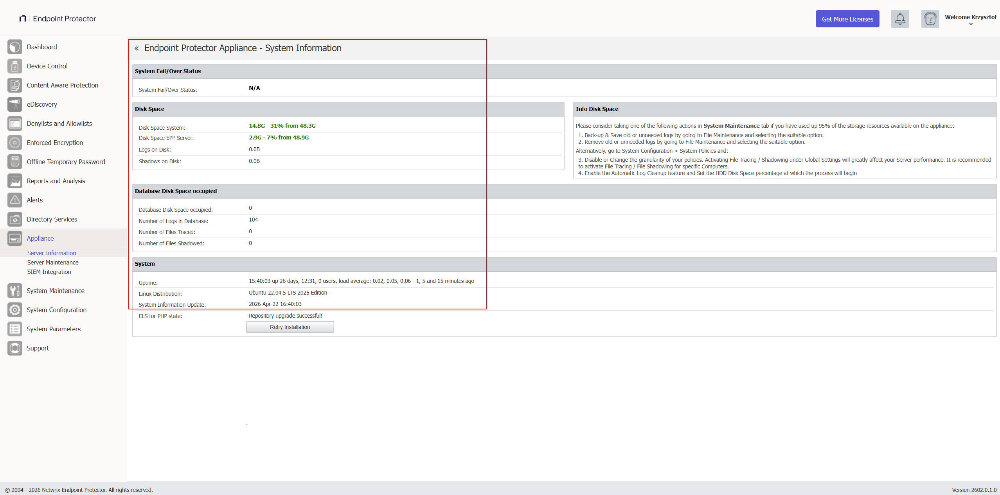
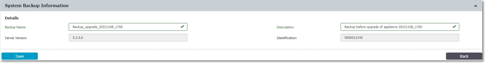
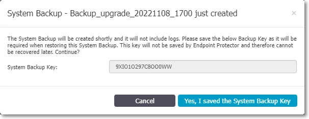
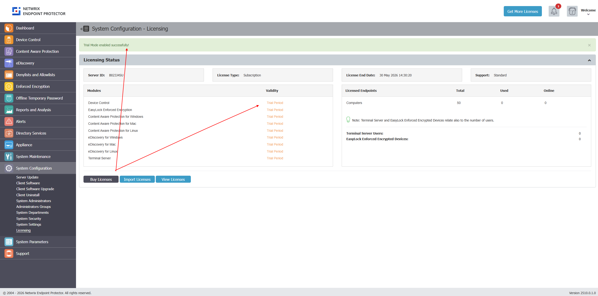
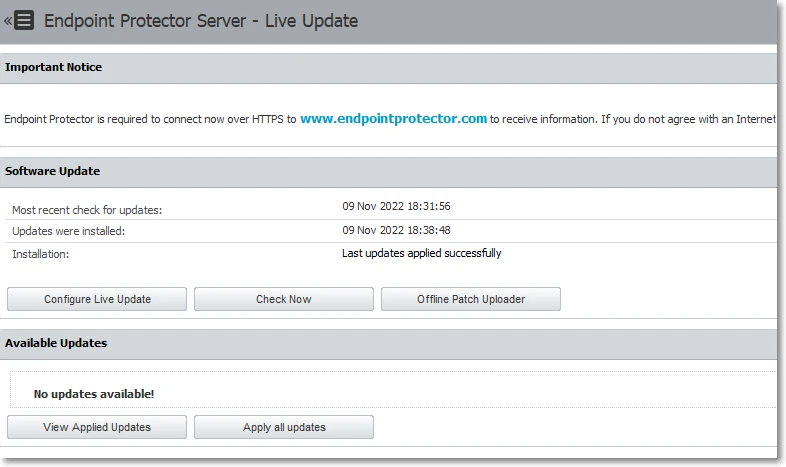
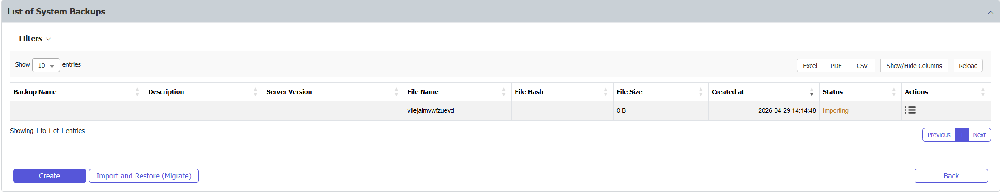
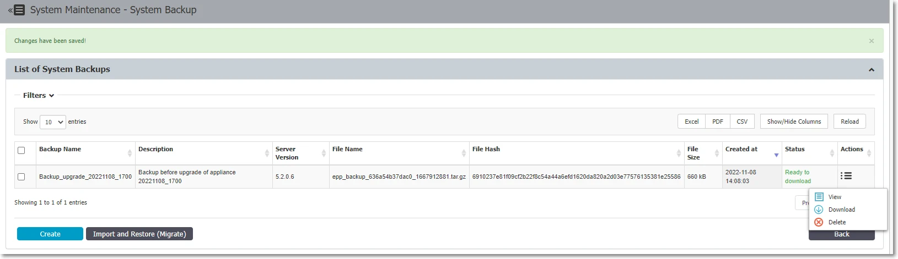
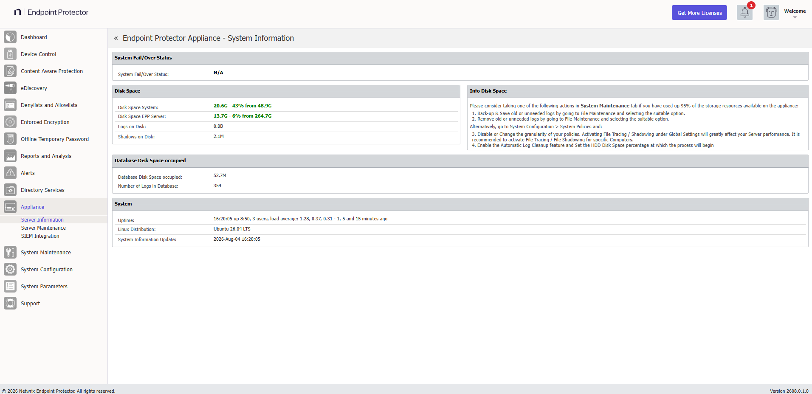
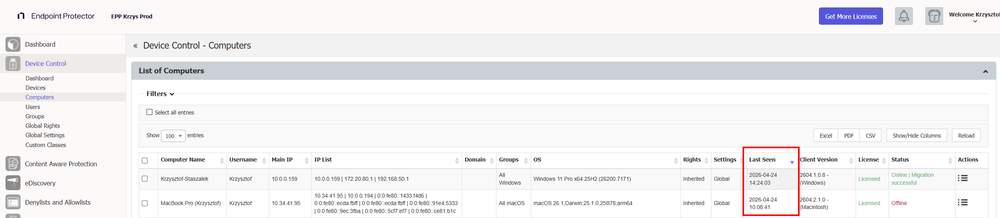

<small><em>Document version: 1.0</em></small>

---

:::note
This article covers on-premises EPP Servers already running the current image-based platform — any version from **2509 through 2604**. If your server is still on a legacy 5.x release (5.7.0.0–5.9.4.2), see [Migrating from a Legacy 5.x Server to 2608](/docs/endpointprotector/install/migrationprocedure/migration-legacy-5x) instead. For the full picture and how this fits together, start at the [EPP Server Migration & Upgrade Guide](/docs/endpointprotector/install/migrationprocedure/migrationguide).
:::

## Overview

Since you're already on the image-based platform, migrating to 2608 doesn't require the intermediate version step that legacy 5.x servers need. The procedure has the same three parts as your last image migration: back up your configuration, deploy the new 2608 image, and restore the backup onto it.

### Backup Compatibility

| Your Current Version | Recommendation |
|---|---|
| 2509, 2510, 2601, 2602, or 2604 | Migrate directly to 2608 — no intermediate version is required |

:::tip
2608 accepts a direct backup restore from any of 2509, 2510, 2601, 2602, or 2604. It's still good practice to upgrade to 2604 before migrating, since the 2604 → 2608 path is the most thoroughly validated in Netwrix labs.
:::

---

## Pre-Migration Prerequisites and Checklist

Complete **all** items in this checklist before beginning any migration activity. This list is shorter than the legacy 5.x path — items specific to upgrading from an old 5.x release (cumulative patch planning, first-time license verification, etc.) don't apply, since your server already has a valid license and is already on the current platform.

:::note
If your current license includes the `php_els` field (used on the 2509–2604 image line to unlock OS patch updates), 2608 no longer requires it and ignores it. You don't need to do anything about `php_els`.
:::

### Hypervisor Compatibility Check

**Verified compatible hypervisors:**
- VMware vSphere
- VMware ESXi
- Microsoft Hyper-V
- AWS, Azure, GCP (cloud deployments — snapshot behavior differs per provider)
- Proxmox VE — not officially supported; see the following note

:::note
**Proxmox VE** isn't an officially supported hypervisor for Endpoint Protector. Based on customer feedback, Proxmox VE can host the EPP Server image after manually adjusting networking and IP configuration post-deployment. Converting the provided OVF image for use on Proxmox, along with any such adjustments, is entirely the customer's responsibility and falls outside Netwrix support.
:::

:::warning
The 2608 image runs Ubuntu 26.04 LTS, a newer guest OS than the Ubuntu 22.04 LTS used by 2509/2510/2604. Verify Ubuntu 26.04 LTS guest support with your hypervisor vendor before scheduling a migration maintenance window.
:::

:::tip
Confirm hypervisor version compatibility **before** scheduling a migration maintenance window.
:::

### System Resource Assessment

Before migrating, assess the health of the current appliance.

**In the EPP Console:**

1. Go to **Appliance → Server Information**.
2. Note and screenshot the following values:
   - Current server version
   - Disk Space EPP Server (database partition utilization)
   - Database Disk Space occupied (current DB size)
   - RAM and CPU allocation

You can verify disk space and current server versions in Appliance → Server Information.

**Minimum resource requirements before proceeding:**

For authoritative CPU, RAM, and disk minimum recommendations, refer to the official User Manual: [Netwrix Endpoint Protector — Server Requirements](/docs/endpointprotector/requirements/server)

:::warning
The 2608 image adds CrateDB, which may raise the minimum disk, RAM, and CPU baseline above the values listed here, even though migration doesn't move historical data into CrateDB at deployment time. Check the linked Server Requirements documentation for current minimums before starting migration.
:::

:::tip
If disk space is below 30%, perform database shrinking via **System Maintenance → Audit Log Backups** before proceeding. Exporting old logs to an external SIEM or repository reduces DB size significantly. If not possible, consider expanding the associated disk space. To export logs, see [Audit Log Backup](/docs/endpointprotector/admin/systemmaintenance/overview#audit-log-backup).
:::

### Maintenance Window Planning

Plan a maintenance window that accounts for the following:

- Backup creation time: varies by configuration size
- New VM deployment: **30–60 minutes**
- Backup restoration: **15–45 minutes**
- Post-migration verification: **30–60 minutes**
- Client package uploads: **10–20 minutes**

These times reflect laboratory test results and may vary in your environment depending on several factors, including hardware assigned to the appliance.

**During the upgrade window, the following will be unavailable:**
- EPP/EE client communication with the server
- Email alerts and SIEM integrations
- File Shadow and log generation

:::tip
EPP clients continue logging events locally during server downtime. The server receives all queued events once communication resumes. You don't lose any endpoint data.
:::

:::tip
In large enterprise environments with a high number of active EPP clients, Netwrix recommends **temporarily disabling client communications** before starting the upgrade. This prevents clients from sending EPP logs to the server during the process, allowing the server to focus on the upgrade and ensuring no logs remain unprocessed in the queue. You can disable client communications in several ways:
- Blocking the EPP communication port on the perimeter or host-based firewall
- Blocking the port at the virtual machine network stack level (vSwitch port group policy, NSX rule, or equivalent)

Re-enable communications after you verify the upgraded server and it's ready to accept traffic.
:::

### VM Snapshot and Backup

**This step is non-negotiable. Don't proceed without completing both.**

:::note
VM backup and snapshot management is the full responsibility of the customer's administrators. Netwrix doesn't manage, verify, or maintain hypervisor-level snapshots. However, Netwrix considers a valid VM snapshot an **obligatory prerequisite** before starting any upgrade or migration activity. Proceeding without a snapshot leaves you with no rollback path — if a failure occurs, recovery may be impossible, and Netwrix Support can't help restore the environment.
:::

**Step 1 — Create a VM snapshot** on your hypervisor (VMware, Hyper-V, ESXi, AWS, Azure, etc.).

:::warning
In AWS, the system queues snapshots and doesn't take them instantly. Verify the snapshot is in **"completed"** status before proceeding.
:::

:::tip
Keep the VM snapshot active until you have fully validated the new 2608 environment and are ready to decommission the old server. This is your rollback path.
:::

**Step 2 — Create a System Configuration Backup (in the EPP Console):**

1. Log in to Endpoint Protector Console.
2. Navigate to **System Maintenance → System Backup v2**.
3. Click **Create**, enter a name and description (include the date and version, e.g., `pre-upgrade-2604-2026-04-20`), click **Save**.
4. **Save the System Backup Key** that appears in the prompt — you need this key for restoration and can't recover it if you lose it.
5. Wait for the status to show **"Ready to download"**, then download the backup file.

:::danger
Store backup files in a secure repository with limited access. The backup contains full server configuration including policies, users, groups, and device rules.
:::

**Step 3 — Export logs and file shadows separately (optional but recommended):**

The System Configuration Backup doesn't include logs and file shadows — and CrateDB on the new 2608 server starts empty, so no path carries historical log data forward. If you need historical logs for compliance or forensics:

- Use **System Maintenance → Audit Log Backups** to export logs to an external location. See [Audit Log Backup](/docs/endpointprotector/admin/systemmaintenance/overview#audit-log-backup) for export steps.
- Retain the old server VM after migration for log access.

:::tip
If your organization has compliance requirements for data retention (e.g., GDPR, HIPAA, SOX), never decommission the old server until you have confirmed that an alternative solution (SIEM, external export) meets log retention requirements.
:::

### Pre-Migration Checklist Summary

| # | Task | Status |
|---|---|---|
| 1 | Current server version confirmed as 2509, 2510, 2601, 2602, or 2604 | ☐ |
| 2 | VM snapshot created and confirmed | ☐ |
| 3 | System backup created and key saved | ☐ |
| 4 | Backup file downloaded to secure location | ☐ |
| 5 | Disk space ≥ 30% free on current server | ☐ |
| 6 | Server resource counters noted (baseline) | ☐ |
| 7 | Maintenance window communicated | ☐ |
| 8 | Appliance → Server Information screenshot taken | ☐ |
| 9 | EPP Client 2608 packages downloaded | ☐ |
| 10 | Enforced Encryption (EE) Client 2608 packages downloaded (if applicable) | ☐ |

---

## Migration Procedure

### Choosing Your IP/FQDN Strategy

Before deploying the new VM, decide whether the new 2608 server will use the **same or a different IP address/FQDN** as the current server. This decision has significant security and operational implications.

#### Option A — Same IP/FQDN (Recommended)

| Aspect | Detail |
|---|---|
| Certificate trust | Preserved — no changes required on endpoints |
| Enforced Encryption (EE) | No user action required — drives remain encrypted |
| Deep Packet Inspection (DPI) / Content Aware Protection (CAP) functionality | Works immediately after migration |
| Client reconnection | Automatic — endpoints find server at same address |
| Recommended for | All environments, especially EE deployments |

**Procedure:**
- Shut down or isolate the old server before starting the new one.
- Assign the old IP address to the new 2608 VM.
- DNS records remain unchanged.

:::tip
Always use the **same IP/FQDN** option. The operational complexity and user impact of changing the IP/FQDN — especially in environments using Enforced Encryption — is very high. Consider a different IP/FQDN only when technically unavoidable.
:::

#### Option B — Different IP/FQDN (Not Recommended Except for Device Control-Only Environments)

| Risk | Impact |
|---|---|
| DPI certificate trust broken | Content Aware Protection and DPI will fail until you regenerate the certificates |
| CAP policy disruption | All Content Aware Protection rules break |
| EE drives locked | Users must manually decrypt and re-encrypt every protected drive |
| Root CA redistribution | You must push the new root CA to all endpoints via GPO/MDM |
| High server load | Certificate regeneration for all endpoints creates a burst load spike |

:::warning
If using Enforced Encryption and you change the IP/FQDN, every user with an EE-protected drive must decrypt their drive and re-encrypt it after reconnecting to the new server. This can be a major operational disruption in large organizations. Netwrix strongly discourages this.
:::

:::warning
If you use SSO (Single Sign-On) and choose a different IP address instead of an FQDN for the new server, reviewing your SSO configuration after the backup is restored is mandatory. SSO response/callback URLs are tied to the server address used at configuration time — changing the IP breaks them. After migration, either manually recreate the SSO configuration with the updated response URL, or open a Netwrix Support case to have it updated on the backend. See [Third-Party Integration Reconfiguration](#third-party-integration-reconfiguration) in Post-Migration Verification.
:::

### Deploying the 2608 Base Image

1. Download the Endpoint Protector **2608** VM image from the [My Products portal on netwrix.com](https://customer.netwrix.com/sign_in.html?rf=my_products.html), or request it from your account team.
2. Deploy the VM in your hypervisor environment.
   - For full CPU, RAM, and storage recommendations see: [Netwrix Endpoint Protector — Server Requirements](/docs/endpointprotector/requirements/server)
3. Configure the VM network settings:
   - Assign IP address (same as old server if using Option A)
   - Configure DNS

4. Power on the new VM and access the console at `https://<new-ip-or-fqdn>:443`.

### Temporarily Disabling Client Communications

Immediately after you provision the new VM and it's reachable, disable client communications before performing any further configuration. This prevents endpoints from discovering and connecting to the new server while you're still preparing it.

1. Log in to the new server console.
2. Navigate to **System Configuration → System Settings**.
3. Disable client communication.

:::tip
Disabling client communications prevents endpoints from registering with an incomplete server configuration. Re-enable only after the full restoration and verification is complete.
:::

### Activate Trial License on a Newly Deployed Image

To upgrade a clean appliance, activate at least a Trial license. Go to **System Configuration** → **Licensing** and choose **Free Trial**. You'll import your existing license in a later step, after the backup restore process.
After successful activation, you should see a green banner at the top.

### Restoring Your Backup onto 2608

1. Log in to the **2608 server console**.
2. Navigate to **System Maintenance → System Backup v2**.
3. Click **Import and Restore (Migrate)**.

4. In the wizard, select the backup file you created from your current server (2509, 2510, 2601, 2602, or 2604).
5. Enter the **System Backup Key** you saved during backup creation.
6. Click **Import**.

7. Monitor the restore progress: the status will show **"Generating"** while restoring.
8. When the restore completes, the status changes to **"Your back import file has been queued"**.

9. After a few minutes, click **Reload** above the status column to refresh progress. If the console becomes unresponsive, refresh the browser — this is normal during application restart.

:::tip
Restoration can take several minutes depending on backup size. Don't interrupt the process or close the browser. If the console appears frozen, wait at least 5 minutes before refreshing.
:::

:::warning
Large backups on under-resourced VMs can cause **server unresponsiveness or a 500 error** during import. If you receive a 500 error:

1. Don't retry immediately — check server logs via SSH first.
2. Verify sufficient free disk space on the VM.
3. Verify the backup file isn't corrupted (re-download from the source server if needed).
4. Contact Netwrix Support if the error persists.
:::

### Import License on the New 2608 Server

1. Navigate to **System Configuration → System Licensing → Import License**.
2. Upload your existing license file.
3. After import, go to **Appliance → Server Information**.
4. Confirm the license shows as active and reflects your expected entitlements.

If the license doesn't show as active, or entitlements look incorrect, contact Netwrix Support or your account team before continuing.

---

## Post-Migration Verification

Complete all items in this checklist after you finish the migration.

### Server Health Check

| Check | How to Verify |
|---|---|
| Server version shows the latest 2608.x.x.x version | Appliance → Server Information |
| Server responds to browser access | `https://<server>:443` loads normally |
| License imported successfully and active | System Configuration → System Licensing |

### Re-Enabling Client Communications

After you verify the restore and upload the client packages (see [Client Upgrade Management](/docs/endpointprotector/install/migrationprocedure/clientupgrade)):

1. Navigate to **System Configuration → System Settings**.
2. Re-enable client communications.
3. Monitor **Device Control → Computers** — endpoints should begin checking in within their configured communication interval.

### Endpoint Communication Check

1. Navigate to **Device Control → Computers**.
2. Sort by **Last Seen** column.
3. Verify that endpoints are checking in with recent timestamps (within expected communication interval).
4. Check for any endpoints stuck on old client versions.

### Policy and Functionality Check

Verify each active module:

| Module | Where to Check |
|---|---|
| Device Control | Device Control → Dashboard |
| Content Aware Protection | Content Aware Protection → Dashboard |
| eDiscovery | eDiscovery → Dashboard |
| Enforced Encryption | Check that EE-protected drives are accessible |
| Reports & Analytics | Reports and Analytics → relevant sub-service |
| Alerts | Check that configured alerts are firing |

:::tip
Generate deliberate test events on a known test machine for each active module. For example: plug in a USB drive (Device Control), transfer a file with sensitive content (CAP), run an eDiscovery scan. Confirm the events appear in the console before declaring the migration complete.
:::

### eDiscovery Scan Locations Verification

:::warning
If an eDiscovery policy with configured **Scan Locations** is restored from a System Configuration Backup, EPP ignores the Scan Locations and runs a full disk scan instead — with no error reported anywhere. This is a known post-migration issue for any environment using the eDiscovery module.
:::

If you use eDiscovery with Scan Locations configured on any policy, this check is mandatory after restore:

1. Navigate to **eDiscovery** and open each policy that defines Scan Locations.
2. Edit and save the policy — even without changing anything — to re-apply the Scan Locations.
3. Run a scan and confirm it targets only the configured Scan Locations, not the full disk.

### DPI / CAP Functionality Verification

If using Deep Packet Inspection or Content Aware Protection:

1. Verify endpoints trust the root CA certificate.
2. Test a known-blocked transfer to confirm CAP policy is active.
3. If endpoints don't trust the certificates, and you used a **different IP/FQDN**, you may need to push the new root CA via GPO or MDM.

### Backup Creation Verification

1. Navigate to **System Maintenance → System Backup**.
2. Verify that backups are configured and active.
3. Run a test backup and confirm **"Ready to download"** status.

### Third-Party Integration Reconfiguration

After migration, manually re-import and reconfigure all 3rd-party integrations. While the backup includes configuration data, it doesn't always fully restore credentials and connection secrets, and integration endpoints may require re-registration against the new server.

Re-import and reconfigure each active integration before proceeding to verification:

| Integration | Where to Reconfigure |
|---|---|
| SMTP / Email alerts | System Configuration → System Settings → Email Configuration |
| AD / LDAP | Directory Services → Microsoft Active Directory |
| Entra ID | Directory Services → Azure Active Directory |
| SCIM | Directory Services → SCIM API Configuration |
| SSO | System Configuration → SSO / Single Sign-On |
| SIEM / Syslog | System Configuration → SIEM Settings |
| AWS / S3 / File Shadows | System Configuration → File Shadow Repository |

#### Post-Migration Integration Verification

After reconfiguration, verify each integration is functioning:

| Integration | How to Verify |
|---|---|
| SMTP / Email alerts | Use the built-in test email function; confirm delivery |
| AD / LDAP | Click **Test Connection**; trigger a manual sync; check object counts |
| Entra ID / SSO | Perform a test SSO login in an incognito browser window |
| SIEM / Syslog | Generate a test event; confirm it appears in the SIEM receiver |
| AWS / S3 / File Shadows | Generate a file shadow; confirm it reaches the S3 bucket |

:::warning
**Mandatory if you used an IP address instead of an FQDN for the new server:** Review your SSO configuration after the backup is restored. The SSO response/callback URL registered against the old server address no longer matches, and SSO logins fail until this is corrected. You have two options:
1. Manually recreate the SSO configuration in **System Configuration → SSO / Single Sign-On** with the updated response/callback URL, and update the corresponding redirect URI in your identity provider.
2. Raise a Netwrix Support case to have the SSO configuration updated on the backend.
:::

:::warning
AD Sync may appear to complete successfully but only import a partial set of users or groups. Always cross-check the imported object count against your directory — don't rely solely on the "success" status message.
:::

If an integration fails verification, see [Troubleshooting Failed Integrations](/docs/endpointprotector/install/migrationprocedure/migration-legacy-5x#troubleshooting-failed-integrations).

### Audit Log Backup Verification

:::warning
After migration, the **Audit Log Backup job can enter a state where it runs continuously and never completes**. Always verify that jobs finish within a reasonable timeframe.
:::

After migration, verify:
1. Navigate to **System Maintenance → Audit Log Backups**.
2. Check that any running audit backup jobs have a defined end time and aren't stuck in an active state.
3. If a job has been running for more than 4 hours with no progress, stop it and contact Netwrix Support.

:::tip
Don't start Audit Log Backup jobs immediately after migration. Allow the server to stabilize for 24 hours, then start a test backup and monitor its completion before scheduling recurring jobs.
:::

### Performance Baseline Comparison

Compare current resource utilization with the baseline captured in the prerequisites:

- CPU and RAM usage should be similar or lower than before migration.
- After initial policy recalibration (which may cause a brief CPU spike), utilization should normalize.
- Monitor for 48 hours post-migration before drawing conclusions.

---

## Next Step

Continue to [Client Upgrade Management](/docs/endpointprotector/install/migrationprocedure/clientupgrade) to bring EPP and Enforced Encryption clients up to the 2608 release.
