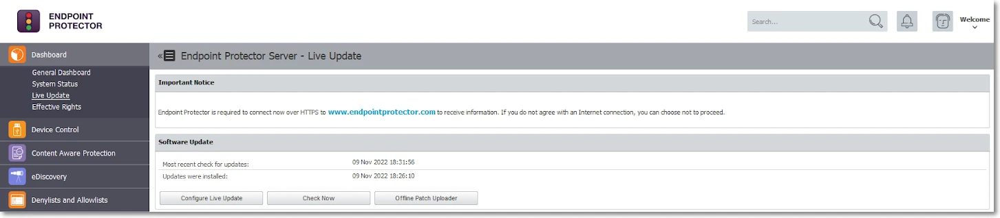
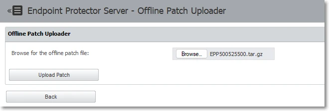
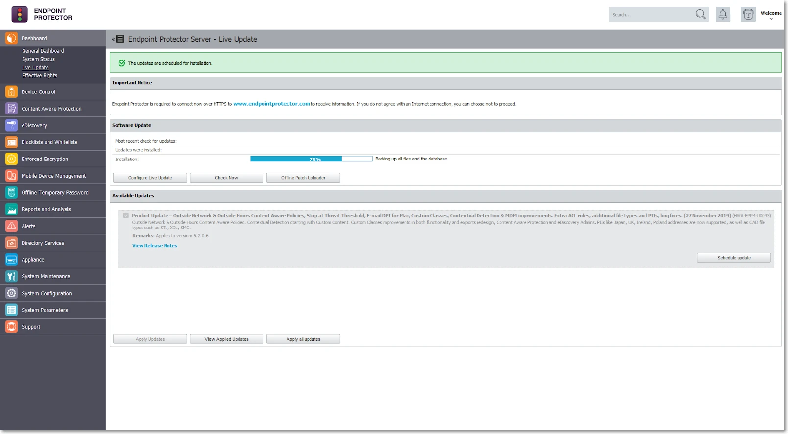

<small><em>Document version: 1.0</em></small>

---

:::note
This article covers on-premises EPP Servers running any version from **5.7.0.0 through 5.9.4.2** (5700, 5710, 5800, 5810, 5820, 5900, 5910, 5920, 5930, 5940, 5941, 5942). If your server is already on the current image-based platform (2509–2604), see [Migrating from the Current Image Platform to 2608](/docs/endpointprotector/install/migrationprocedure/migration-current-image) instead. For the full picture and how this fits together, start at the [EPP Server Migration & Upgrade Guide](/docs/endpointprotector/install/migrationprocedure/migrationguide).
:::

## Overview

Migrating a legacy 5.x server to 2608 is a two-step process:

1. **Reach exactly 5.9.4.2** — if you're on any earlier 5.x version, apply the cumulative patch first.
2. **Deploy the 2608 image and restore your backup** — after you're on 5.9.4.2, deploy the 2608 base image directly and restore your 5.9.4.2 backup onto it. There's no need to route through the older 2510/2604 platform.

---

## Pre-Migration Prerequisites and Checklist

:::warning
Support for 5.9.4.2 and all older versions ended **14 February 2026**. If you are reading this guide on a 5.x server, your environment is running without security coverage. Schedule your migration maintenance window as soon as possible.
:::

Complete **all** items in this checklist before beginning any upgrade or migration activity.

### License Verification

Confirm your Endpoint Protector license is valid and current before migrating.

:::note
Licenses for the 2509–2604 image line included a `php_els` field that unlocked OS patch updates on that platform. **2608 no longer requires this field.** If your existing license still contains it, 2608 ignores it — you don't need to do anything about `php_els`.
:::

**How to verify your license:**

1. Open your current EPP Server console.
2. Navigate to **System Configuration → System Licensing**.
3. Confirm the license shows as active and reflects your current entitlements (modules, endpoint count, expiration).

If you're unsure whether your license is current, contact Netwrix Support or your account team before proceeding.

### Hypervisor Compatibility Check

**Verified compatible hypervisors:**
- VMware vSphere
- VMware ESXi
- Microsoft Hyper-V
- AWS, Azure, GCP (cloud deployments — snapshot behavior differs per provider)
- Proxmox VE — not officially supported; see the following note

:::note
**Proxmox VE** isn't an officially supported hypervisor for Endpoint Protector. Based on customer feedback, Proxmox VE can host the EPP Server image after manually adjusting networking and IP configuration post-deployment. Converting the provided OVF image for use on Proxmox, along with any such adjustments, is entirely the customer's responsibility and falls outside Netwrix support.
:::

:::warning
The 2608 image runs Ubuntu 26.04 LTS, a newer guest OS than the Ubuntu 22.04 LTS used by 2510/2604. Verify Ubuntu 26.04 LTS guest support with your hypervisor vendor before scheduling a migration maintenance window.
:::

:::tip
Confirm hypervisor version compatibility **before** scheduling a migration maintenance window.
:::

:::note
These hypervisor recommendations reflect the best available guidance based on the EPP image format and known compatibility. However, hypervisor provisioning, configuration, and ongoing maintenance fall outside the scope of Netwrix support. Netwrix can't assist with hypervisor-side issues — customers are responsible for their own virtualisation infrastructure.
:::

### System Resource Assessment

Before any upgrade, assess the health of the current appliance.
- For upgrades from 5.7.0.0 to 5.9.2.x, verify that disk space and database (DB) allocation are sufficient.
- For migration from 5.9.4.2, the migration transfers configuration only — EPP log data doesn't migrate.

**In the EPP Console:**

1. Go to **Appliance → Server Information**.
2. Note and screenshot the following values:
   - Current server version
   - Disk Space EPP Server (database partition utilization)
   - Database Disk Space occupied (current DB size)
   - RAM and CPU allocation

You can verify disk space and current server versions in Appliance → Server Information.

**Minimum resource requirements before proceeding:**

For authoritative CPU, RAM, and disk minimum recommendations, refer to the official User Manual: [Netwrix Endpoint Protector — Server Requirements](/docs/endpointprotector/requirements/server)

:::warning
The 2608 image adds CrateDB, which may raise the minimum disk, RAM, and CPU baseline above the values listed here, even though migration doesn't move historical data into CrateDB at deployment time. Check the linked Server Requirements documentation for current minimums before starting migration.
:::

:::tip
If disk space is below 30%, perform database shrinking via **System Maintenance → Audit Log Backups** before proceeding. Exporting old logs to an external SIEM or repository reduces DB size significantly. If not possible, consider expanding the associated disk space. To export logs, see [Audit Log Backup](/docs/endpointprotector/admin/systemmaintenance/overview#audit-log-backup).
:::

### Maintenance Window Planning

Plan a maintenance window that accounts for the following:

- Patch upload and installation time: **15–60 minutes** for the 5.9.4.2 cumulative patch
- Backup creation time: varies by configuration size
- New VM deployment: **30–60 minutes**
- Backup restoration: **15–45 minutes**
- Post-migration verification: **30–60 minutes**
- Client package uploads: **10–20 minutes**

These times reflect laboratory test results and may vary in your environment depending on several factors, including hardware assigned to the appliance.

**During the upgrade window, the following will be unavailable:**
- EPP/EE client communication with the server
- Email alerts and SIEM integrations
- File Shadow and log generation

:::tip
EPP clients continue logging events locally during server downtime. The server receives all queued events once communication resumes. You don't lose any endpoint data.
:::

:::tip
In large enterprise environments with a high number of active EPP clients, Netwrix recommends **temporarily disabling client communications** before starting the upgrade. This prevents clients from sending EPP logs to the server during the process, allowing the server to focus on the upgrade and ensuring no logs remain unprocessed in the queue. You can disable client communications in several ways:
- Blocking the EPP communication port on the perimeter or host-based firewall
- Blocking the port at the virtual machine network stack level (vSwitch port group policy, NSX rule, or equivalent)

Re-enable communications after you verify the upgraded server and it's ready to accept traffic.
:::

### VM Snapshot and Backup

**This step is non-negotiable. Don't proceed without completing both.**

:::note
VM backup and snapshot management is the full responsibility of the customer's administrators. Netwrix doesn't manage, verify, or maintain hypervisor-level snapshots. However, Netwrix considers a valid VM snapshot an **obligatory prerequisite** before starting any upgrade or migration activity. Proceeding without a snapshot leaves you with no rollback path — if a failure occurs, recovery may be impossible, and Netwrix Support can't help restore the environment.
:::

**Step 1 — Create a VM snapshot** on your hypervisor (VMware, Hyper-V, ESXi, AWS, Azure, etc.).

:::warning
In AWS, the system queues snapshots and doesn't take them instantly. Verify the snapshot is in **"completed"** status before proceeding.
:::

:::tip
Keep the VM snapshot active until you have fully validated the new 2608 environment and are ready to decommission the old server. This is your rollback path.
:::

**Step 2 — Create a System Configuration Backup (in the EPP Console):**

1. Log in to Endpoint Protector Console.
2. Navigate to **System Maintenance → System Backup**.
3. Click **Create**, enter a name and description (include the date and version, e.g., `pre-upgrade-5942-2026-04-20`), click **Save**.
4. **Save the System Backup Key** that appears in the prompt — you need this key for restoration and can't recover it if you lose it.
5. Wait for the status to show **"Ready to download"**, then download the backup file.

:::danger
Store backup files in a secure repository with limited access. The backup contains full server configuration including policies, users, groups, and device rules.
:::

**Step 3 — Export logs and file shadows separately (optional but recommended):**

The System Configuration Backup doesn't include logs and file shadows. If you need historical logs for compliance or forensics:

- Use **System Maintenance → Audit Log Backups** to export logs to an external location. See [Audit Log Backup](/docs/endpointprotector/admin/systemmaintenance/overview#audit-log-backup) for export steps.
- Retain the old server VM after migration for log access.

:::tip
If your organization has compliance requirements for data retention (e.g., GDPR, HIPAA, SOX), never decommission the old server until you have confirmed that an alternative solution (SIEM, external export) meets log retention requirements.
:::

### Pre-Migration Checklist Summary

| # | Task | Status |
|---|---|---|
| 1 | Valid, current license confirmed | ☐ |
| 2 | VM snapshot created and confirmed | ☐ |
| 3 | System backup created and key saved | ☐ |
| 4 | Backup file downloaded to secure location | ☐ |
| 5 | Disk space ≥ 30% free on current server | ☐ |
| 6 | Server resource counters noted (baseline) | ☐ |
| 7 | Maintenance window communicated | ☐ |
| 8 | Appliance → Server Information screenshot taken | ☐ |
| 9 | EPP Client 5.9.4.3 Hotfix 1 downloaded (only if any endpoints are still on 5.9.4.1 or older), plus the latest 2608 client packages | ☐ |
| 10 | Enforced Encryption (EE) Client 2608 packages downloaded (if applicable) | ☐ |

---

## Phase 1 — Upgrade to 5.9.4.2 via Cumulative Patch

This phase applies to environments running **any version from 5.7.0.0 through 5.9.4.1** (5.7.0.0, 5.7.1.0, 5.8.0.0, 5.8.1.0, 5.8.2.0, 5.9.0.0, 5.9.1.0, 5.9.2.0, 5.9.3.0, 5.9.4.0, 5.9.4.1). The cumulative patch upgrades your server directly to 5.9.4.2 in a single operation, incorporating all fixes and features introduced across every intermediate version. If you're already on 5.9.4.2, skip to [Phase 2](#phase-2--deploy-the-2608-base-image-and-restore-your-backup).

### Downloading the Cumulative Patch

The 5.9.4.2 cumulative patch is available from the Netwrix Community portal. Contact your Netwrix account team or Customer Support to obtain the patch file if you don't have direct access.

:::tip
📹 **Community Portal:** A video walkthrough of the cumulative patch process is available at the Netwrix Community: [5.9.4.2 Cumulative Upgrade Patch for Endpoint Protector Server 5.7.0.0–5.9.4.1](https://community.netwrix.com/t/5-9-4-2-cumulative-upgrade-patch-for-endpoint-protector-server-5-7-0-0-5-9-4-1/9321)
:::

The patch includes:
- All updates, fixes, and features from 5.7.0.0 through 5.9.4.2
- Latest Enforced Encryption Client
- A separate offline client patch is also available (Windows and macOS direct installers provided)

### Applying the Offline Cumulative Patch

1. Download the patch file to the machine you will use to access the EPP console.
2. Log in to the **Endpoint Protector Server Console**.
3. Navigate to **Dashboard → Live Update**.
4. Click **Offline Patch Uploader**.

5. In the wizard, select the downloaded patch file and click **Upload Patch**.

6. After you upload the file, click **Back** when prompted.
7. The progress notification will appear in the Software Update section.

### Monitoring Patch Progress

The patch installation typically takes **15–60 minutes** depending on server performance. You can monitor progress by staying on the **Dashboard → Live Update** page and watching the status bar.

### Post-Patch Verification

After the installation completes:

1. The console will display **"Last updates applied successfully"** status.
2. Refresh your browser and log back in.
3. Navigate to **Appliance → Server Information** and confirm the version shows **5.9.4.2**.
4. Verify the update history: **Dashboard → Live Update → View all applied updates**.

After the patch applies successfully, **don't perform any further upgrades or major configuration changes for at least 24 hours**. Although the UI confirms the patch as complete, critical background processes continue running after the visible upgrade finishes. These include:

- **Database schema migration** — aligns internal table structures and indexes to the new version format
- **Log reindexing** — rebuilds search indexes across stored audit and event logs
- **Service reconfiguration** — updates internal service dependencies, daemon configurations, and file path mappings introduced by the patch
- **Nightly cron maintenance** — runs at 9:00 PM and performs integrity checks, cache rebuilds, and housekeeping tasks that finalize the upgrade state

These tasks run silently in the background and don't produce visible progress in the console. Performing another upgrade, restoring a backup, or making significant configuration changes before these processes complete can impact stability or, in edge cases, corrupt the database and leave the server in an inconsistent state.

### Create Final Backup at 5.9.4.2

After confirming the upgrade to 5.9.4.2 is stable (wait for the 24-hour background task window), create a **new System Configuration Backup** specifically for use in the 2608 migration:

1. Navigate to **System Maintenance → System Backup**.
2. Click **Create** and name it clearly: `migration-to-2608-YYYY-MM-DD`.
3. Save the backup key securely.
4. Download the backup file once status shows **"Ready to download"**.
5. Check the size of the backup. If it's larger than 200 MB, refer to [Backups Larger Than 200 MB](#backups-larger-than-200-mb).

:::tip
This backup at 5.9.4.2 is the **only** backup that will work directly on the 2608 platform. Label it clearly and store it separately from previous backups to avoid any confusion during the restoration step.
:::

:::note
The Backup feature backs up all configuration details, excluding log evidence and File Shadows.
:::

Use [Audit Log Backup](/docs/endpointprotector/admin/systemmaintenance/overview.md#audit-log-backup) to back up logs and/or File Shadows (optional). The migration process doesn't transfer logs or file shadow backups to the new environment. See the notes in this section for an overview of how to preserve logs and/or File Shadows in an offline state before starting the upgrade process.

### Backups Larger Than 200 MB

If your 5.9.4.2 backup export is larger than 200 MB, follow these steps:
1. Consider cleaning up the database using the Audit Log Backup feature if possible (refer to the [Audit Log Backup](/docs/endpointprotector/admin/systemmaintenance/overview.md#audit-log-backup) chapter). This removes obsolete data and can decrease the backup file size.
2. Contact EPP Support and report that your "5.9.4.2 backup is bigger than 200 MB." Request an individual offline patch file to fix the backup export size. You can also request assistance with the manual procedure.
3. Apply the patch, which adds several backup export improvements on top of the 5.9.4.2 backup functionality.

:::note
This doesn't change the EPP Server version — it remains 5.9.4.2.
:::

4. If the new export attempt still returns more than 200 MB after successfully importing the offline patch, contact Netwrix Support for assistance with the manual procedure.

---

## Phase 2 — Deploy the 2608 Base Image and Restore Your Backup

### Choosing Your IP/FQDN Strategy

Before deploying the new VM, decide whether the new 2608 server will use the **same or a different IP address/FQDN** as the current server. This decision has significant security and operational implications.

#### Option A — Same IP/FQDN (Recommended)

| Aspect | Detail |
|---|---|
| Certificate trust | Preserved — no changes required on endpoints |
| Enforced Encryption (EE) | No user action required — drives remain encrypted |
| Deep Packet Inspection (DPI) / Content Aware Protection (CAP) functionality | Works immediately after migration |
| Client reconnection | Automatic — endpoints find server at same address |
| Recommended for | All environments, especially EE deployments |

**Procedure:**
- Shut down or isolate the old 5.9.4.2 server before starting the new one.
- Assign the old IP address to the new 2608 VM.
- DNS records remain unchanged.

:::tip
Always use the **same IP/FQDN** option. The operational complexity and user impact of changing the IP/FQDN — especially in environments using Enforced Encryption — is very high. Consider a different IP/FQDN only when technically unavoidable.
:::

#### Option B — Different IP/FQDN (Not Recommended Except for Device Control-Only Environments)

| Risk | Impact |
|---|---|
| DPI certificate trust broken | Content Aware Protection and DPI will fail until you regenerate the certificates |
| CAP policy disruption | All Content Aware Protection rules break |
| EE drives locked | Users must manually decrypt and re-encrypt every protected drive |
| Root CA redistribution | You must push the new root CA to all endpoints via GPO/MDM |
| High server load | Certificate regeneration for all endpoints creates a burst load spike |

:::warning
If using Enforced Encryption and you change the IP/FQDN, every user with an EE-protected drive must decrypt their drive and re-encrypt it after reconnecting to the new server. This can be a major operational disruption in large organizations. Netwrix strongly discourages this.
:::

:::warning
If you use SSO (Single Sign-On) and choose a different IP address instead of an FQDN for the new server, reviewing your SSO configuration after the backup is restored is mandatory. SSO response/callback URLs are tied to the server address used at configuration time — changing the IP breaks them. After migration, either manually recreate the SSO configuration with the updated response URL, or open a Netwrix Support case to have it updated on the backend. See [Third-Party Integration Reconfiguration](#third-party-integration-reconfiguration) in Post-Migration Verification.
:::

### Deploying the 2608 Base Image

1. Download the Endpoint Protector **2608** VM image from the [My Products portal on netwrix.com](https://customer.netwrix.com/sign_in.html?rf=my_products.html), or request it from your account team.
2. Deploy the VM in your hypervisor environment.
   - For full CPU, RAM, and storage recommendations see: [Netwrix Endpoint Protector — Server Requirements](/docs/endpointprotector/requirements/server)
3. Configure the VM network settings:
   - Assign IP address (same as old server if using Option A)
   - Configure DNS

:::note
On unpatched 2509 and early 2510 environments, IP network settings didn't save unless you filled in both DNS fields. Patch 2604 fixed this, so the workaround doesn't apply to 2608.
:::

4. Power on the new VM and access the console at `https://<new-ip-or-fqdn>:443`.

### Temporarily Disabling Client Communications

Immediately after you provision the new VM and it's reachable, disable client communications before performing any further configuration. This prevents endpoints from discovering and connecting to the new server while you're still preparing it.

1. Log in to the new server console.
2. Navigate to **System Configuration → System Settings**.
3. Disable client communication.

:::tip
Disabling client communications prevents endpoints from registering with an incomplete server configuration. Re-enable only after the full restoration and verification is complete.
:::

### Activate Trial License on a Newly Deployed Image

To upgrade a clean appliance, activate at least a Trial license. Go to **System Configuration** → **Licensing** and choose **Free Trial**. You'll import the proper license in a later step, after the upgrade and backup restore process.
After successful activation, you should see a green banner at the top.

### Upgrade the 2608 Image to the Latest Patch

With the license active, upgrade the fresh 2608 image to the current latest patch version in the 2608 line.

1. Navigate to **System Configuration → Server Update**.
2. Use the **Offline Patch Uploader** if the server has no internet access:
   - Navigate to **Dashboard → Live Update → Offline Patch Uploader**.
   - Upload the latest 2608 cumulative patch file.

:::tip
For air-gapped environments, follow the same procedure using the 2608 cumulative patch file — this is the same patch as for online environments.
:::

3. After each patch, refresh the browser and verify the version in **Appliance → Server Information** before applying the next.
4. Once fully patched, confirm the server is stable and all services are running before proceeding to the backup restore.

### Restoring the 5.9.4.2 Backup onto 2608

1. Log in to the **2608 server console**.
2. Navigate to **System Maintenance → System Backup v2**.
3. Click **Import and Restore (Migrate)**.

4. In the wizard, select the 5.9.4.2 backup file you created in Phase 1.
5. Enter the **System Backup Key** you saved during backup creation.
6. Click **Import**.

7. Monitor the restore progress: the status will show **"Generating"** while restoring.

8. When the restore completes, the status changes to **"Your back import file has been queued"**.

9. After a few minutes, click **Reload** above the status column to refresh progress. If the console becomes unresponsive, refresh the browser — this is normal during application restart.

:::tip
Restoration can take several minutes depending on backup size. Don't interrupt the process or close the browser. If the console appears frozen, wait at least 5 minutes before refreshing.
:::

:::warning
Large backups on under-resourced VMs can cause **server unresponsiveness or a 500 error** during import. If you receive a 500 error:

1. Don't retry immediately — check server logs via SSH first.
2. Verify sufficient free disk space on the VM.
3. Verify the backup file isn't corrupted (re-download from the source server if needed).
4. Contact Netwrix Support if the error persists.
:::

:::note
This is a one-time 500 error during import. If 500 errors instead recur every few days after you complete the migration and clear only after a full server reboot, see [Recurring HTTP 500 Errors Resolved Only by a Full Reboot](/docs/endpointprotector/install/migrationprocedure/troubleshooting.md#recurring-http-500-errors-resolved-only-by-a-full-reboot).
:::

### Import License on the Upgraded EPP Server Image with Restored Configuration

1. Navigate to **System Configuration → System Licensing → Import License**.
2. Upload your license file.
3. After import, go to **Appliance → Server Information**.
4. Confirm the license shows as active and reflects your expected entitlements.

If the license doesn't show as active, or entitlements look incorrect, contact Netwrix Support or your account team before continuing.

---

## Post-Migration Verification

Complete all items in this checklist after you finish the migration.

### Server Health Check

| Check | How to Verify |
|---|---|
| Server version shows the latest 2608.x.x.x version | Appliance → Server Information |
| Server responds to browser access | `https://<server>:443` loads normally |
| License imported successfully and active | System Configuration → System Licensing |

### Re-Enabling Client Communications

After you verify the restore and upload the client packages (see [Client Upgrade Management](/docs/endpointprotector/install/migrationprocedure/clientupgrade)):

1. Navigate to **System Configuration → System Settings**.
2. Re-enable client communications.
3. Monitor **Device Control → Computers** — endpoints should begin checking in within their configured communication interval.

### Endpoint Communication Check

1. Navigate to **Device Control → Computers**.
2. Sort by **Last Seen** column.
3. Verify that endpoints are checking in with recent timestamps (within expected communication interval).
4. Check for any endpoints stuck on old client versions.

### Policy and Functionality Check

Verify each active module:

| Module | Where to Check |
|---|---|
| Device Control | Device Control → Dashboard |
| Content Aware Protection | Content Aware Protection → Dashboard |
| eDiscovery | eDiscovery → Dashboard |
| Enforced Encryption | Check that EE-protected drives are accessible |
| Reports & Analytics | Reports and Analytics → relevant sub-service |
| Alerts | Check that configured alerts are firing |

:::tip
Generate deliberate test events on a known test machine for each active module. For example: plug in a USB drive (Device Control), transfer a file with sensitive content (CAP), run an eDiscovery scan. Confirm the events appear in the console before declaring the migration complete.
:::

### eDiscovery Scan Locations Verification

:::warning
If an eDiscovery policy with configured **Scan Locations** is restored from a System Configuration Backup, EPP ignores the Scan Locations and runs a full disk scan instead — with no error reported anywhere. This is a known post-migration issue for any environment using the eDiscovery module.
:::

If you use eDiscovery with Scan Locations configured on any policy, this check is mandatory after restore:

1. Navigate to **eDiscovery** and open each policy that defines Scan Locations.
2. Edit and save the policy — even without changing anything — to re-apply the Scan Locations.
3. Run a scan and confirm it targets only the configured Scan Locations, not the full disk.

### CAP Policy Verification

:::note
In rare cases, a Content Aware Protection (CAP) policy restored from a System Configuration Backup doesn't redistribute correctly and stops triggering, with no error reported.
:::

If you use Content Aware Protection, this check is recommended after restore:

1. Test each active CAP policy against a known-blocked transfer to confirm it still triggers.
2. If a policy doesn't trigger, open it, edit and save it — even without changing anything — to redistribute it to endpoints.
3. Re-test to confirm the policy now triggers correctly.

### DPI / CAP Functionality Verification

If using Deep Packet Inspection or Content Aware Protection:

1. Verify endpoints trust the root CA certificate.
2. Test a known-blocked transfer to confirm CAP policy is active.
3. If endpoints don't trust the certificates, and you used a **different IP/FQDN**, you may need to push the new root CA via GPO or MDM.

### Backup Creation Verification

1. Navigate to **System Maintenance → System Backup**.
2. Verify that backups are configured and active.
3. Run a test backup and confirm **"Ready to download"** status.

### Third-Party Integration Reconfiguration

After migration, manually re-import and reconfigure all 3rd-party integrations. While the backup includes configuration data, it doesn't always fully restore credentials and connection secrets, and integration endpoints may require re-registration against the new server.

Re-import and reconfigure each active integration before proceeding to verification:

| Integration | Where to Reconfigure |
|---|---|
| SMTP / Email alerts | System Configuration → System Settings → Email Configuration |
| AD / LDAP | Directory Services → Microsoft Active Directory |
| Entra ID | Directory Services → Azure Active Directory |
| SCIM | Directory Services → SCIM API Configuration |
| SSO | System Configuration → SSO / Single Sign-On |
| SIEM / Syslog | System Configuration → SIEM Settings |
| AWS / S3 / File Shadows | System Configuration → File Shadow Repository |

#### Post-Migration Integration Verification

After reconfiguration, verify each integration is functioning:

| Integration | How to Verify |
|---|---|
| SMTP / Email alerts | Use the built-in test email function; confirm delivery |
| AD / LDAP | Click **Test Connection**; trigger a manual sync; check object counts |
| Entra ID / SSO | Perform a test SSO login in an incognito browser window |
| SIEM / Syslog | Generate a test event; confirm it appears in the SIEM receiver |
| AWS / S3 / File Shadows | Generate a file shadow; confirm it reaches the S3 bucket |

:::warning
**Mandatory if you used an IP address instead of an FQDN for the new server:** Review your SSO configuration after the backup is restored. The SSO response/callback URL registered against the old server address no longer matches, and SSO logins fail until this is corrected. You have two options:
1. Manually recreate the SSO configuration in **System Configuration → SSO / Single Sign-On** with the updated response/callback URL, and update the corresponding redirect URI in your identity provider.
2. Raise a Netwrix Support case to have the SSO configuration updated on the backend.
:::

#### Troubleshooting Failed Integrations

If an integration fails verification, use the following steps:

**SMTP / Email alerts not firing:**
1. Navigate to **System Configuration → System Settings → Email Configuration**.
2. Re-enter SMTP credentials — the backup doesn't always restore passwords.
3. Use the test email function and check server logs if delivery fails.
4. Verify firewall allows outbound on the configured SMTP port (25, 465, or 587).

**AD / LDAP sync broken:**
1. Navigate to **System Configuration → Active Directory / LDAP**.
2. Click **Test Connection** — if it fails, re-enter the bind DN and password.
3. Trigger a manual sync and monitor for completion.

:::warning
AD Sync may appear to complete successfully but only import a partial set of users or groups. Always cross-check the imported object count against your directory — don't rely solely on the "success" status message.
:::

**Entra ID / SSO / SCIM not working:**
1. Navigate to **System Configuration → SSO / Single Sign-On**.
2. Re-enter tenant ID, client ID, and client secret — the backup doesn't restore these.
3. Verify the redirect URI registered in Azure AD matches the new server address. If the new server uses an IP address instead of an FQDN, either manually recreate the SSO configuration with the updated response/callback URL, or raise a Netwrix Support case to have it updated on the backend.
4. Perform a test SSO login in an incognito window.
5. If SCIM provisioning is broken, re-generate the SCIM token in the EPP console and update it in Entra ID.

**SIEM / Syslog events not forwarding:**
1. Reconfigure the SIEM destination IP, port, and protocol.
2. Generate a test event and confirm it reaches the SIEM receiver.
3. If events still don't appear, contact Netwrix Support — you may need a server-side script to restart the syslog forwarding service.

**AWS / S3 file shadows unreachable:**
1. Navigate to **System Configuration → File Shadow Repository**.
2. Re-enter the S3 bucket name, region, access key, and secret key.
3. Run a test file shadow and confirm the file appears in the bucket.

### Audit Log Backup Verification

:::warning
After migration, the **Audit Log Backup job can enter a state where it runs continuously and never completes**. Always verify that jobs finish within a reasonable timeframe.
:::

After migration, verify:
1. Navigate to **System Maintenance → Audit Log Backups**.
2. Check that any running audit backup jobs have a defined end time and aren't stuck in an active state.
3. If a job has been running for more than 4 hours with no progress, stop it and contact Netwrix Support.

:::tip
Don't start Audit Log Backup jobs immediately after migration. Allow the server to stabilize for 24 hours, then start a test backup and monitor its completion before scheduling recurring jobs.
:::

### Performance Baseline Comparison

Compare current resource utilization with the baseline captured in the prerequisites:

- CPU and RAM usage should be similar or lower than before migration.
- After initial policy recalibration (which may cause a brief CPU spike), utilization should normalize.
- Monitor for 48 hours post-migration before drawing conclusions.

---

## Next Step

Continue to [Client Upgrade Management](/docs/endpointprotector/install/migrationprocedure/clientupgrade) to bring EPP and Enforced Encryption clients up to the 2608 release.
