*Document version: 2.0*

---

:::warning
**Action Required — Support Ended 14 February 2026**

Netwrix discontinued support for Endpoint Protector Server version **5.9.4.2 and all older versions** as of 14 February 2026. Customers still running any 5.x version are no longer receiving security patches, bug fixes, or technical support.

**Complete migration to the new image-based platform (2510 with latest patch 2604) immediately.**

For the full support lifecycle and version status, see: [Netwrix Endpoint Protector Server Supportability](/docs/endpointprotector/supportability/server-supportability)
:::

---

## Overview

Endpoint Protector's new server platform runs on Ubuntu 22.04 LTS and requires a full image migration — not a simple patch. Two base images are available as starting points:

- **2509** — The original release. No longer available for download. Customers already running 2509 don't need to switch to 2510 unless they require a larger initial storage disk size.
- **2510** — Recommended for new deployments. Includes improvements to disk sizing and DHCP/DNS configuration.

You can upgrade both images directly to the current patch version (**2604**). Upgrade the base image to 2604 before importing the configuration backup.

The complete migration process follows this sequence:

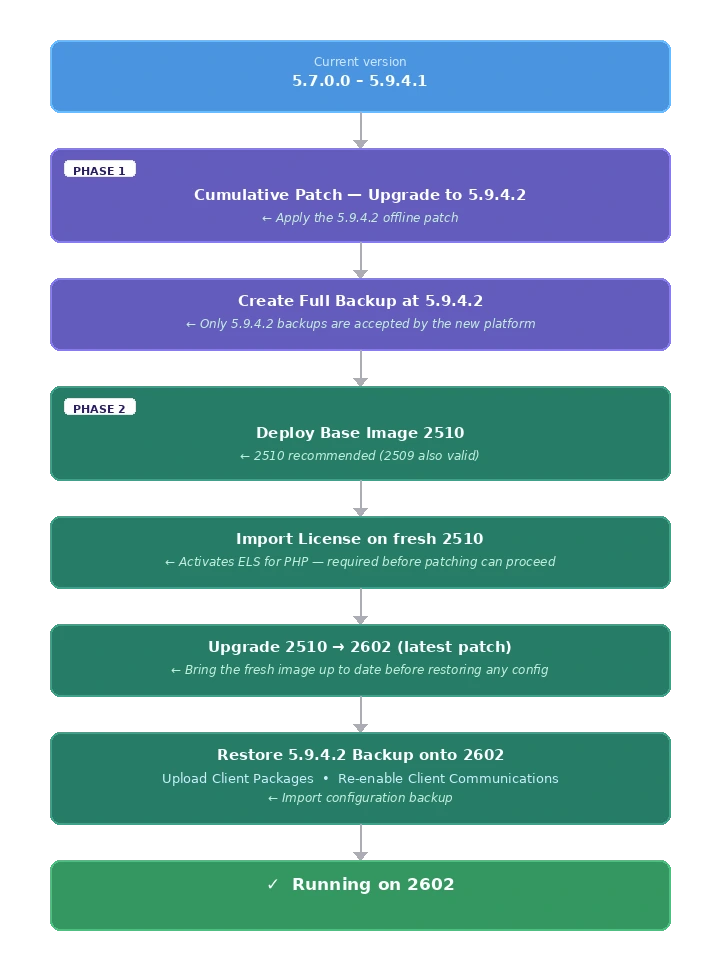

:::warning
The server doesn't accept backups from versions **other than 5.9.4.2**. The intermediate upgrade step to 5.9.4.2 is **mandatory** — skipping it will result in a failed restoration.
:::

:::warning
Import the license on the fresh 2510 image **before** applying patches. Without an active ELS for PHP license, the server can't receive OS and patch updates.
:::

---

## Understanding the Migration Architecture

### Why 5.9.4.2 Is a Required Stepping Stone

The 2510 base image (and any patch version built on top of it, such as 2604) accepts configuration backups exclusively from version **5.9.4.2**. This is because:

- The internal database schema at 5.9.4.2 is the last known-compatible schema for import into the new image platform.
- The reworked backend OS (Ubuntu 22.04) introduced breaking changes to service configurations and file paths.
- The migration process validates the backup format and version checksum before restoring.

:::note
Restore the backup **after** you fully patch the 2510 image to 2602. The 5.9.4.2 backup format remains compatible across all patch versions of the new image (2510, 2511, …, 2604).
:::

**Version compatibility matrix:**

| Backup Source Version | Can Be Restored to 2602 |
|---|---|
| Older than 5.7.0.0 | ❌ Step-by-step upgrade path required first |
| 5.7.0.0 – 5.9.4.1 | ❌ Must reach 5.9.4.2 first via cumulative patch |
| **5.9.4.2** | ✅ **Yes — the only accepted source version from historical image appliances** |
| **2509, 2510, 2601, 2602, 2604** | ✅ **Yes - Possible** |

:::warning
The server accepts only backups created on **exactly version 5.9.4.2**.
Always verify your source server version before creating the migration backup.
:::

### New EPP Client and Server versioning

Starting with the 2509 EPP Server release in October 2025, Netwrix introduced a new versioning scheme. For details, see [Unified EPP Clients and Server Versioning](/docs/endpointprotector/install/overview.md).

:::tip
Netwrix recommends the migration upgrade path to the 2510 image with 2604 patch for any environment still on legacy 5.x versions. Use in-place upgrades within the 5.x series only as an intermediate step to reach 5.9.4.2.
:::

---

## Pre-Migration Prerequisites and Checklist

:::warning 
Support for 5.9.4.2 and all older versions ended **14 February 2026**. If you are reading this guide on a 5.x server, your environment is running without security coverage. Schedule your migration maintenance window as soon as possible.
:::

Complete **all** items in this checklist before beginning any upgrade or migration activity.

### License Verification

Version 2510 requires an updated license format that includes a `php_els` field.

**How to verify your license:**

1. Open your current EPP Server console.
2. Navigate to **System Configuration → System Licensing**.
3. Download or view the license file content.
4. Verify that the license file contains a field ending with: `"php_els":"your-unique-value"`, as shown in the following example.
  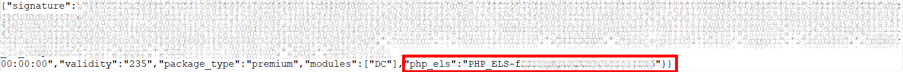

If the `php_els` field is missing:
- Licenses issued **after January 1, 2025** typically include the `php_els` field.
- Contact Netwrix Support or your account team to request a refreshed license before proceeding.

:::warning
Without a valid `php_els` license, the new server's underlying OS components will **not** receive updates after migration. Don't proceed without confirming this field exists.
:::

### Hypervisor Compatibility Check

**Verified compatible hypervisors:**
- VMware vSphere 6.7+
- VMware ESXi 7.0+
- Microsoft Hyper-V (Windows Server 2016+)
- Proxmox VE (IP/network configuration requires manual attention after deployment)
- AWS, Azure, GCP (cloud deployments — snapshot behavior differs per provider)

:::warning
The 2510 VM image is **not compatible with VMware vSphere 6.5**. If your environment runs vSphere 6.5, you must upgrade the hypervisor before deploying the new EPP image.
:::

:::tip
Confirm hypervisor version compatibility **before** scheduling a migration maintenance window.
:::

:::note
The preceding hypervisor recommendations reflect the best available guidance based on the EPP image format and known compatibility. However, hypervisor provisioning, configuration, and ongoing maintenance fall outside the scope of Netwrix support. Netwrix can't assist with hypervisor-side issues — customers are responsible for their own virtualisation infrastructure.
:::

### System Resource Assessment

Before any upgrade, assess the health of the current appliance.
- For upgrades from 5.7.0.0 to 5.9.2.x, verify that disk space and database (DB) allocation are sufficient.
- For migration from 5.9.4.2, the migration transfers configuration only — EPP log data doesn't migrate.

**In the EPP Console:**

1. Go to **Appliance → Server Information**.
2. Note and screenshot the following values:
   - Current server version
   - Disk Space EPP Server (database partition utilization)
   - Database Disk Space occupied (current DB size)
   - RAM and CPU allocation

You can verify disk space and current server versions in Appliance → Server Information.
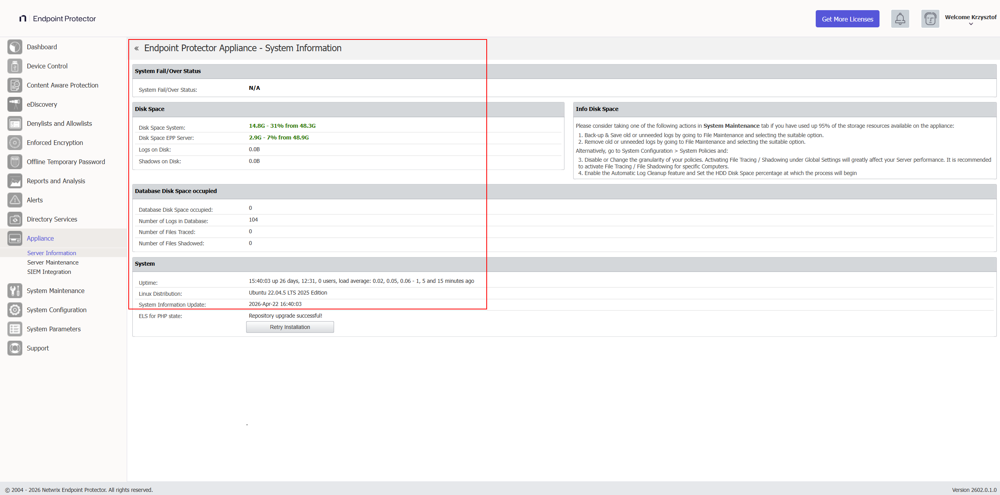

**Minimum resource requirements before proceeding:**

For authoritative CPU, RAM, and disk minimum recommendations, refer to the official User Manual: [Netwrix Endpoint Protector — Server Requirements](/docs/endpointprotector/requirements/server)

:::tip
If disk space is below 30%, perform database shrinking via **System Maintenance → Audit Log Backups** before proceeding. Exporting old logs to an external SIEM or repository reduces DB size significantly. If not possible, consider expanding the associated disk space. To export logs, see [Audit Log Backup](/docs/endpointprotector/admin/systemmaintenance/overview#audit-log-backup).
:::

### Maintenance Window Planning

Plan a maintenance window that accounts for the following:

- Patch upload and installation time: **15–60 minutes** for the 5.9.4.2 cumulative patch
- Backup creation time: varies by configuration size
- New VM deployment: **30–60 minutes**
- Backup restoration: **15–45 minutes**
- Post-migration verification: **30–60 minutes**
- Client package uploads: **10–20 minutes**

These times reflect laboratory test results and may vary in your environment depending on several factors, including hardware assigned to the appliance.

**During the upgrade window, the following will be unavailable:**
- EPP/EE client communication with the server
- Email alerts and SIEM integrations
- File Shadow and log generation

:::tip
EPP clients continue logging events locally during server downtime. The server receives all queued events once communication resumes. No endpoint data is lost.
:::

:::tip
In large enterprise environments with a high number of active EPP clients, Netwrix recommends **temporarily disabling client communications** before starting the upgrade. This prevents clients from sending EPP logs to the server during the process, allowing the server to focus on the upgrade and ensuring no logs remain unprocessed in the queue. Client communications can be disabled in several ways:
- Blocking the EPP communication port on the perimeter or host-based firewall
- Blocking the port at the virtual machine network stack level (vSwitch port group policy, NSX rule, or equivalent)

Re-enable communications after you verify the upgraded server and it's ready to accept traffic.
:::

### VM Snapshot and Backup

**This step is non-negotiable. Don't proceed without completing both.**

:::note
VM backup and snapshot management is the full responsibility of the customer's administrators. Netwrix doesn't manage, verify, or maintain hypervisor-level snapshots. However, Netwrix considers a valid VM snapshot an **obligatory prerequisite** before starting any upgrade or migration activity. Proceeding without a snapshot means there is no rollback path — if there is a failure, recovery may be impossible without one, and Netwrix Support will be unable to assist with restoring the environment.
:::

**Step 1 — Create a VM snapshot** on your hypervisor (VMware, Hyper-V, ESXi, AWS, Azure, etc.).

:::warning
In AWS, the system queues snapshots and doesn't take them instantly. Verify the snapshot is in **"completed"** status before proceeding.
:::

:::tip
Keep the VM snapshot active until you have fully validated the new 2510 environment and are ready to decommission the old server. This is your rollback path.
:::

**Step 2 — Create a System Configuration Backup (in the EPP Console):**

1. Log in to Endpoint Protector Console.
2. Navigate to **System Maintenance → System Backup**.
3. Click **Create**, enter a name and description (include the date and version, e.g., `pre-upgrade-5942-2026-04-20`), click **Save**.
4. **Save the System Backup Key** that appears in the prompt — you need this key for restoration and can't recover it if lost.
5. Wait for the status to show **"Ready to download"**, then download the backup file.

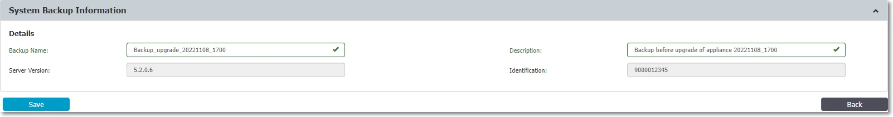

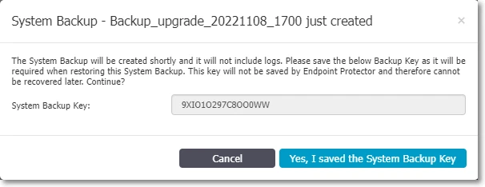

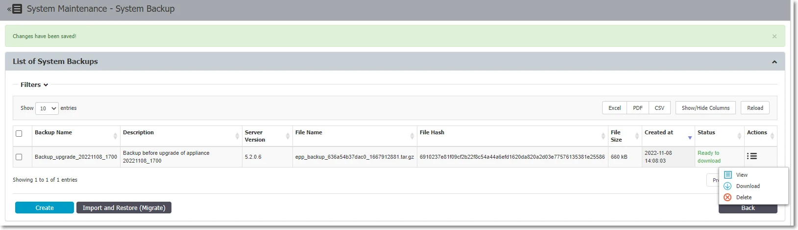

:::danger
Store backup files in a secure repository with limited access. The backup contains full server configuration including policies, users, groups, and device rules.
:::

**Step 3 — Export logs and file shadows separately (optional but recommended):**

The System Configuration Backup doesn't include logs and file shadows. If you need historical logs for compliance or forensics:

- Use **System Maintenance → Audit Log Backups** to export logs to an external location. See [Audit Log Backup](/docs/endpointprotector/admin/systemmaintenance/overview#audit-log-backup) for export steps.
- Retain the old server VM after migration for log access.

:::tip
If your organization has compliance requirements for data retention (e.g., GDPR, HIPAA, SOX), never decommission the old server until you have confirmed that an alternative solution (SIEM, external export) meets log retention requirements.
:::

### Pre-Migration Checklist Summary

| # | Task | Status |
|---|---|---|
| 1 | License contains `php_els` field | ☐ |
| 2 | VM snapshot created and confirmed | ☐ |
| 3 | System backup created and key saved | ☐ |
| 4 | Backup file downloaded to secure location | ☐ |
| 5 | Disk space ≥ 30% free on current server | ☐ |
| 6 | Server resource counters noted (baseline) | ☐ |
| 7 | Maintenance window communicated | ☐ |
| 8 | Appliance → Server Information screenshot taken | ☐ |
| 9 | Updated license file obtained (with `php_els`) | ☐ |
| 10 | EPP Client 5.9.4.3 (for customers not migrated yet) or latest packages downloaded | ☐ |
| 11 | Enforced Encryption (EE) Client 2509+ packages downloaded (if applicable) | ☐ |

---

## Phase 1 — Upgrade to 5.9.4.2 via Cumulative Patch

This phase applies to environments running **any version from 5.7.0.0 through 5.9.4.1**. The cumulative patch upgrades your server directly to 5.9.4.2 in a single operation, incorporating all fixes and features introduced across every intermediate version.

### Downloading the Cumulative Patch

The 5.9.4.2 cumulative patch is available from the Netwrix Community portal. Contact your Netwrix account team or Customer Support to obtain the patch file if you don't have direct access.

:::tip
📹 **Community Portal:** A video walkthrough of the cumulative patch process is available at the Netwrix Community: [5.9.4.2 Cumulative Upgrade Patch for Endpoint Protector Server 5.7.0.0–5.9.4.1](https://community.netwrix.com/t/5-9-4-2-cumulative-upgrade-patch-for-endpoint-protector-server-5-7-0-0-5-9-4-1/9321)
:::

The patch includes:
- All updates, fixes, and features from 5.7.0.0 through 5.9.4.2
- Latest Enforced Encryption Client
- A separate offline client patch is also available (Windows and macOS direct installers provided)

### Applying the Offline Cumulative Patch

1. Download the patch file to the machine you will use to access the EPP console.
2. Log in to the **Endpoint Protector Server Console**.
3. Navigate to **Dashboard → Live Update**.
4. Click **Offline Patch Uploader**.

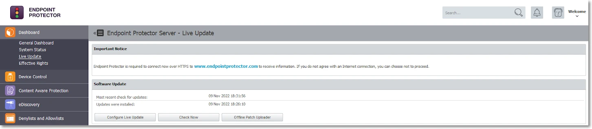

5. In the wizard, select the downloaded patch file and click **Upload Patch**.

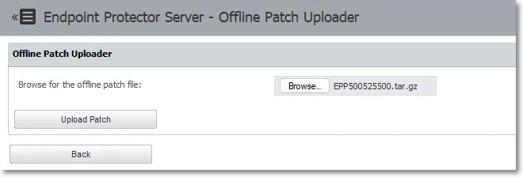

6. After you upload the file, click **Back** when prompted.
7. The progress notification will appear in the Software Update section.

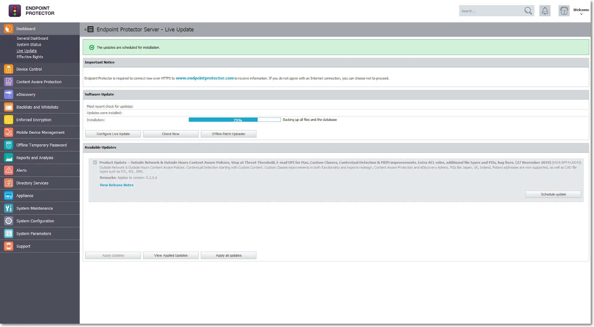

### Monitoring Patch Progress

The patch installation typically takes **15–60 minutes** depending on server performance. You can monitor progress by staying on the **Dashboard → Live Update** page and watching the status bar.

### Post-Patch Verification

After the installation completes:

1. The console will display **"Last updates applied successfully"** status.
2. Refresh your browser and log back in.
3. Navigate to **Appliance → Server Information** and confirm the version shows **5.9.4.2**.
4. Verify the update history: **Dashboard → Live Update → View all applied updates**.

After the patch applies successfully, **don't perform any further upgrades or major configuration changes for at least 24 hours**. Although the UI confirms the patch as complete, critical background processes continue running after the visible upgrade finishes. These include:

- **Database schema migration** — aligns internal table structures and indexes to the new version format
- **Log reindexing** — rebuilds search indexes across stored audit and event logs
- **Service reconfiguration** — updates internal service dependencies, daemon configurations, and file path mappings introduced by the patch
- **Nightly cron maintenance** — runs at 9:00 PM and performs integrity checks, cache rebuilds, and housekeeping tasks that finalize the upgrade state

These tasks run silently in the background and don't produce visible progress in the console. Performing another upgrade, restoring a backup, or making significant configuration changes before these processes complete can impact stability or, in edge cases, corrupt the database and leave the server in an inconsistent state.

### Create Final Backup at 5.9.4.2

After confirming the upgrade to 5.9.4.2 is stable (wait for the 24-hour background task window), create a **new System Configuration Backup** specifically for use in the 2510 migration:

1. Navigate to **System Maintenance → System Backup**.
2. Click **Create** and name it clearly: `migration-to-2510-YYYY-MM-DD`.
3. Save the backup key securely.
4. Download the backup file once status shows **"Ready to download"**.
5. Check the size of the backup. If it's larger than 200 MB, refer to the [next subchapter](#my-backup-is-bigger-than-200-mb).

:::tip
This backup at 5.9.4.2 is the **only** backup that will work on the 2510 platform. Label it clearly and store it separately from previous backups to avoid any confusion during the restoration step.
:::

:::note
The Backup feature backs up all configuration details, excluding log evidence and File Shadows.
:::

Use [Audit Log Backup](/docs/endpointprotector/admin/systemmaintenance/overview.md#audit-log-backup) to back up logs and/or File Shadows (optional). Logs and file shadow backups aren't migrated to the new environment. See the notes in this section for an overview of how to preserve logs and/or File Shadows in an offline state before starting the upgrade process.

#### My backup is bigger than 200 MB

If your 5.9.4.2 backup export is larger than 200 MB, follow these steps:
1. Consider cleaning up the database using the Audit Log Backup feature if possible (refer to the [Audit Log Backup](/docs/endpointprotector/admin/systemmaintenance/overview.md#audit-log-backup) chapter). This removes obsolete data and can decrease the backup file size.
2. Contact EPP Support and report that your "5.9.4.2 backup is bigger than 200 MB." Request an individual offline patch file to fix the backup export size. You can also request assistance with the manual procedure.
3. Apply the mentioned patch, which adds several backup export improvements on top of the 5.9.4.2 backup functionality. 
:::note
This doesn't change the EPP Server version — it remains 5.9.4.2.
:::

4. If the new export attempt still returns more than 200 MB after successfully importing the offline patch, contact Netwrix Support for assistance with the manual procedure.

---

## Phase 2 — Deploy 2510 Base Image and Migrate to 2602

### Choosing Your IP/FQDN Strategy

Before deploying the new VM, decide whether the new 2510 server will use the **same or a different IP address/FQDN** as the current server. This decision has significant security and operational implications.

#### Option A — Same IP/FQDN (Recommended)

| Aspect | Detail |
|---|---|
| Certificate trust | Preserved — no changes required on endpoints |
| Enforced Encryption (EE) | No user action required — drives remain encrypted |
| DPI / CAP functionality | Works immediately after migration |
| Client reconnection | Automatic — endpoints find server at same address |
| Recommended for | All environments, especially EE deployments |

**Procedure:**
- Shut down or isolate the old 5.9.4.2 server before starting the new one.
- Assign the old IP address to the new 2510 VM.
- DNS records remain unchanged.

:::tip
Always use the **same IP/FQDN** option. The operational complexity and user impact of changing the IP/FQDN — especially in environments using Enforced Encryption — is very high. Consider a different IP/FQDN only when technically unavoidable.
:::

#### Option B — Different IP/FQDN (Not Recommended Except for Device Control-Only Environments)

| Risk | Impact |
|---|---|
| DPI certificate trust broken | Content Aware Protection and DPI will fail until certificates regenerated |
| CAP policy disruption | All Content Aware Protection rules break |
| EE drives locked | Users must manually decrypt and re-encrypt every protected drive |
| Root CA redistribution | You must push the new root CA to all endpoints via GPO/MDM |
| High server load | Certificate regeneration for all endpoints creates a burst load spike |

:::warning
If using Enforced Encryption and you change the IP/FQDN, every user with an EE-protected drive must decrypt their drive and re-encrypt it after reconnecting to the new server. This can be a major operational disruption in large organizations. Netwrix strongly discourages this.
:::

### Deploying the 2510 Base Image

:::tip
You can upgrade both the **2509** and **2510** base images directly to 2602. **Netwrix recommends the 2510 image** for new deployments — it includes improvements to disk sizing (320 GB) and resolves DHCP/DNS configuration issues present in 2509. If you already have a 2509 image available, Netwrix fully supports it and you can reach 2602 without any intermediate image migration.
:::

1. Download the Endpoint Protector **2510** VM image from the [My Products portal on netwrix.com](https://customer.netwrix.com/sign_in.html?rf=my_products.html), or request it from your account team.
2. Deploy the VM in your hypervisor environment.
   - Minimum disk: **320 GB**
   - Ensure at least **2 GB of free space** on the VM
   - For full CPU, RAM, and storage recommendations see: [Netwrix Endpoint Protector — Server Requirements](/docs/endpointprotector/requirements/server)
3. Configure the VM network settings:
   - Assign IP address (same as old server if using Option A)
   - Configure DNS

:::note
⚠️ **Known Issue:** IP network settings may not save correctly if you fill only one DNS field. **Workaround:** Fill **both** DNS fields. Use for example Google's public DNS (`8.8.8.8` and `8.8.4.4`) as a secondary if you don't have a second internal DNS server.
:::

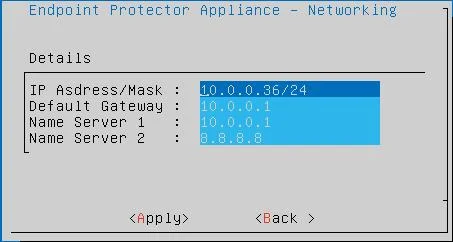

4. Power on the new VM and access the console at `https://<new-ip-or-fqdn>:443`.

### Temporarily Disabling Client Communications

Immediately after you provision the new VM and it's reachable, disable client communications before performing any further configuration. This prevents endpoints from discovering and connecting to the new server while you're still preparing it.

1. Log in to the new server console.
2. Navigate to **System Configuration → System Settings**.
3. Disable client communication.

:::tip
Disabling client communications prevents endpoints from registering with an incomplete server configuration. Re-enable only after the full restoration and verification is complete.
:::

### Activate trial license on a newly deployed image

To upgrade a clean appliance, activate at least a Trial license. Go to **System Configuration** → **Licensing** and choose **Free Trial**. You'll import the proper license in a later step, after the upgrade and backup restore process.
After successful activation, you should see a green banner at the top.

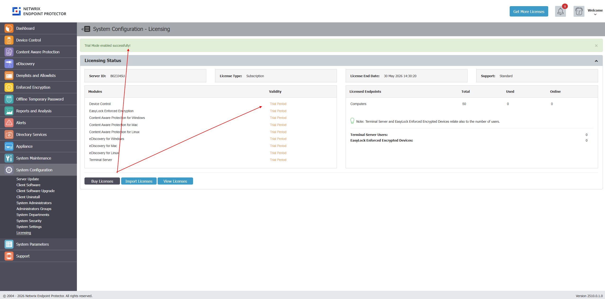

### Upgrade the 2510 Image to the Latest Version (2604)

With the license active, upgrade the fresh 2510 image to the current latest patch version. The current version is **2604** — always apply all available updates.

1. Navigate to **System Configuration → Server Update**.
2. Use the **Offline Patch Uploader** if the server has no internet access:
   - Navigate to **Dashboard → Live Update → Offline Patch Uploader**.
   - Upload the 2604 cumulative patch file — it covers all versions from 2509 to 2604 in a single update.

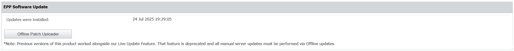

:::tip
For air-gapped environments, follow the same procedure using the 2604 cumulative patch file — this is the same patch as for online environments.
:::

3. After each patch, refresh the browser and verify the version in **Appliance → Server Information** before applying the next.
4. Once on 2604, confirm the server is stable and all services are running before proceeding to the backup restore.

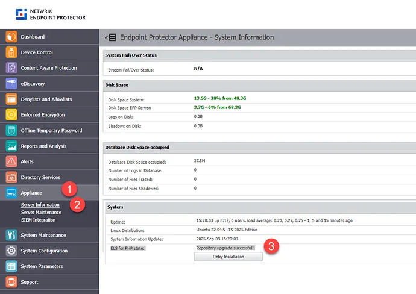

### Restoring the 5.9.4.2 Backup onto 2604

Restore the 5.9.4.2 backup onto the fully patched 2604 server. The backup format is compatible with all versions in the new image series (2510 through 2604 and later).

1. Log in to the **2604 server console**.
2. Navigate to **System Maintenance → System Backup v2**.
3. Click **Import and Restore (Migrate)**.

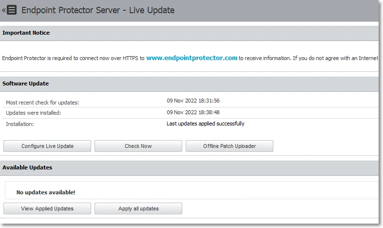

4. In the wizard, select the 5.9.4.2 backup file you created in Phase 1.
5. Enter the **System Backup Key** saved during backup creation.
6. Click **Import**.

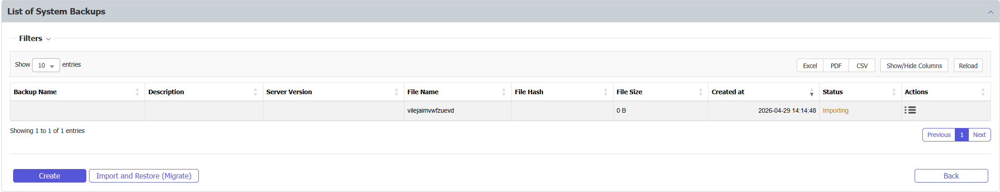

7. Monitor the restore progress: the status will show **"Generating"** while restoring.

8. Once complete, the status changes to **"Your back import file has been queued"**. 

9. After a few minutes, click **Reload** above the status column to refresh progress. If the console becomes unresponsive, refresh the browser — this is normal during application restart.

:::tip
Restoration can take several minutes depending on backup size. Don't interrupt the process or close the browser. If the console appears frozen, wait at least 5 minutes before refreshing.
:::

:::warning
Large backups on under-resourced VMs can cause **server unresponsiveness or a 500 error** during import. If you receive a 500 error:

1. Don't retry immediately — check server logs via SSH first.
2. Verify at least 2 GB free disk space on the VM.
3. Verify the backup file isn't corrupted (re-download from the source server if needed).
4. Contact Netwrix Support if the error persists.
:::
### Import License on the Upgraded EPP server image with restore configuration

1. Navigate to **System Configuration → System Licensing → Import License**.
2. Upload the license file that contains the `php_els` field.
3. After import, go to **Appliance → Server Information**.
4. Confirm that **"ELS for PHP = Active"** appears before continuing.

You can validate the php_els component status in Appliance → Server Information.
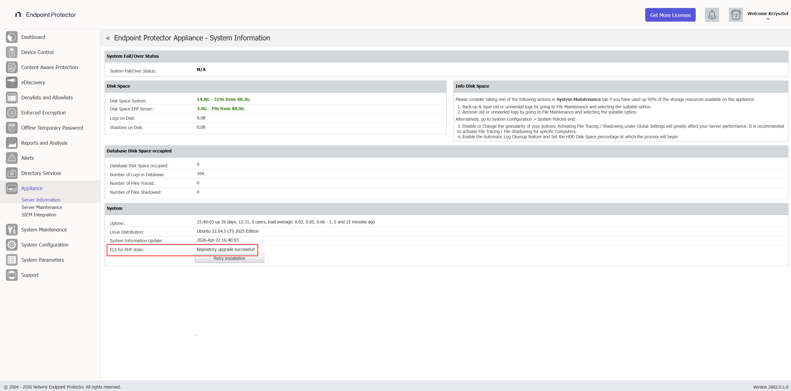

If you imported the license successfully, the Server Information page shows:

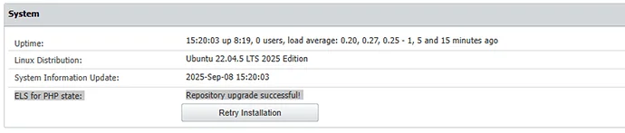

If errors appear:

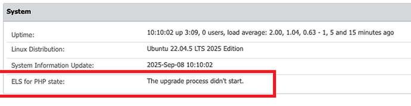

:::danger
If ELS for PHP is **not Active**, stop and resolve this before proceeding. The server can't receive patches without it, and the subsequent upgrade step will not complete successfully.
:::

## Phase 3 — Uploading EPP & EE Client Packages

The new 2509/2510 server and further EPP Server patches don't include client packages by default. You must upload them manually.

If you are using an external tool to manage your packages, you can ignore this section unless you are a Netwrix Enforced Encryption (EasyLock) customer — in that case, follow the instructions in this section.

Download the Endpoint Protector Clients from the [My Products portal on netwrix.com](https://customer.netwrix.com/sign_in.html?rf=my_products.html), or request them from your account team.

:::note
The EPP Server Client Upgrade feature doesn't support Linux client upgrades — administrators must upgrade Linux clients manually.
:::

The average size of EPP Clients update is:

- Endpoint Protector Client for Windows ~ 50 MB
- Endpoint Protector Client for macOS ~ 50 MB
- Endpoint Protector Client for Linux ~ 15 MB (with no dependencies)
- Endpoint Protector Enforced Encryption Client ~ 15 MB
- Endpoint Protector Server ~ 30 MB

For environments where the payload of an update is a concern, you can save bandwidth by using Offline Patches. You can also deploy Endpoint Protector Clients manually, directly on each endpoint.

### Certificate Bridge and Upgrade Path

Understanding the required package set requires knowing why a direct upgrade from older 5.x clients to 2605 isn't possible.

Netwrix acquired CoSoSys (the original developer of Endpoint Protector) and transitioned all code signing certificates from **CoSoSys signatures** to **Netwrix signatures**. This transition affects how endpoint clients verify server-pushed updates:

| Client Version | Trusted Signatures | Notes |
|---|---|---|
| 5.9.4.1 and older | CoSoSys only | Can't verify Netwrix-signed packages |
|5.9.4.3 | **Both CoSoSys AND Netwrix** | ✅ The required bridge version |
| 2511 and newer | Netwrix only | Can't be pushed to 5.9.4.1 clients directly |

Clients on 5.9.4.1 or older **can't** upgrade directly to 2605. They must first upgrade to **5.9.4.3** (which trusts both signature types), then proceed to 2605:

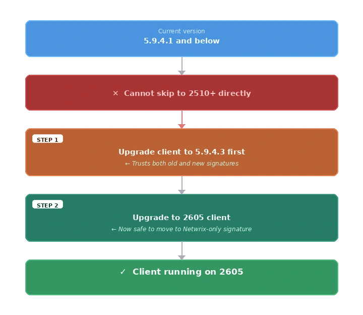

### Required Packages

The packages you need to upload depend on your current EPP client population and whether you use Enforced Encryption.

| Package | Notes |
|---|---|
| EPP Client 2605 (Windows) | Latest — primary target for all endpoints |
| EPP Client 2605 (macOS) | Latest — primary target for all endpoints |
| EPP Client 5.9.4.3 Hotfix 1 (Windows) | Bridge client — required only for endpoints still below 5.9.4.3 |
| EPP Client 5.9.4.3 Hotfix 1 (macOS) | Bridge client — required only for endpoints still below 5.9.4.3 |
| Checksum file for each client | Required for integrity verification |
| EE Client 2605 (Windows) | Latest — required if Enforced Encryption is in use |
| EE Client 2605 (macOS) | Latest — required if Enforced Encryption is in use |

### Upload Procedure

The client update mechanism controls how the server distributes and updates EPP clients. For a full description of available settings and options, see [Client Update Mechanism](/docs/endpointprotector/admin/systemconfiguration/systemsettings#client-update-mechanism). 

1. Navigate to **System Configuration → Client Software**.
2. Use the upload function to add each client package and its corresponding checksum file.

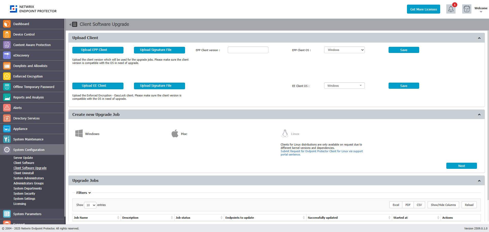

:::warning
Upload **both** EE clients for Windows and macOS if your organization uses both operating systems. Missing even one platform's EE client can break encryption enforcement on that platform.
:::

### Obsolete OS limitations

As defined in the [Client Supportability Statement](/docs/endpointprotector/supportability/client-supportability.md), the latest EPP Client versions don't support obsolete and discontinued operating systems. If you must continue using the EPP Client on an unsupported operating system, use the last available Client version compatible with that operating system. While such Client versions may retain the ability to communicate with the EPP Server, the standard support agreement no longer covers them. Netwrix provides no warranty, guarantee, or obligation for EPP Client functionality on unsupported operating systems. Netwrix provides support in such cases on a best-effort basis only. For example, the last EPP Client version for obsolete operating systems such as Windows XP, Windows 7, and Windows 8 is 5.9.4.0 release one (6.2.4.2000).

---

## Post-Migration Verification

Complete all items in this checklist after you finish the migration.

### Server Health Check

| Check | How to Verify |
|---|---|
| Server version shows latest 2604.0.x.x version | Appliance → Server Information |
| ELS for PHP = Active | Appliance → Server Information |
| Server responds to browser access | `https://<server>:443` loads normally |
| License imported successfully | System Configuration → System Licensing |

### Re-Enabling Client Communications

After the restore is verified and client packages are uploaded:

1. Navigate to **System Configuration → System Settings**.
2. Re-enable client communications.
3. Monitor **Device Control → Computers** — endpoints should begin checking in within their configured communication interval.

### Endpoint Communication Check

1. Navigate to **Device Control → Computers**.
2. Sort by **Last Seen** column.
3. Verify that endpoints are checking in with recent timestamps (within expected communication interval).
4. Check for any endpoints stuck on old client versions.

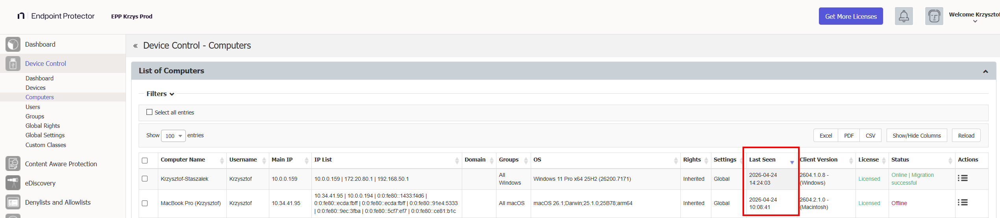

### Policy and Functionality Check

Verify each active module:

| Module | Where to Check |
|---|---|
| Device Control | Device Control → Dashboard |
| Content Aware Protection | Content Aware Protection → Dashboard |
| eDiscovery | eDiscovery → Dashboard |
| Enforced Encryption | Check that EE-protected drives are accessible |
| Reports & Analytics | Reports and Analytics → relevant sub-service |
| Alerts | Check that configured alerts are firing |

:::tip
Generate deliberate test events on a known test machine for each active module. For example: plug in a USB drive (Device Control), transfer a file with sensitive content (CAP), run an eDiscovery scan. Confirm the events appear in the console before declaring the migration complete.
:::

### DPI / CAP Functionality Verification

If using Deep Packet Inspection or Content Aware Protection:

1. Verify endpoints trust the root CA certificate.
2. Test a known-blocked transfer to confirm CAP policy is active.
3. If endpoints don't trust the certificates, and you used a **different IP/FQDN**, you may need to push the new root CA via GPO or MDM.

### Backup Creation Verification

1. Navigate to **System Maintenance → System Backup**.
2. Verify that backups are configured and active.
3. Run a test backup and confirm **"Ready to download"** status.

### Third-Party Integration Reconfiguration

After migration, manually re-import and reconfigure all 3rd-party integrations. While the backup includes configuration data, it doesn't always fully restore credentials and connection secrets, and integration endpoints may require re-registration against the new server.

Re-import and reconfigure each active integration before proceeding to verification:

| Integration | Where to Reconfigure |
|---|---|
| SMTP / Email alerts | System Configuration → System Settings → Email Configuration |
| AD / LDAP | Directory Services → Microsoft Active Directory  |
| Entra ID | Directory Services → Azure Active Directory |
| SCIM | Directory Services → SCIM API Configuration |
| SSO  | System Configuration → SSO / Single Sign-On |
| SIEM / Syslog | System Configuration → SIEM Settings |
| AWS / S3 / File Shadows | System Configuration → File Shadow Repository |

#### Post-Migration Integration Verification

After reconfiguration, verify each integration is functioning:

| Integration | How to Verify |
|---|---|
| SMTP / Email alerts | Use the built-in test email function; confirm delivery |
| AD / LDAP | Click **Test Connection**; trigger a manual sync; check object counts |
| Entra ID / SSO | Perform a test SSO login in an incognito browser window |
| SIEM / Syslog | Generate a test event; confirm it appears in the SIEM receiver |
| AWS / S3 / File Shadows | Generate a file shadow; confirm it reaches the S3 bucket |

#### Troubleshooting Failed Integrations

If an integration fails verification, use the following steps:

**SMTP / Email alerts not firing:**
1. Navigate to **System Configuration → System Settings → Email Configuration**.
2. Re-enter SMTP credentials — the backup doesn't always restore passwords.
3. Use the test email function and check server logs if delivery fails.
4. Verify firewall allows outbound on the configured SMTP port (25, 465, or 587).

**AD / LDAP sync broken:**
1. Navigate to **System Configuration → Active Directory / LDAP**.
2. Click **Test Connection** — if it fails, re-enter the bind DN and password.
3. Trigger a manual sync and monitor for completion.

:::warning
AD Sync may appear to complete successfully but only import a partial set of users or groups. Always cross-check the imported object count against your directory — don't rely solely on the "success" status message.
:::

**Entra ID / SSO / SCIM not working:**
1. Navigate to **System Configuration → SSO / Single Sign-On**.
2. Re-enter tenant ID, client ID, and client secret — the backup doesn't restore these.
3. Verify the redirect URI registered in Azure AD matches the new server address.
4. Perform a test SSO login in an incognito window.
5. If SCIM provisioning is broken, re-generate the SCIM token in the EPP console and update it in Entra ID.

**SIEM / Syslog events not forwarding:**
1. Reconfigure the SIEM destination IP, port, and protocol.
2. Generate a test event and confirm it reaches the SIEM receiver.
3. If events still don't appear, contact Netwrix Support — you may need a server-side script to restart the syslog forwarding service.

**AWS / S3 file shadows unreachable:**
1. Navigate to **System Configuration → File Shadow Repository**.
2. Re-enter the S3 bucket name, region, access key, and secret key.
3. Run a test file shadow and confirm the file appears in the bucket.

### Audit Log Backup Verification

:::warning
After migration to 2510/2601, the **Audit Log Backup job can enter a state where it runs continuously and never completes**. Always verify that jobs finish within a reasonable timeframe.
:::

After migration, verify:
1. Navigate to **System Maintenance → Audit Log Backups**.
2. Check that any running audit backup jobs have a defined end time and aren't stuck in an active state.
3. If a job has been running for more than 4 hours with no progress, stop it and contact Netwrix Support.

:::tip
Don't start Audit Log Backup jobs immediately after migration. Allow the server to stabilize for 24 hours, then start a test backup and monitor its completion before scheduling recurring jobs.
:::

### Performance Baseline Comparison

Compare current resource utilization with the baseline captured in the prerequisites:

- CPU and RAM usage should be similar or lower than before migration.
- After initial policy recalibration (which may cause a brief CPU spike), utilization should normalize.
- Monitor for 48 hours post-migration before drawing conclusions.

### Deploying Client Upgrades

For a full overview of the Client Software Upgrade feature, including version management and deployment settings, see [Client Software Upgrade](/docs/endpointprotector/admin/systemconfiguration/overview#client-software-upgrade).

:::tip
Use your organization's existing software deployment infrastructure (Microsoft Intune, SCCM, Jamf, or equivalent) for client upgrades rather than relying solely on EPP's built-in upgrade function. Enterprise deployment tools provide better visibility, rollback capability, and bandwidth management.
:::

If using EPP's built-in upgrade:

1. Navigate to **System Configuration → Client Software Upgrade**.
2. Select the target OS and agent version, click **Next**.
3. Select target computers carefully.

:::warning
EPP's built-in upgrade limits the rate to **50 machines per hour**. For large deployments, plan accordingly or use external deployment tools.
:::

:::tip
Always upgrade a small pilot group (10–20 endpoints across diverse hardware/OS configurations) before mass rollout. Validate behavior, policies, and communication for 24–48 hours before proceeding with the full fleet.
:::

---
