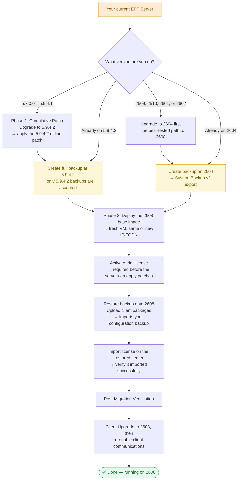

<small><em>Document version: 3.0</em></small>

---

:::tip Need to Migrate Before 2608 Ships?
Netwrix expects to release **2608** in **late August 2026**. If you're on a legacy 5.x server and need to migrate sooner, the previous target platform (2510/2604) is still a valid, supported path — see [Migrating from a Legacy 5.x Server to 2510/2604 (Temporary)](/docs/endpointprotector/install/migrationprocedure/migration-legacy-5x-to-2510). **If your timeline allows waiting, Netwrix recommends migrating directly to 2608 instead** — migrating to 2510/2604 now means a second migration shortly afterward. This temporary article will be retired once 2608 is generally available.
:::

---

:::warning
**Action Required**

Netwrix discontinued support for Endpoint Protector Server version **5.9.4.2 and all older versions** as of **14 February 2026**. Customers still running any 5.x version are no longer receiving security patches, bug fixes, or technical support.

**Complete migration to the new image-based platform immediately.**

For the full support lifecycle and version status, see: [Netwrix Endpoint Protector Server Supportability](/docs/endpointprotector/supportability/server-supportability)
:::

:::note
This guide covers **on-premises (Self-Hosted)** deployments only. Netwrix-hosted **SaaS** appliances are migrated directly by the Netwrix team — no customer action is required. Unlike the self-hosted paths in this guide, historical log data **is** carried over for SaaS as part of that Netwrix-managed migration — after migration, SaaS customers see two tabs in the Reports menu: one for historical data still held in MySQL, and one for current data captured and stored in CrateDB going forward. See [Deployment Models: SaaS vs. Self-Hosted Update Cadence](/docs/endpointprotector/supportability/server-supportability#deployment-models-saas-vs-self-hosted-update-cadence).
:::

---

## Overview

Endpoint Protector's server platform requires a full image migration rather than a simple in-place patch whenever the underlying base image changes. Netwrix is releasing a new base image, **2608**, that refreshes the entire server stack: Ubuntu 26.04 LTS, PHP 8.5, and updated MySQL and OpenSSL components. The 2608 image also introduces **CrateDB**, a new database component dedicated to storing log data going forward, alongside MySQL, which continues to own server configuration and EPP objects (Computers, Users, and Groups).

Every on-premises EPP Server — whether it's still on a legacy 5.x release or already migrated to the current image-based platform (2509–2604) — needs to migrate again to reach 2608.

:::note
CrateDB ships empty on a freshly deployed 2608 server. No historical log data is migrated into it — this matches today's behavior, where System Configuration Backup carries over policies, users, groups, and device rules, but never log data or file shadows. If you need historical logs for compliance or forensics, export them separately (see [Audit Log Backup](/docs/endpointprotector/admin/systemmaintenance/overview#audit-log-backup)) or retain your old server VM, exactly as described in each migration article's prerequisites.
:::

The migration path depends on where you're starting from:

```mermaid
flowchart TD
    Start["Your current EPP Server"] --> Q{"What version are you on?"}

    Q -->|"5.7.0.0 – 5.9.4.1"| Patch["Phase 1: Cumulative Patch<br/>Upgrade to 5.9.4.2<br/>→ apply the 5.9.4.2 offline patch"]
    Patch --> Backup1["Create full backup at 5.9.4.2<br/>→ only 5.9.4.2 backups are accepted"]
    Q -->|"Already on 5.9.4.2"| Backup1

    Q -->|"2509, 2510, 2601, or 2602"| Recommend["Upgrade to 2604 first<br/>→ the best-tested path to 2608"]
    Recommend --> Backup2["Create backup on 2604<br/>→ System Backup v2 export"]
    Q -->|"Already on 2604"| Backup2

    Backup1 --> Deploy["Phase 2: Deploy the 2608 base image<br/>→ fresh VM, same or new IP/FQDN"]
    Backup2 --> Deploy

    Deploy --> Trial["Activate trial license<br/>→ required before the server can apply patches"]
    Trial --> Restore["Restore backup onto 2608<br/>Upload client packages<br/>→ imports your configuration backup"]
    Restore --> License["Import license on the restored server<br/>→ verify it imported successfully"]
    License --> Verify["Post-Migration Verification"]
    Verify --> ClientUpgrade["Client Upgrade to 2608, then<br/>re-enable client communications"]
    ClientUpgrade --> Done(["✅ Done — running on 2608"])

    classDef startPoint fill:#fdebd3,stroke:#d68910,color:#7e5109
    classDef upgraded fill:#e8f8f0,stroke:#28a745,color:#1e7e34
    classDef backup fill:#fdf6d8,stroke:#d4ac0d,color:#7d6608

    class Start startPoint
    class Backup1,Backup2 backup
    class Done upgraded
```

## Which Article Applies to You

Check your current server version under **Appliance → Server Information**, then follow the matching article.

| Your Current Version | Article to Follow |
|---|---|
| Any version from **5.7.0.0 to 5.9.4.2** (5700, 5710, 5800, 5810, 5820, 5900, 5910, 5920, 5930, 5940, 5941, 5942) | [Migrating from a Legacy 5.x Server to 2608](/docs/endpointprotector/install/migrationprocedure/migration-legacy-5x) |
| Any version from **2509 to 2604** (2509, 2510, 2601, 2602, 2604) | [Migrating from the Current Image Platform to 2608](/docs/endpointprotector/install/migrationprocedure/migration-current-image) |

:::tip Need to Migrate Before 2608 Ships?
Netwrix expects to release **2608** in **late August 2026**. If you're on a legacy 5.x server and need to migrate sooner, the previous target platform (2510/2604) is still a valid, supported path — see [Migrating from a Legacy 5.x Server to 2510/2604 (Temporary)](/docs/endpointprotector/install/migrationprocedure/migration-legacy-5x-to-2510). **If your timeline allows waiting, Netwrix recommends migrating directly to 2608 instead** — migrating to 2510/2604 now means a second migration shortly afterward. This temporary article will be retired once 2608 is generally available.
:::

Both articles converge on the same two final phases, common to every migration regardless of your starting version:

1. [Client Upgrade Management](/docs/endpointprotector/install/migrationprocedure/clientupgrade) — upgrading EPP and Enforced Encryption (EE) clients to the 2608 release.
2. Post-Migration Verification — confirming the new 2608 server and all integrations are healthy (covered at the end of each migration article).

## Understanding the Migration Architecture

### Why an Intermediate Version Is Required for Legacy 5.x Servers

The 2608 base image accepts configuration backups from a fixed set of source versions only — it doesn't accept a backup from an arbitrary 5.x release. If you're on any version older than 5.9.4.2, you must reach 5.9.4.2 first. This is because:

- The internal database schema at 5.9.4.2 is the last known-compatible schema for import into the new image platform.
- The migration process validates the backup format and version checksum before restoring.

Once you're on exactly 5.9.4.2, you deploy the 2608 image directly and restore your backup there — there's no need to route through the older 2510/2604 platform first.

:::note
If you're already on the current image-based platform (2509–2604), a different rule applies — see [Migrating from the Current Image Platform to 2608](/docs/endpointprotector/install/migrationprocedure/migration-current-image#backup-compatibility).
:::

**Version compatibility matrix:**

| Backup Source Version | Can Be Restored to 2608 |
|---|---|
| Older than 5.7.0.0 | ❌ Step-by-step upgrade path required first |
| 5.7.0.0 – 5.9.4.1 | ❌ Must reach 5.9.4.2 first via cumulative patch |
| **5.9.4.2** | ✅ **Yes — direct to 2608** |
| **2509, 2510, 2601, 2602** | ✅ Yes, but Netwrix recommends upgrading to 2604 first |
| **2604** | ✅ **Yes — the best-tested source version for 2608** |

:::tip
If you're currently on 2509, 2510, 2601, or 2602, Netwrix recommends upgrading to **2604** before migrating to 2608. The 2604 → 2608 path is the most thoroughly tested in Netwrix labs; other source versions in that range aren't as extensively validated yet.
:::

### New EPP Client and Server Versioning

Starting with the 2509 EPP Server release in October 2025, Netwrix introduced a new versioning scheme. For details, see [Unified EPP Clients and Server Versioning](/docs/endpointprotector/install/overview.md#unified-epp-clients-and-server-versioning). With the 2608 release, EPP Server and EPP/EE Client versions share the same number for the first time — both are released as **2608**.

---

## Prerequisites, Procedures, and Post-Migration Verification

Prerequisites and the exact migration procedure differ depending on your starting version — see [Which Article Applies to You](#which-article-applies-to-you). Both articles end with their own Post-Migration Verification checklist, since a small number of checks (for example, license validation) apply identically regardless of your starting point.

After completing your migration article, continue to [Client Upgrade Management](/docs/endpointprotector/install/migrationprocedure/clientupgrade) to bring EPP and EE clients up to the 2608 release.
