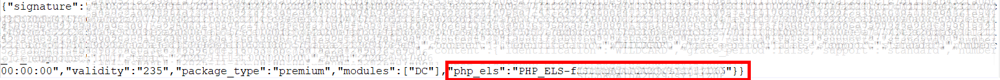
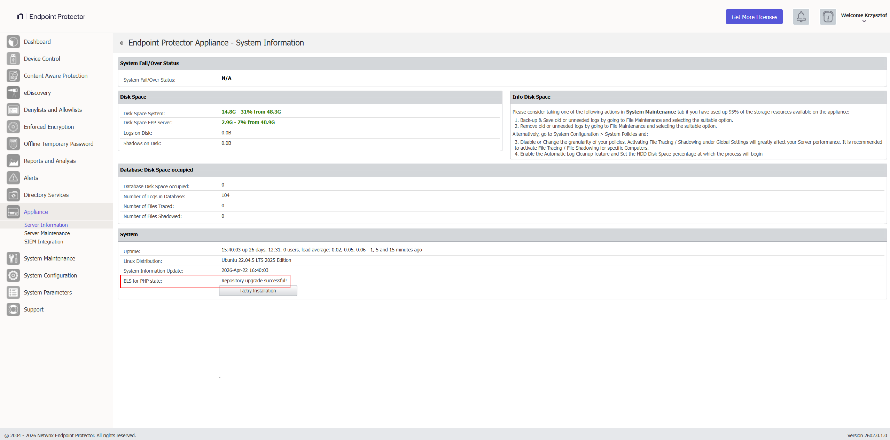
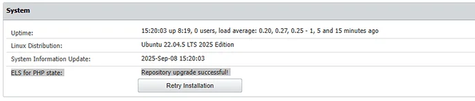
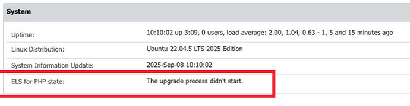

# Troubleshooting Common Issues

:::info Temporary — Two Migration Targets Until Late August 2026
This page primarily covers migrating to **2608**. Until Netwrix releases 2608 (expected **late August 2026**), legacy 5.x customers who need to migrate sooner can still follow the temporary [Migrating from a Legacy 5.x Server to 2510/2604](/docs/endpointprotector/install/migrationprocedure/migration-legacy-5x-to-2510) path instead. Entries that differ between the two targets carry a **2510/2604 path:** marker. Netwrix will remove this distinction, and these marked notes, once 2608 ships.
:::

## EPP Server

### High CPU Usage After Mass Client Reconnect

**Symptom:** Server CPU spikes to 100% and stays elevated for an extended period (commonly 60–90 minutes) following a mass client reinstall, redeployment, or resumption of communication after an outage.

**Root cause:** When many endpoints resume communication simultaneously, each one delivers any logs queued during the outage and requests its settings, rights, and policies. On environments with a large fleet or a short **Policy Refresh Interval** (see [Client Settings](/docs/endpointprotector/admin/dc_module/globalsettings.md#client-settings)), this creates a load spike proportional to the number of machines reconnecting at once.

**Resolution:**
1. Confirm how many endpoints reconnected simultaneously and the configured Policy Refresh Interval — both directly affect spike severity and duration.
2. Allow the spike to resolve on its own; it typically subsides within 60–90 minutes as the backlog clears.
3. After the spike subsides, verify all endpoints are communicating properly (**Device Control → Computers**, sorted by **Last Seen**).
4. For future mass reinstalls or outages, stagger reconnection in batches instead of restoring communication for the entire fleet at once.

:::note
A CPU spike following a mass reconnect event is expected behavior. It doesn't indicate an issue with SIEM, Audit, or other integrations, which operate independently of client check-in load.
:::

---

### Backup Restore Fails or Is Rejected by the Server

**Symptom:** The import wizard rejects the backup file or shows an error.

**Root cause:** The backup originates from a server version 2608 doesn't accept directly. 2608 accepts backups only from **5.9.4.2** (legacy path) or from **2509, 2510, 2601, 2602, 2604** (current-image path).

**Resolution:**
1. Verify the source server version (Appliance → Server Information) against the accepted versions named in the root cause.
2. If the source is an older 5.x version, complete the cumulative patch to 5.9.4.2 first — see [Migrating from a Legacy 5.x Server to 2608](/docs/endpointprotector/install/migrationprocedure/migration-legacy-5x).
3. Create a new backup on the accepted source version and retry.

:::note
**2510/2604 path:** The 2510/2604 platform accepts only exactly **5.9.4.2** as a source — see [Migrating from a Legacy 5.x Server to 2510/2604](/docs/endpointprotector/install/migrationprocedure/migration-legacy-5x-to-2510).
:::

---

### Network Settings Won't Save on 2509/Early 2510 {#network-settings-wont-save-on-2510}

**Symptom:** IP configuration changes don't save; error appears after clicking Save.

**Root cause:** Known bug in 2509/early 2510 where the settings page requires you to fill both DNS fields. Netwrix fixed this in patch 2604 — it only affects unpatched 2509/early 2510 environments.

**Resolution:** Enter a value in **both** DNS fields (use `8.8.8.8` and `8.8.4.4` if no secondary DNS is available).

---

### Backup File Exceeds 200 MB Import Limit

**Symptom:** Backup upload fails due to file size limits.

**Resolution:**
1. Clean up the database using the Audit Log Backup feature, if possible (see [Audit Log Backup](/docs/endpointprotector/admin/systemmaintenance/overview.md#audit-log-backup)). This removes obsolete data and can reduce the backup file size below 200 MB.
2. If the file is still over 200 MB, contact Netwrix Support and request the **5.9.4.2 backup export fix**. This script trims the backup file by dropping legacy tables that migration doesn't require. This is the preferred resolution and requires no backend access on your part.
3. If the fix script still doesn't bring the file below 200 MB, contact Netwrix Support for the manual upload limit adjustment procedure.

---

### SIEM Not Receiving Events After Migration

**Symptom:** SIEM integration stops receiving events after restore.

**Resolution:** SIEM functionality may require reconfiguration after migration. If the SIEM integration appears down, verify that the underlying `syslog-ng` service is running on the server.

:::note
The following commands require backend (SSH) access to the EPP Server. If you don't have backend access, contact Netwrix Support and request that they perform this check.
:::

```bash
dpkg -l | grep syslog-ng
syslog-ng --version
systemctl status syslog-ng
```

If `syslog-ng` isn't running, restart the service and confirm SIEM event delivery resumes. If it stays down or events still don't arrive after a restart, contact Netwrix Support.

---

### Cleaning Up and Recreating an Audit Configuration

**Symptom:** The Audit Log Backup job is stuck, unresponsive, or you need to reset an Audit configuration after migration.

**Resolution:** Clean up the existing Audit configuration and set up a new one.

:::note
The following steps require backend (SSH) access to the EPP Server. If you don't have backend access, contact Netwrix Support and request that they perform this cleanup.
:::

Before cleanup, back up any audit-related files so you don't lose any log data:
1. If server disk space allows, move the audit export files under `/tmp` (filenames starting with `cflog_initial`) to a secure, external location.
2. After confirming the backup, delete these files from `/tmp` to free disk space.
3. To reclaim additional disk space, remove the oldest directories under `/var/eppfiles/logbackup/jsdata/` (named `logs_<timestamp>`), keeping only what your retention policy requires.
4. Recreate the Audit configuration (**System Maintenance → Audit Log Backups**).

:::warning
Back up files before deleting them from `/tmp`. Deleting `cflog_initial*` files without a backup permanently discards any log data they contain.
:::

---

### Predefined HIPAA Dictionaries Stop Working After Migration

**Symptom:** Predefined HIPAA (or other predefined) dictionary downloads fail, or the policy references a stale server address, after migration or after a server hostname/IP change.

**Root cause:** The server generates and caches the dictionary download link when you save the policy. The server reuses this cached link as-is on every subsequent request instead of regenerating it on each client check-in ("Ping"). If the server's hostname or IP changes after you last saved the policy — for example, during a migration — the cached link still points to the old address.

**Resolution:** Edit the affected HIPAA policy and save it again — any no-op change triggers regeneration. The policy's next Ping rebuilds the download link using the current server address.

:::note
This caching behavior is specific to the legacy communication flow. The 2608 server release fixes this by making these links independent of the server's hostname — you only need this workaround on servers still below 2608.
:::

:::note
**2510/2604 path:** You still need this workaround — the fix ships only in 2608, not 2510/2604.
:::

---

### Recurring HTTP 500 Errors Resolved Only by a Full Reboot

**Symptom:** The EPP Server UI intermittently returns HTTP 500 errors, recurring every 1–3 days. Server load average is very high (600+) even though CPU and RAM aren't fully used. Restarting individual services doesn't resolve the error — only a full server reboot restores UI access, until the issue recurs.

**Resolution:**
1. Verify the server's assigned resources meet at least the minimum sizing in [Server Requirements](/docs/endpointprotector/requirements/server) — undersized VMs are a common contributor to this pattern.
2. If resources meet or exceed the sizing requirements and the issue persists, contact Netwrix Support to review and tune the EPP server configuration.

:::note
This is a recurring, ongoing issue distinct from the one-time 500 error that can occur during backup import. For that scenario, see [Backup Import Returns a 500 Error](/docs/endpointprotector/install/migrationprocedure/faq.md#backup-import-returns-a-500-error) in the FAQ.
:::

---

### Verifying the php_els License Entitlement (2509–2604 Only) {#verifying-the-php_els-license-entitlement-2509-2604-only}

:::note
This applies only to the **2509–2604** image line — including the temporary [5.x → 2510/2604 path](/docs/endpointprotector/install/migrationprocedure/migration-legacy-5x-to-2510). **2608 no longer uses the `php_els` entitlement** — if your license still contains that field, 2608 ignores it, and this section doesn't apply.
:::

**Symptom:** On a 2509–2604 server, the underlying OS components don't receive updates, or **ELS for PHP** doesn't show as **Active** in **Appliance → Server Information**.

**Root cause:** The 2509–2604 image line requires a license that includes a `php_els` field to unlock OS patch updates. Without it, the server can't receive OS and patch updates.

**How to verify your license contains the field:**

1. Open the EPP Server console.
2. Navigate to **System Configuration → System Licensing**.
3. Download or view the license file content.
4. Verify that the license file contains a field ending with: `"php_els":"your-unique-value"`, as shown in the following example.



If the `php_els` field is missing:
- Licenses issued **after January 1, 2025** typically include the `php_els` field.
- Contact Netwrix Support or your account team to request a refreshed license.

**How to verify ELS for PHP is active after import:**

1. Navigate to **System Configuration → System Licensing → Import License** and upload the license file that contains the `php_els` field.
2. After import, go to **Appliance → Server Information**.
3. Confirm that **"ELS for PHP = Active"** appears.



If you imported the license successfully, the Server Information page shows:



If errors appear instead:



**Resolution:** If ELS for PHP isn't Active after import, contact Netwrix Support or your account team for a refreshed license — the server can't receive OS and patch updates without it.

---

## EPP Client

### EE Clients Can't Connect After Migration

**Symptom:** Enforced Encryption clients fail to connect or show as untrusted.

**Most likely cause:** The new server IP/FQDN is different from the old server, or the EE client is outdated.

**Resolution:**
- If you used the same IP/FQDN: verify that the backup restored the certificates (check **System Configuration → Certificates**).
- If you used a different IP/FQDN: users must decrypt their drives, reconnect to the new server, and re-encrypt.
- Verify the EE client is on the latest version. Since the **2509** release, Enforced Encryption changed its communication logic with the server, so you must update EE clients immediately after migration rather than leaving them on an older version. See [Enforced Encryption Client Requires Immediate Update](/docs/endpointprotector/install/migrationprocedure/clientupgrade.md#enforced-encryption-client-requires-immediate-update) in Client Upgrade Management.

---

### Endpoints Not Checking In After Migration

**Symptom:** Endpoints show as offline; Last Seen timestamps are old.

**Checklist:**
1. Verify that you have re-enabled client communications on the new server.
2. Confirm the new server is reachable on the expected IP/FQDN from endpoints.
3. Check that you uploaded the 2608 client package to the server (**2510/2604 path:** the 2605 client instead).
4. Verify the old server is no longer running on the same IP if using same-IP strategy.
5. Check endpoint firewall rules allow outbound on ports 443 and any other configured EPP ports.
6. Test with a clean install of the latest EPP Client to eliminate potential issues caused by a corrupted existing client.

:::note
If clients were on 5.9.4.1 or older, they also require the 5.9.4.3 Hotfix 1 signature bridge before they can receive the 2608 client package — any client already on 5.9.4.3 Hotfix 1 or later can go straight to 2608. See [EPP Clients Not Communicating After Migration](/docs/endpointprotector/install/migrationprocedure/faq.md#epp-clients-not-communicating-after-migration) in the FAQ for the full checklist, including the signature bridge requirement. **2510/2604 path:** the same bridge requirement applies for reaching the 2605 client.
:::

---

### Endpoints Not Upgrading via EPP Server Client Upgrade tool

**Symptom:** Endpoint upgrades appear stuck in pending status.

**Checklist:**
1. Verify you're running the latest EPP Server.
2. Clean up all old Client Upgrade tasks on the EPP Server.
3. Check the EPP Client version used in the upgrade process against the Client version you want to upgrade, to rule out the [Certificate Bridge](/docs/endpointprotector/install/migrationprocedure/clientupgrade.md#certificate-bridge--historical-context) issue.
4. Create a new task.
5. Ensure the affected endpoint with current EPP Client is communicating, and refresh policy.
6. Restart the affected Windows endpoint; the installer uses msiexec, which any previous failed installation can block.

---

### Policies Update Fails on Windows 11 EPP Client (Code Signature Verification Error)

**Symptom:** After a clean EPP Client install on a Windows 11 endpoint, the client shows as online in **Device Control → Computers**, but updating policies on the local client returns **"Policies update failed!"**. Client logs show entries similar to:

```
WARN EPPNotifier.exe is not signed [isPeerAuthorized ServerCommandDispatcher.cpp:1663]
ERROR code signature verification failed (0x800B010A) for: ...\Wow64ProcHelper.exe [cf::testFileIntegrity ApiDetourDllInjector.cpp:59]
```

**Root cause:** Windows 11 enforces code signature verification more strictly than Windows 10. On networks with internet access, Windows automatically fetches any missing root or intermediate certificates from Microsoft's trusted root program. In air-gapped or otherwise offline environments, this automatic fetch can't happen, and the endpoint may be missing part of the DigiCert certificate chain that signs EPP binaries — causing signature verification to fail.

**Resolution:** Import the following DigiCert certificates into the endpoint's certificate store one at a time, and retest policy updates after each. The first certificate is often already present on the machine — in most cases, adding the Trusted Root G4 and the intermediate code signing certificate resolves the issue.

**Codesign certificates:**

| Subject | Issuer | Thumbprint |
|---|---|---|
| DigiCert Assured ID Root CA | DigiCert Assured ID Root CA | `0563B8630D62D75ABBC8AB1E4BDFB5A899B24D43` |
| DigiCert Trusted Root G4 | DigiCert Assured ID Root CA | `A99D5B79E9F1CDA59CDAB6373169D5353F5874C6` |
| DigiCert Trusted G4 Code Signing RSA4096 SHA384 2021 CA1 | DigiCert Trusted Root G4 | `7B0F360B775F76C94A12CA48445AA2D2A875701C` |

**Timestamping certificates:**

| Subject | Issuer | Thumbprint |
|---|---|---|
| DigiCert Trusted G4 TimeStamping RSA4096 SHA256 2025 CA1 | DigiCert Trusted Root G4 | `07894D00FC194A17DB273AEB5CF8FACEF14423A4` |
| DigiCert SHA256 RSA4096 Timestamp Responder 2025 1 | DigiCert Trusted G4 TimeStamping RSA4096 SHA256 2025 CA1 | `DD6230AC860A2D306BDA38B16879523007FB417E` |

If policy updates still fail after importing all certificates, contact Netwrix Support.

---
