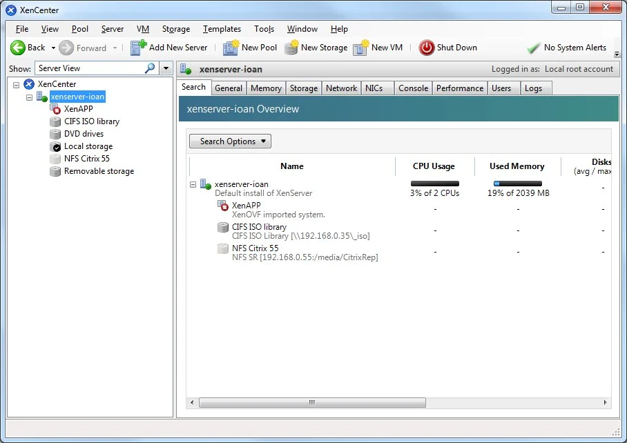
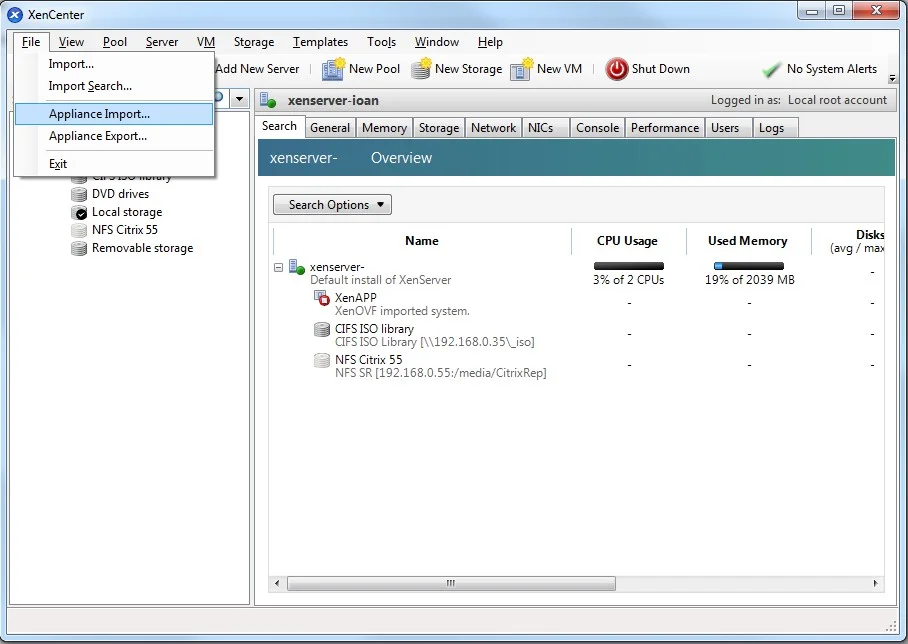
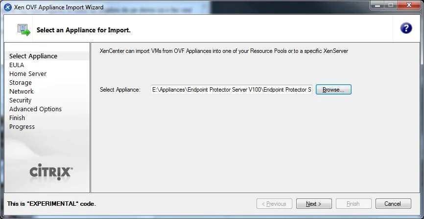
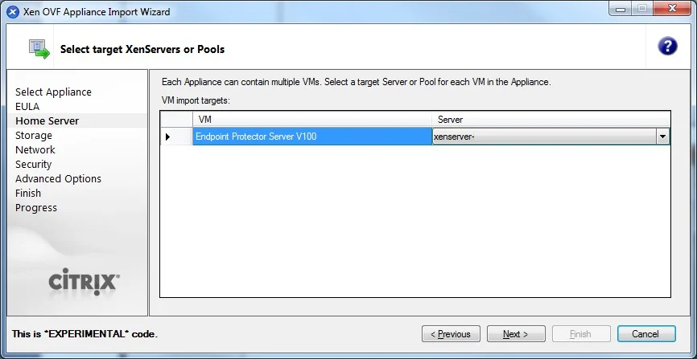
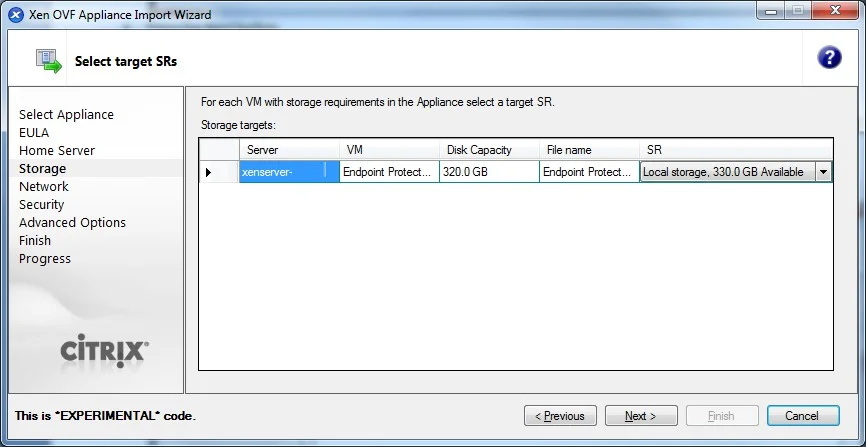
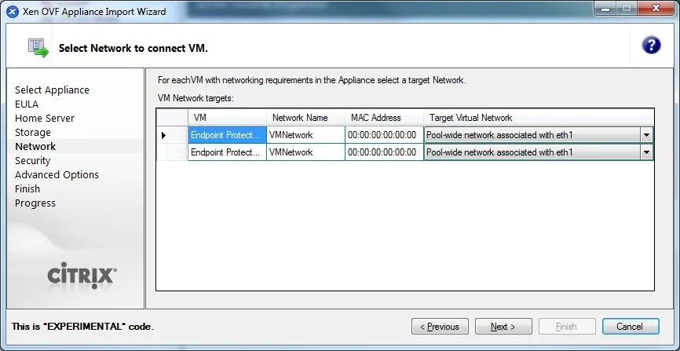
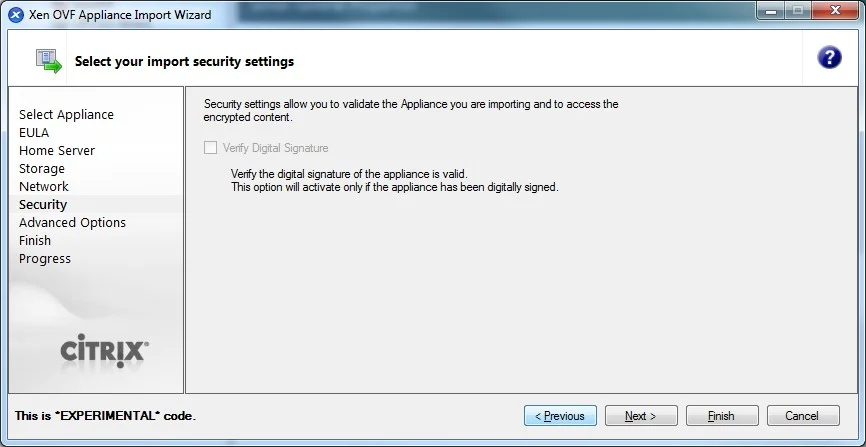
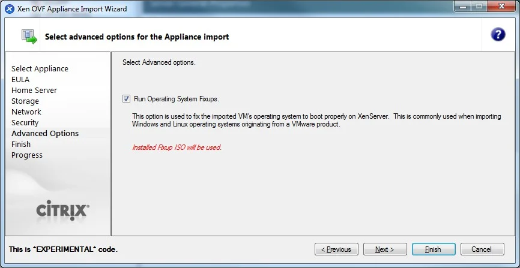
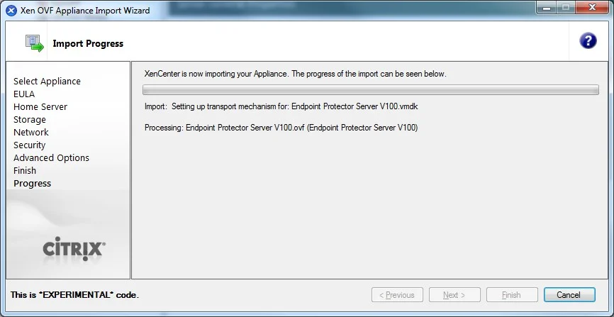

# Citrix XenServer

Citrix XenServer facilitates the import of virtual appliances using the OVF format, catering to
enterprise-grade virtualization needs.

## Citrix XenServer

Citrix XenServer offers straightforward OVF imports for virtual appliances.

Follow the steps to get started with your deployment process.

**Step 1 –** Unzip the downloaded package.

**Step 2 –** Start XenCenter.

**Step 3 –** Go to File and select **Appliance Import**.

**Step 4 –** Select the OVF file and then click **Next**.

**Step 5 –** Read and accept the EULA, then click **Next**.

**Step 6 –** Select the target for the Virtual Appliance.

**Step 7 –** Select the storage location.

**Step 8 –** Select the network (keep default values).

**Step 9 –** On the Security screen, click **Next**.

**Step 10 –** On the Advanced Options screen, click **Next**.

**Step 11 –** On the Finish screen, review the configuration, click **Finish** and wait for the
import to be completed.

The virtual machine is ready to be started.
