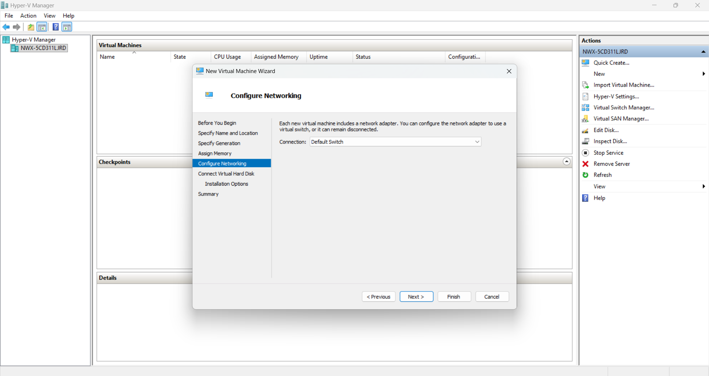

# Hyper-V

Hyper-V Tools utilize the VHD format for virtualization, ensuring seamless integration with
Microsoft environments.

## Implementing Using Microsoft Hyper-V 2022

Follow the steps below to get started with your implementation.

**Step 1 –** Extract the downloaded Endpoint Protector Virtual Appliance .zip package to a location other than the *Documents* or *Downloads* folder and make sure you have ownership of that folder.

**Step 2 -** Open **Hyper-V Manager.**

**Step 3 -** On the right sidebar of the application: click on **New \> Virtual Machine**.

**Step 4 -** On the **Before You Begin** screen, click **Next**.

**Step 5 -** On the **Specify Name and Location**, give your machine a name then click **Next**.

**Step 6 -** On **Specify Generation**, choose **Generation 1**.

**Step 7 -** On **Assign Memory** screen leave the by default memory or make the change you want then click **Next**.

Step 8 - On **Configure Networking screen \> Connection**, choose **Default Switch**.

**Step 9 -** On **Connect Virtual Hard Disk** choose **Use an existing virtual disk**. It is recommended to choose a folder where you have ownership. You can use the location from **Step 1**.

**Step 10 -** Click **Next**.

**Step 11 -** Click **Finish** and end the process.
