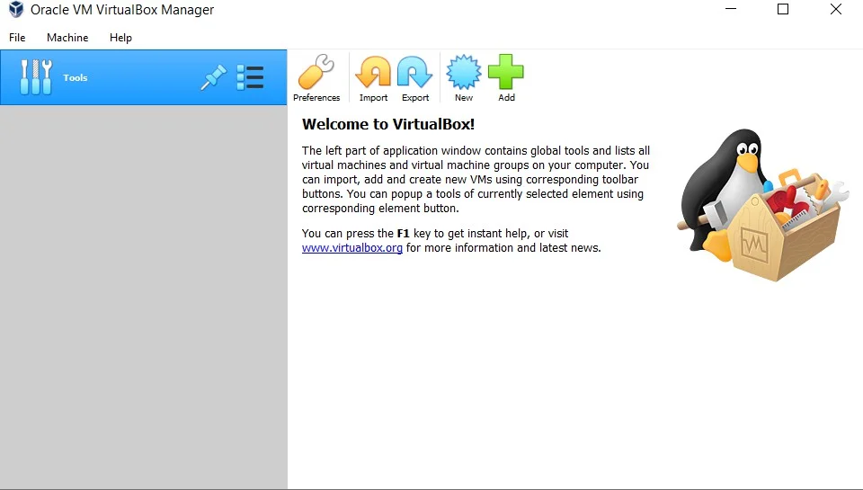
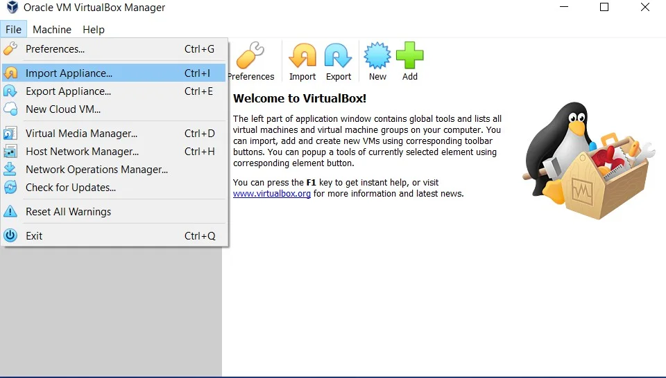
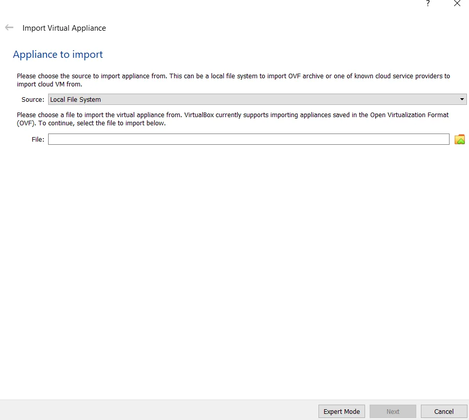
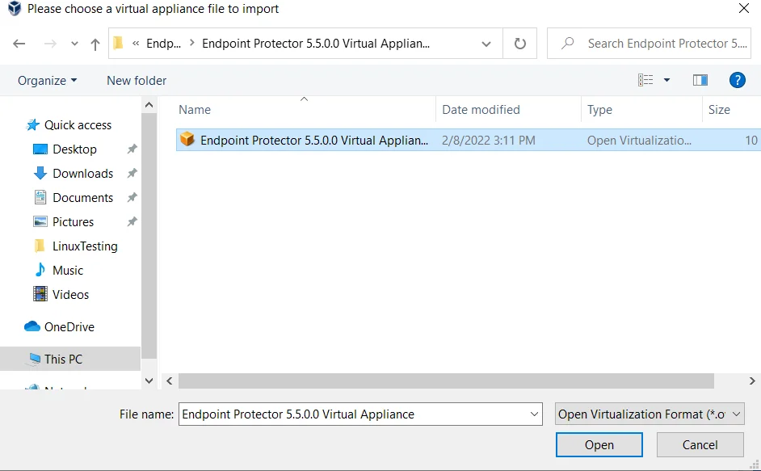
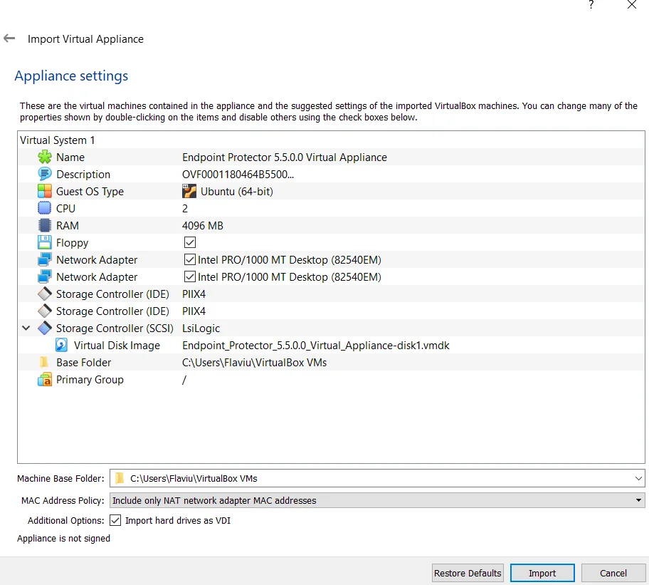
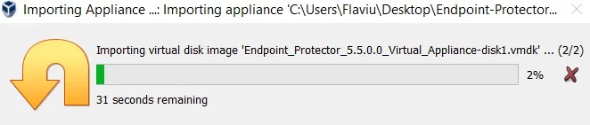
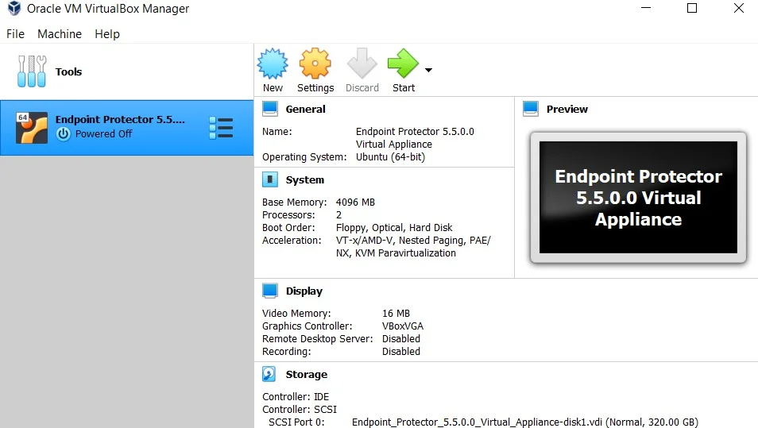

# Oracle VM VirtualBox

Oracle VM VirtualBox supports the OVF format for deploying virtual appliances, offering a
user-friendly open-source solution.

## Oracle VM VirtualBox

Deploy your appliance using Oracle VM VirtualBox with the OVF format.

Follow the steps to get started with the import process.

**Step 1 –** Unzip the downloaded package.

**Step 2 –** Open VirtualBox.

**Step 3 –** Go to File and select **Import Appliance**.

**Step 4 –** On the Appliance to import page, click the **File icon**, browse and select the OVF file
from the extracted zip.

**Step 5 –** Click **Open**.

**Step 6 –** Click **Import**.

**Step 7 –** Wait for the import displayed by the progress bar.

The virtual machine is now ready for use.

