# VMware

VMware Tools support a variety of formats such as OVF, OVA, and VMX for deploying the Endpoint
Protector Virtual Appliance. This section provides the necessary guidance to implement the solution
using different virtualization tools available within the VMware suite.

## Implement Using OVF Format

Leverage the OVF format to efficiently deploy your Endpoint Protector Virtual Appliance across
supported platforms.

### VMware vSphere

VMware vSphere allows you to deploy virtual appliances efficiently using the OVF format.

Follow the steps to set up your virtual machine.

**Step 1 –** Unzip the downloaded package.

**Step 2 –** Start vSphere.

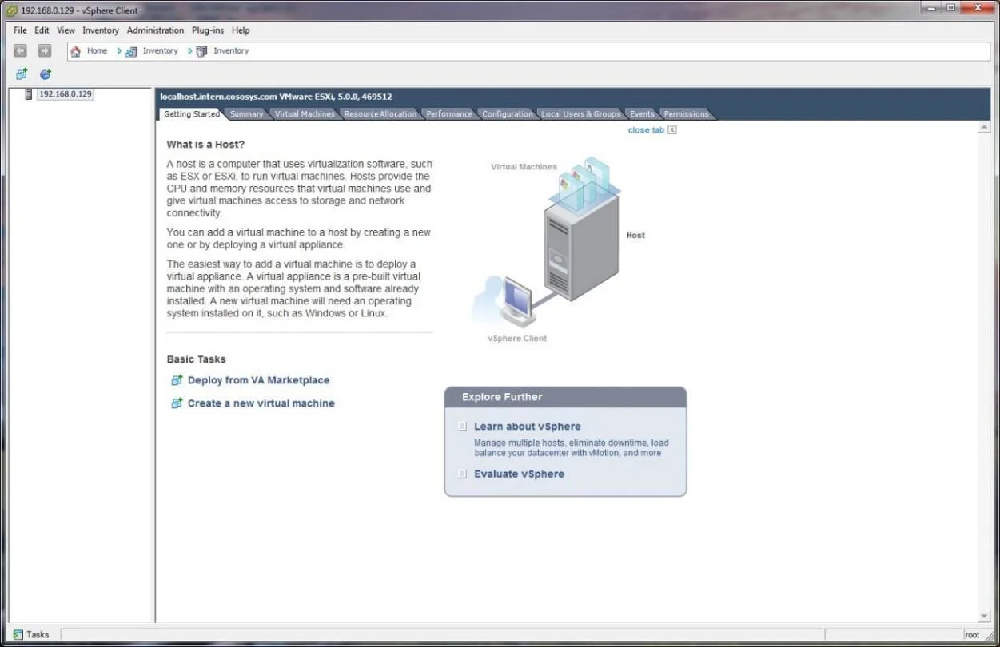

**Step 3 –** Go to File and select **Deploy OVF Template**.

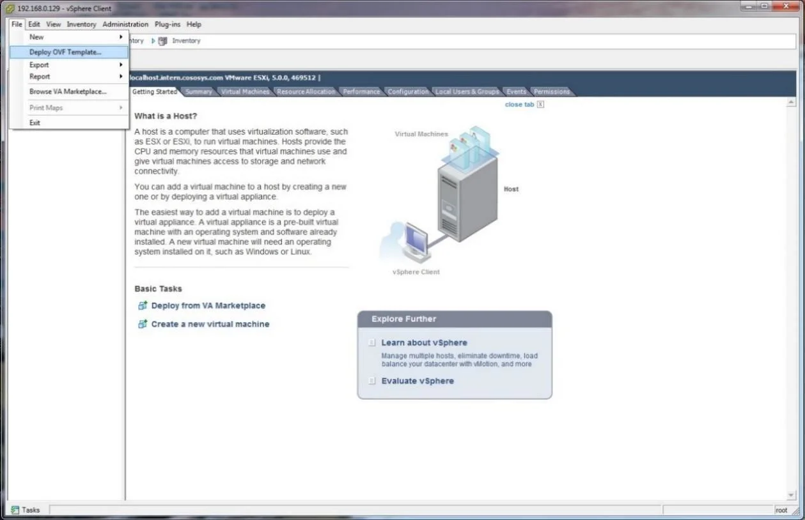

**Step 4 –** Click **Browse**.

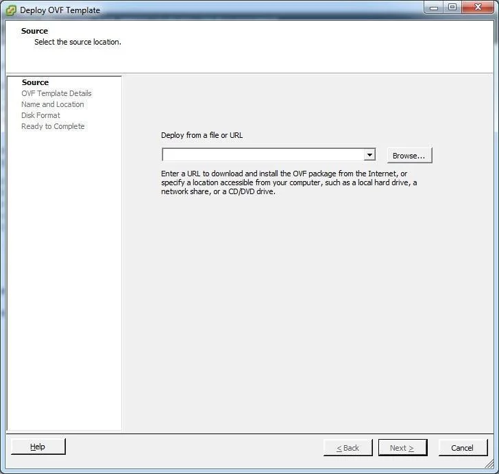

**Step 5 –** Select the OVF file from the extracted zip file.

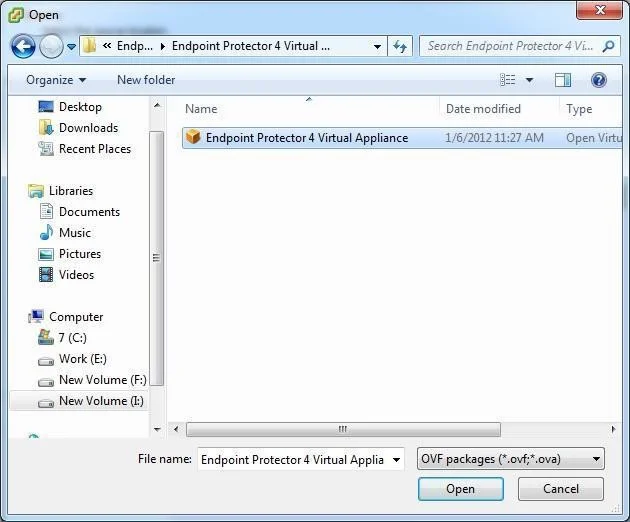

**Step 6 –** Click **Next**.

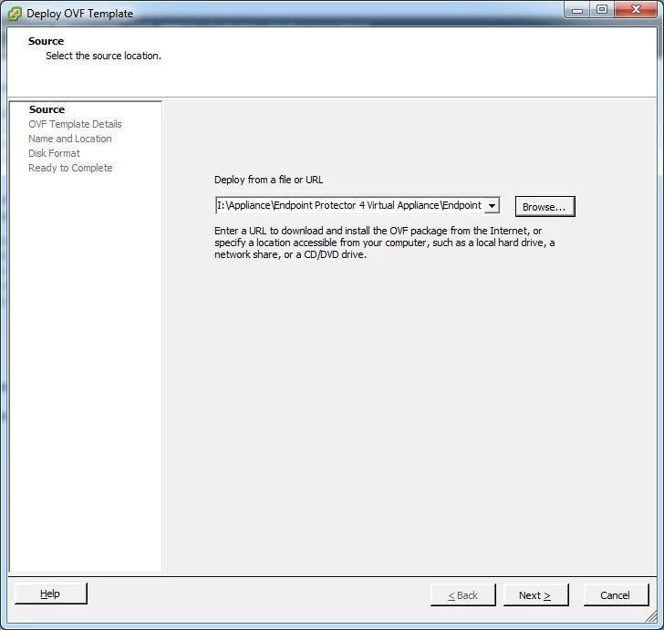

**Step 7 –** Check the OVF Template Details and then click **Next**.

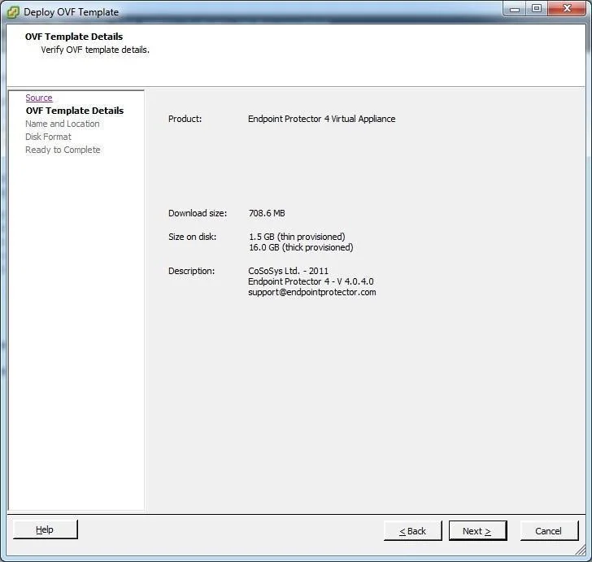

**Step 8 –** Specify the name of the OVF template and click **Next**.

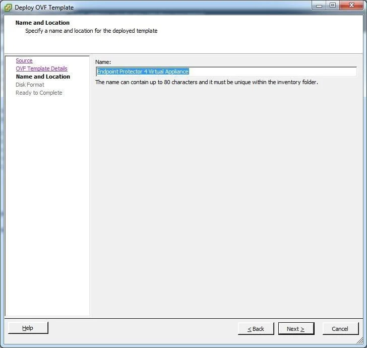

**Step 9 –** Select the Thin provision Disk Format option and click **Next**.

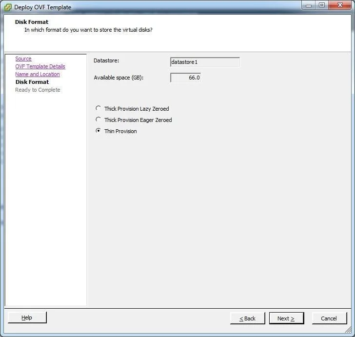

**Step 10 –** Click **Finish** to complete the installation.

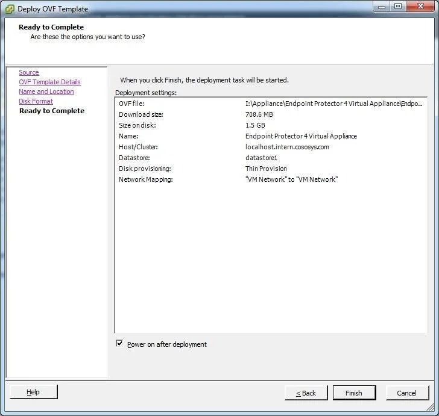

### VMware Workstation

VMware Workstation provides strong virtualization capabilities for deploying Endpoint Protector
using the OVF format.

Follow the steps to get started with setting up your appliance.

**Step 1 –** Extract the downloaded Endpoint Protector Virtual Appliance package and move the files
to the path where your virtual machines are stored.

**Step 2 –** Open VMWare Workstation.

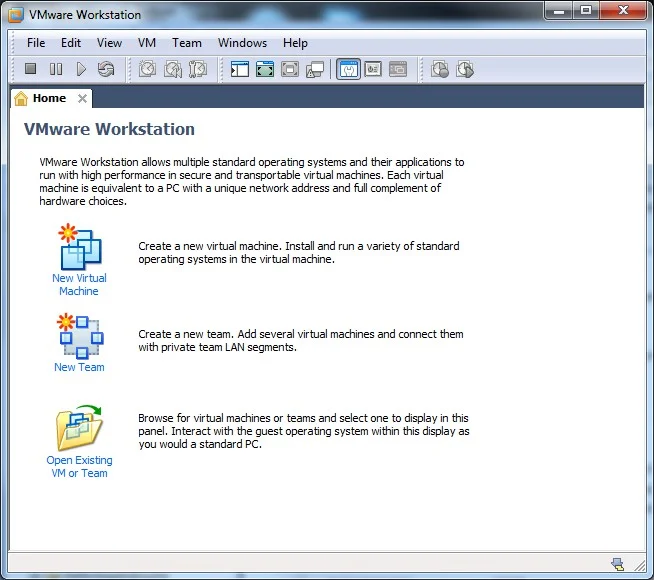

**Step 3 –** Select **Open Existing VM** or **Team**.

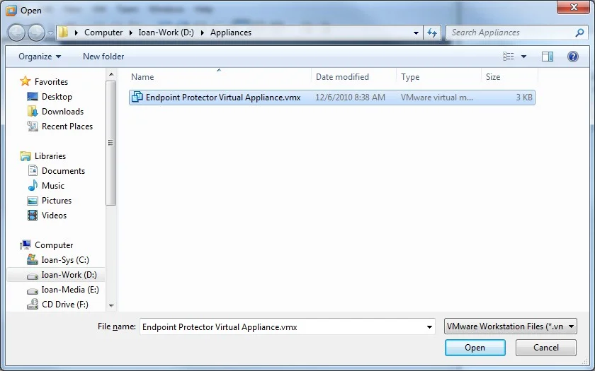

**Step 4 –** After the Virtual Appliance is in your inventory power on the Virtual Appliance.

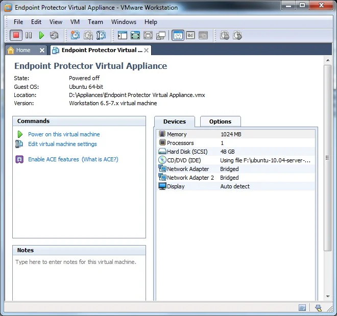

**Step 5 –** If asked if the Virtual Machine was copied or moved, select **I moved it** (if it is
the only Endpoint Protector Virtual Appliance in your network).

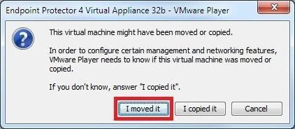

The Virtual Machine is started and ready for use.

## Implement Using VMX Format

Utilize the VMX format to integrate existing virtual machines into your VMware environment.

### VMware Server

In VMware Server environments, the VMX format facilitates the addition of existing virtual machines
to your inventory. Follow the steps below to get started.

**Step 1 –** Extract the downloaded Endpoint Protector Virtual Appliance package and move the files
to the path where your virtual machines are stored.

**Step 2 –** Open your VMware Server web interface and log in.

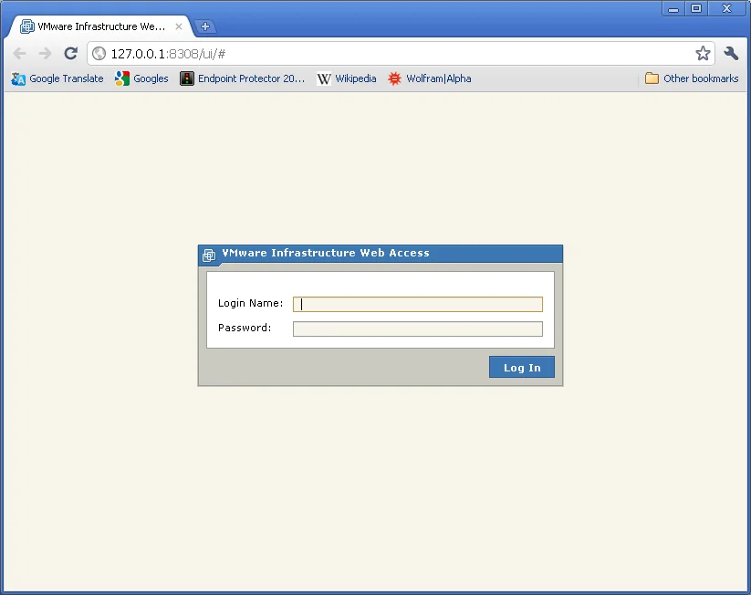

**Step 3 –** Select **Add Virtual Machine to inventory**.

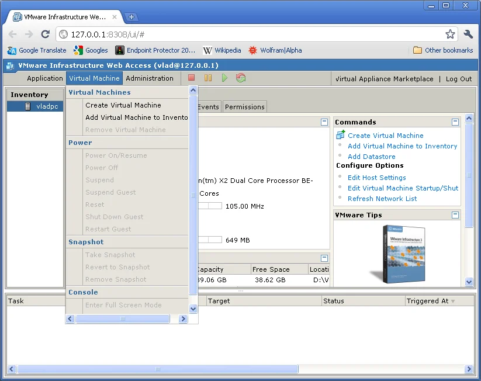

**Step 4 –** Browse in the inventory for Endpoint Protector Virtual Appliance and select the **VMX
file** and click **OK**.

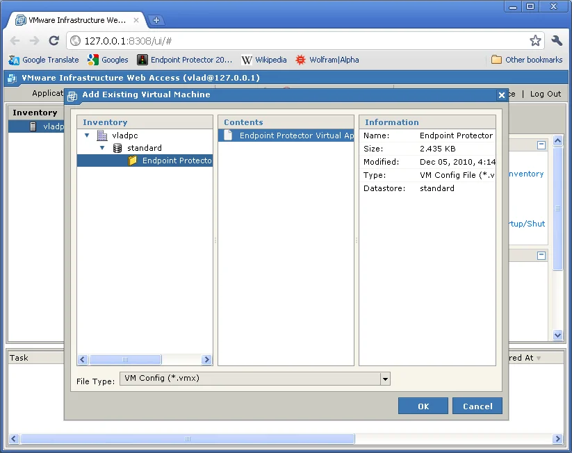

At this point, the Virtual Machine is ready to be started.

### VMware Player

VMware Player supports legacy VMX formats, enabling straightforward virtual machine setup. Follow
the steps below to get started on integrating your appliance.

**Step 1 –** Extract the downloaded Endpoint Protector Virtual Appliance package and move the files
to the path where your virtual machines are stored.

**Step 2 –** Open VMware Player.

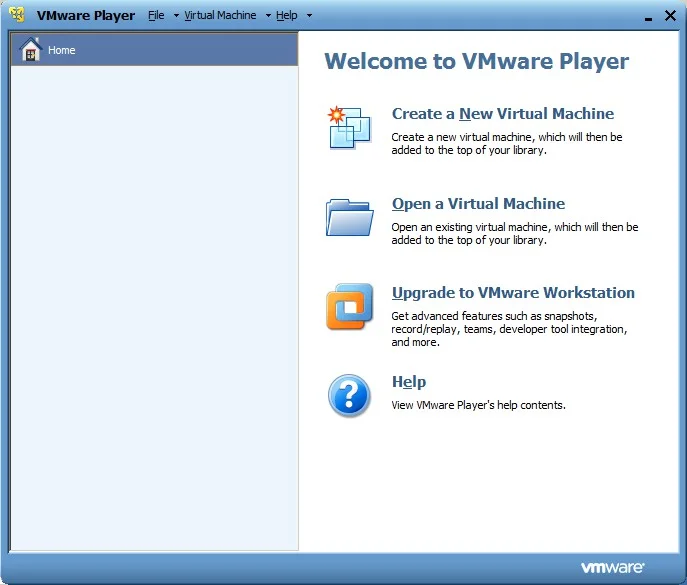

**Step 3 –** Select **Open a Virtual Machine** and select the VMX file from the location where you
extracted it and then click **Open**.

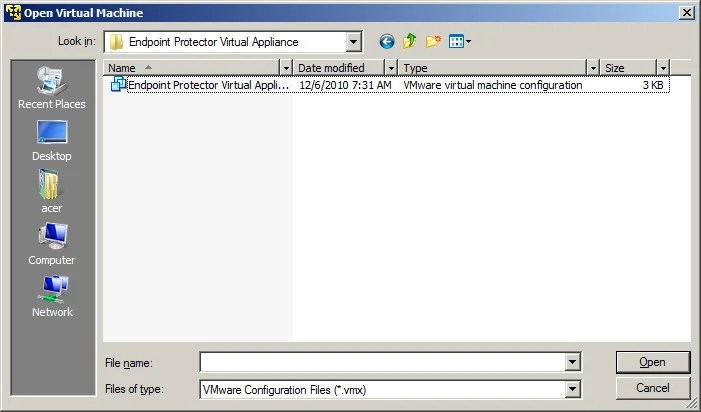

**Step 4 –** After the Virtual Machine is in your inventory click **Play Virtual Machine**.

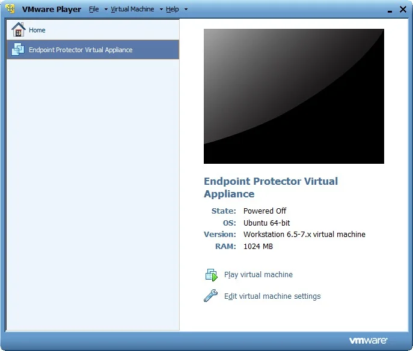

**Step 5 –** If asked if the Virtual Machine was copied or moved, select **I moved it** (if it is
the only Endpoint Protector Virtual Appliance in your network).

At this point, the Virtual Machine is ready to be started.

:::warning
Do not suspend the VMware Player while Endpoint Protector Virtual Appliance is running.
:::

:::warning
Do not shut down your computer while VMware Player is running.

:::
