# VMware

VMware Tools support multiple formats for deploying the Endpoint Protector Virtual Appliance: Open Virtualization Format (OVF), OVA, and Virtual Machine Exchange (VMX). This section provides the necessary guidance to implement the solution
using different virtualization tools available within the VMware suite.

## Implement Using OVF Format

Deploy your Endpoint Protector Virtual Appliance across supported platforms using the OVF format.

### VMware vSphere

Deploy virtual appliances efficiently using the OVF format with VMware vSphere.

**Step 1 –** Unzip the downloaded package.

**Step 2 –** Start vSphere.

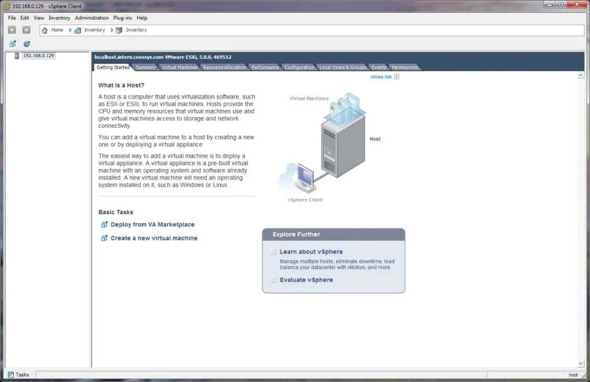

**Step 3 –** Go to File and select **Deploy OVF Template**.

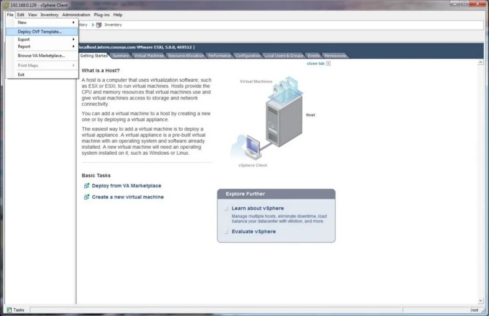

**Step 4 –** Click **Browse**.

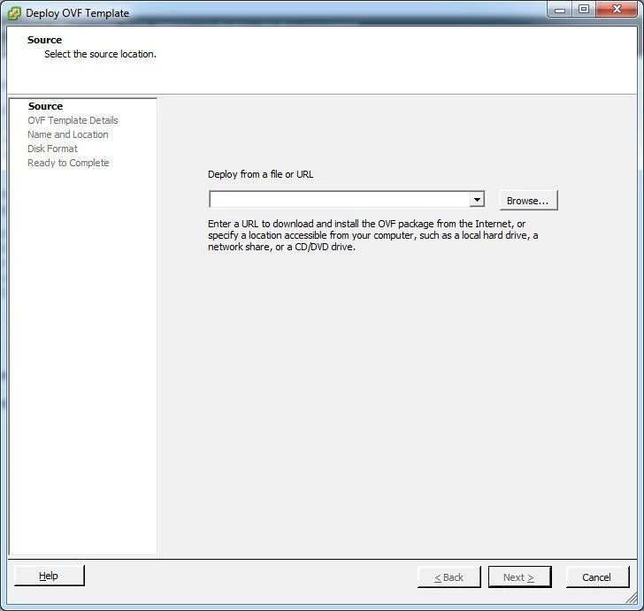

**Step 5 –** Select the OVF file from the extracted zip file.

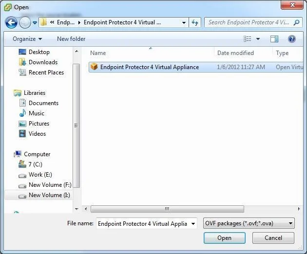

**Step 6 –** Click **Next**.

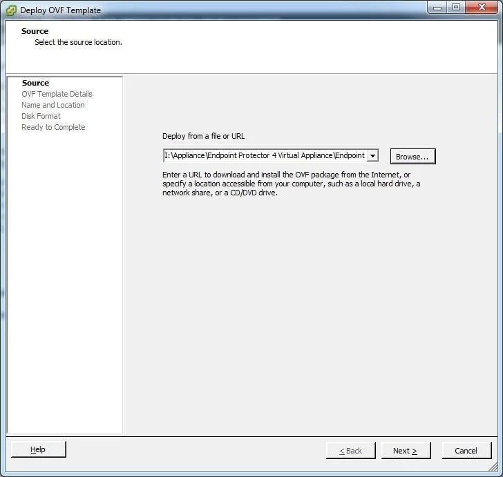

**Step 7 –** Check the OVF Template Details and then click **Next**.

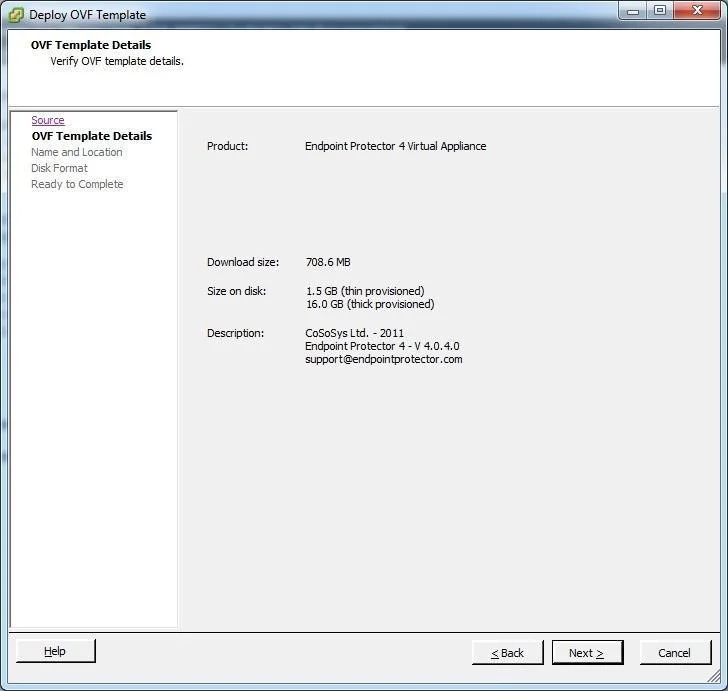

**Step 8 –** Specify the name of the OVF template and click **Next**.

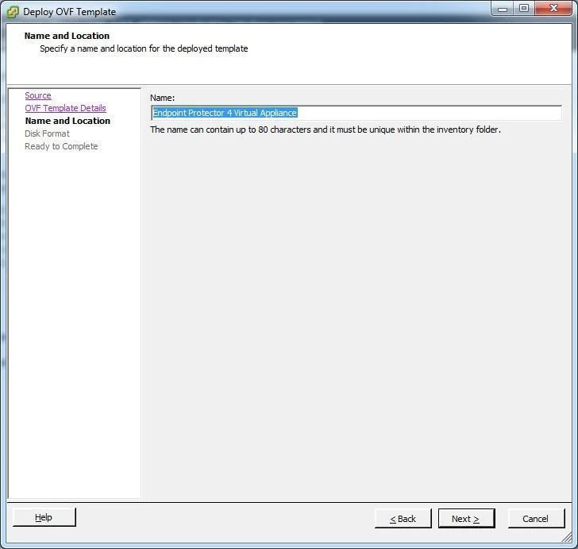

**Step 9 –** Select the Thin provision Disk Format option and click **Next**.

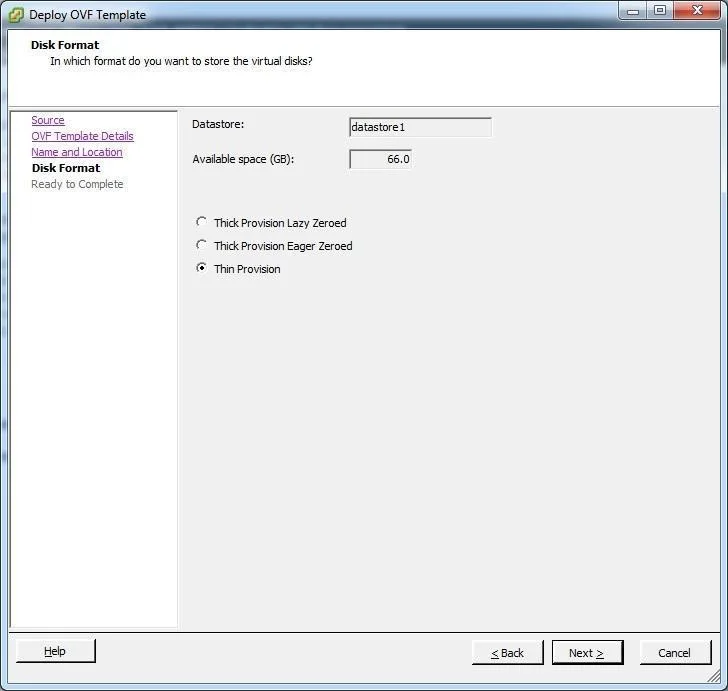

**Step 10 –** Click **Finish** to complete the installation.

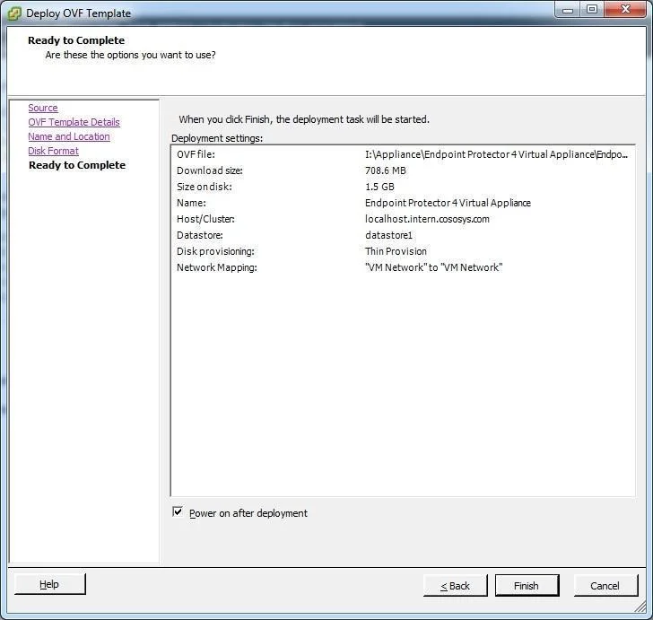

### VMware Workstation

Deploy Endpoint Protector using the OVF format with VMware Workstation, which provides strong virtualization capabilities.

**Step 1 –** Extract the downloaded Endpoint Protector Virtual Appliance package and move the files
to the path where your virtual machines are stored.

**Step 2 –** Open VMWare Workstation.

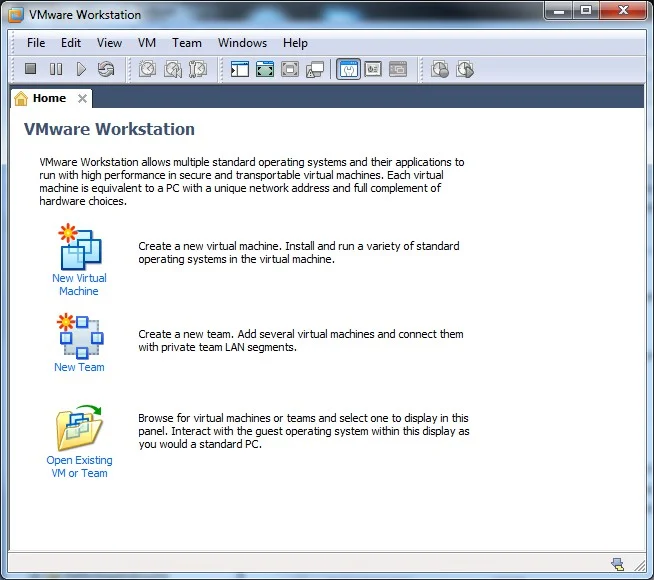

**Step 3 –** Select **Open Existing VM** or **Team**.

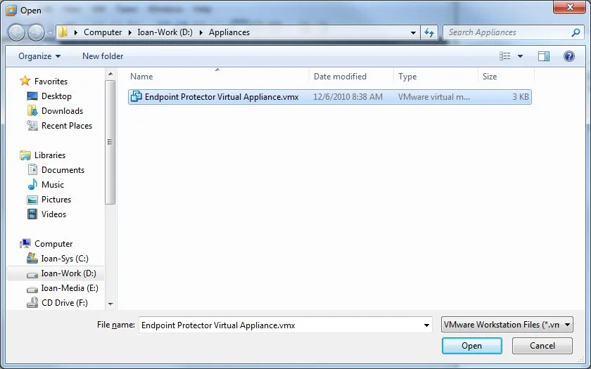

**Step 4 –** After the Virtual Appliance is in your inventory power on the Virtual Appliance.

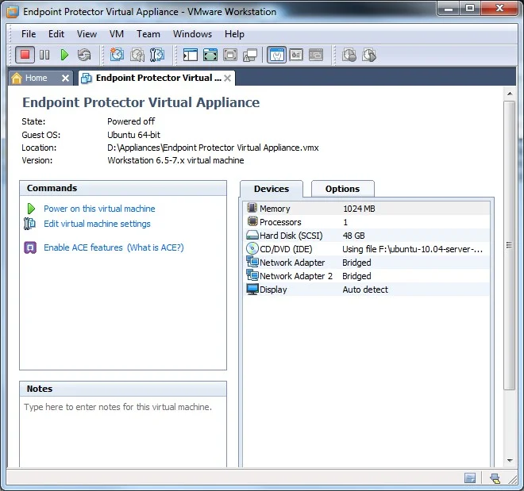

**Step 5 –** If asked if the Virtual Machine was copied or moved, select **I moved it** (if it is
the only Endpoint Protector Virtual Appliance in your network).

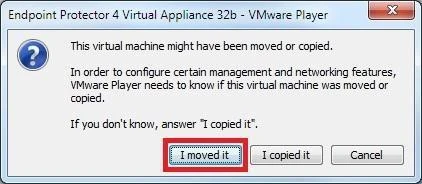

The Virtual Machine is started and ready for use.

## Implement Using VMX Format

use the VMX format to integrate existing virtual machines into your VMware environment.

### VMware Server

In VMware Server environments, the VMX format facilitates the addition of existing virtual machines
to your inventory. Follow the steps below to get started.

**Step 1 –** Extract the downloaded Endpoint Protector Virtual Appliance package and move the files
to the path where your virtual machines are stored.

**Step 2 –** Open your VMware Server web interface and log in.

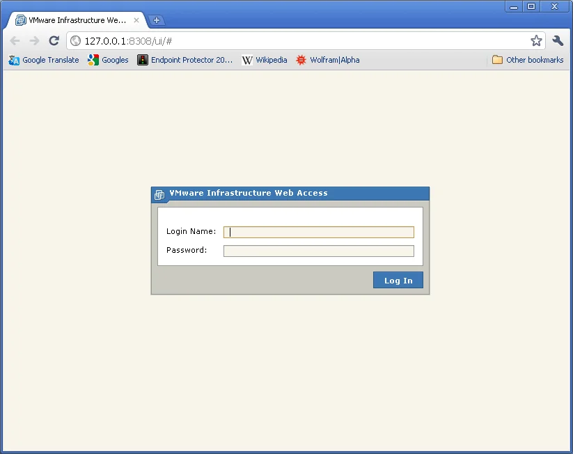

**Step 3 –** Select **Add Virtual Machine to inventory**.

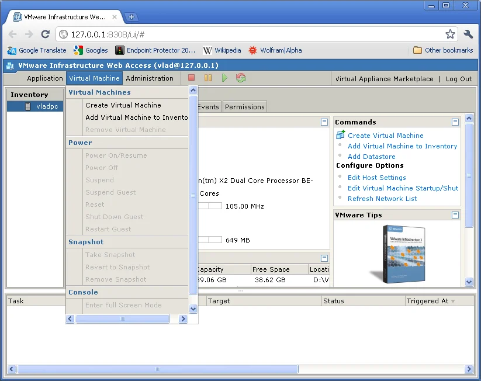

**Step 4 –** Browse in the inventory for Endpoint Protector Virtual Appliance and select the **VMX
file** and click **OK**.

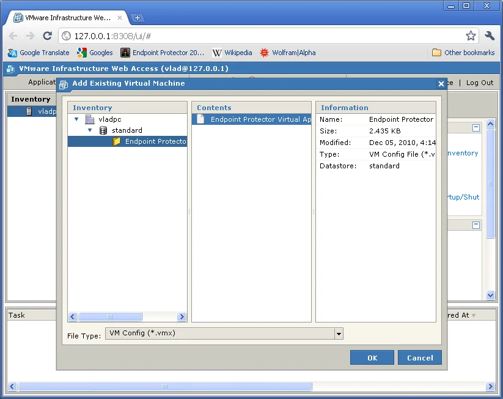

At this point, the Virtual Machine is ready to be started.

### VMware Player

VMware Player supports legacy VMX formats for virtual machine setup. Follow
the steps below to integrate your appliance.

**Step 1 –** Extract the downloaded Endpoint Protector Virtual Appliance package and move the files
to the path where your virtual machines are stored.

**Step 2 –** Open VMware Player.

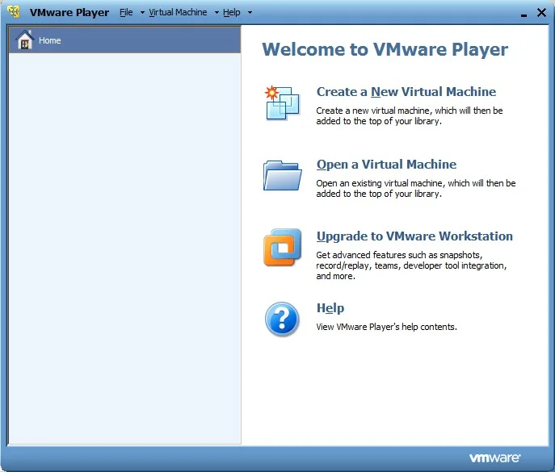

**Step 3 –** Select **Open a Virtual Machine** and select the VMX file from the location where you
extracted it and then click **Open**.

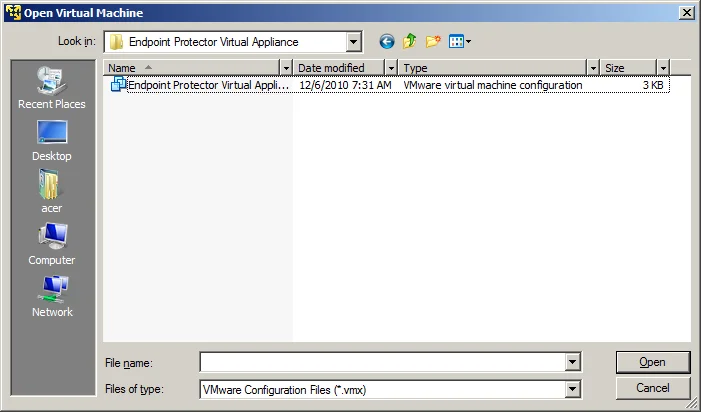

**Step 4 –** After the Virtual Machine is in your inventory click **Play Virtual Machine**.

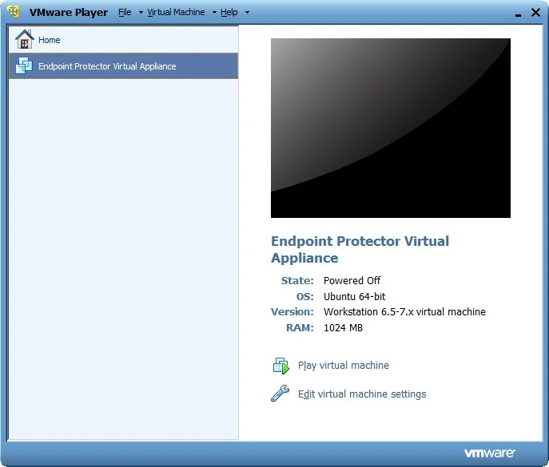

**Step 5 –** If asked if the Virtual Machine was copied or moved, select **I moved it** (if it is
the only Endpoint Protector Virtual Appliance in your network).

At this point, the Virtual Machine is ready to be started.

:::warning
Don't suspend the VMware Player while Endpoint Protector Virtual Appliance is running.
:::

:::warning
Don't shut down your computer while VMware Player is running.

:::
