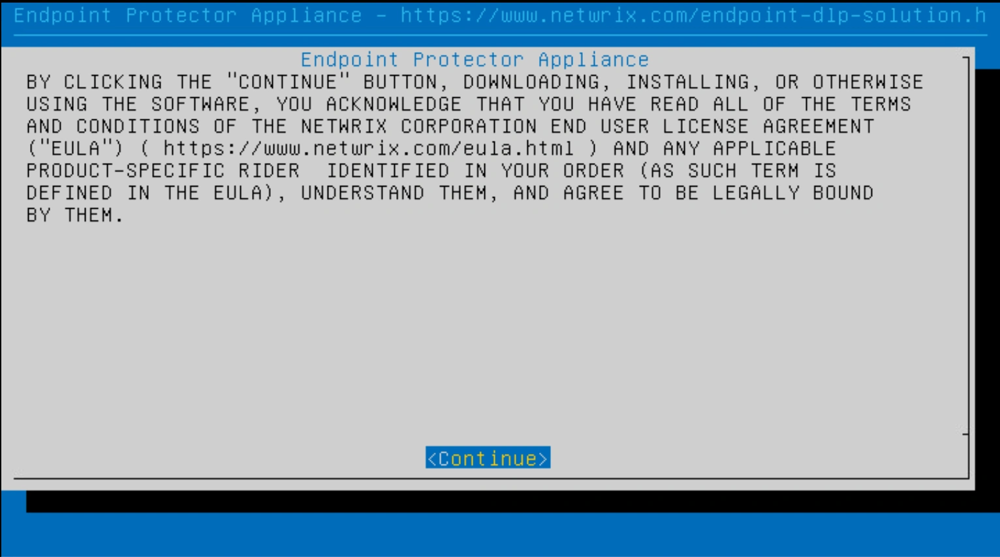
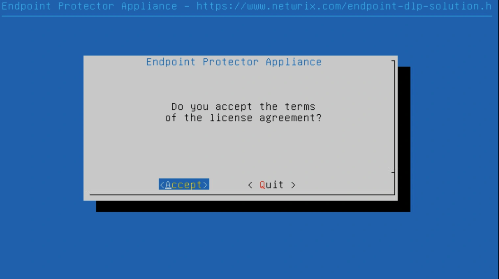
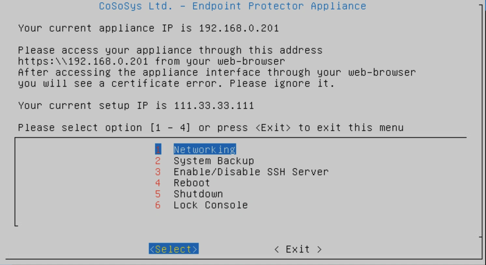
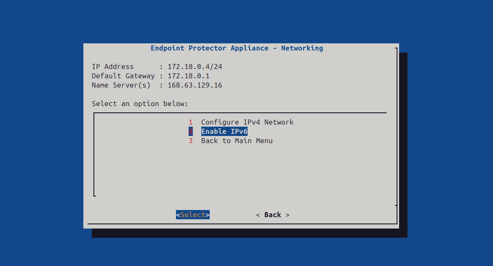
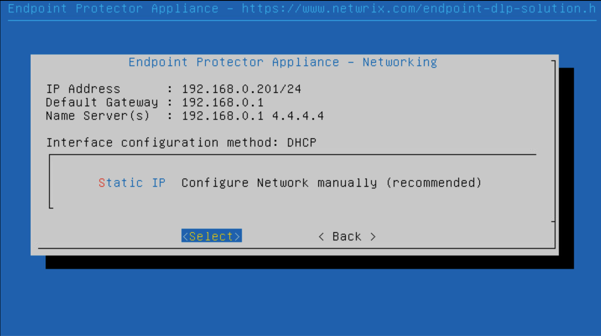
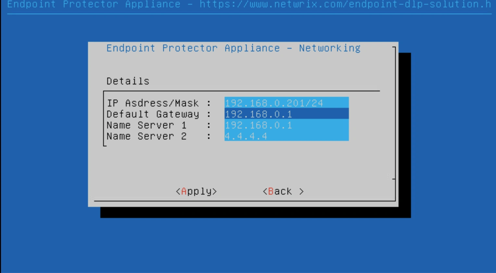
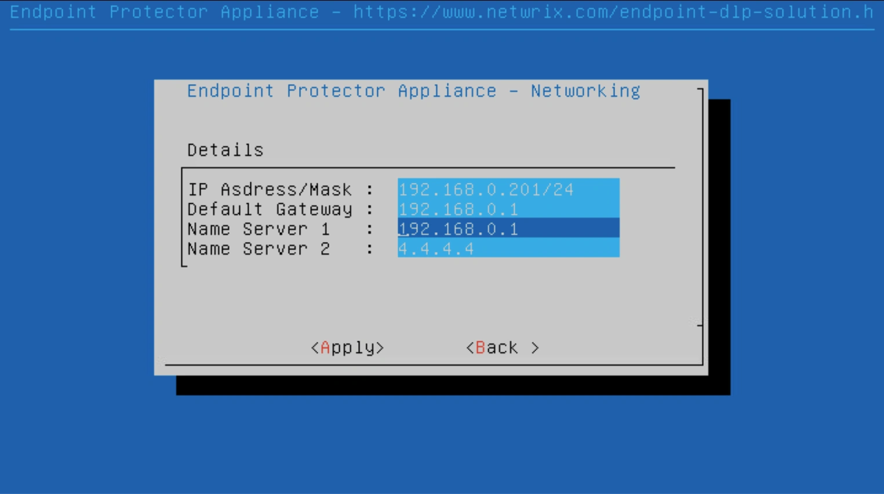

# Setup Wizard

The Endpoint Protector Appliance requires incoming traffic for ports 443 inbound to be whitelisted
from the firewall. They are used for:

- Endpoint Protector Server and Client communication: 443 inbound

Follow the steps to configure the Endpoint Protector Appliance for the first time.

**Step 1 –** Select **Continue** when finished reading the End User License Agreement.

**Step 2 –** Select **Accept**.

**Step 3 –** Select **Networking**.

**Step 4 –** The configuration methods are now available.
Starting with version 2509, only the manual configuration option is available. Also, starting with version 2512, the options available for networking configuration include an option to use IPV4 and and option for IPV6. One one option must be selected.

:::warning
Modifying network configuration creates certificate a regeneration operation which temporarily stops communication between server and clinet
:::

## Manual Configuration

As mentioned before, starting with version 2509, only the manual configuration option is available. But even for older versions, for precise control, use manual configuration to set the IP address and default gateway, ensuring the appliance is correctly set up and accessible.

**Step 1 –** Select **Configure Network manually** (IPV4 example).

**Step 2 –** Set the IP Address, and Default Gateway (in our example we set the IP Address as
192.168.7.94 and the Default Gateway as 192.168.7.1).

**Step 3 –** Press **Tab**.

**Step 4 –** Select **Apply**. The virtual appliance is now accessible from the configured IP
Address. (e.g., https:// 192.168.7.94).
