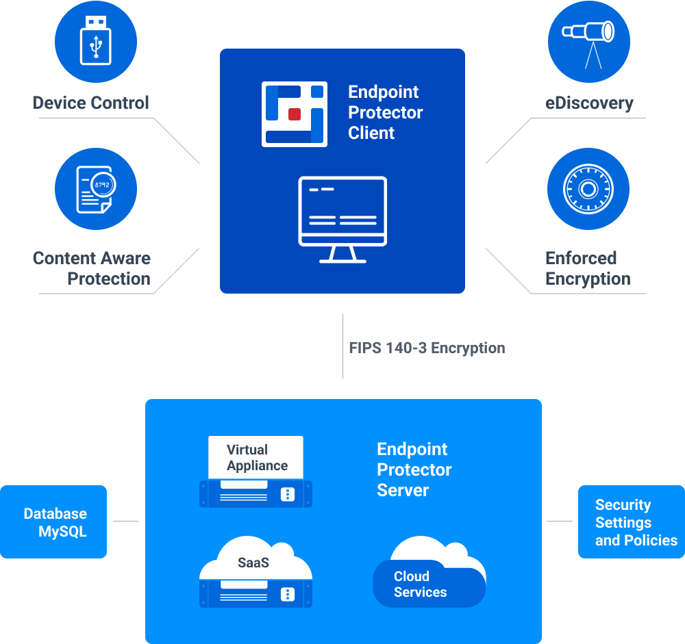
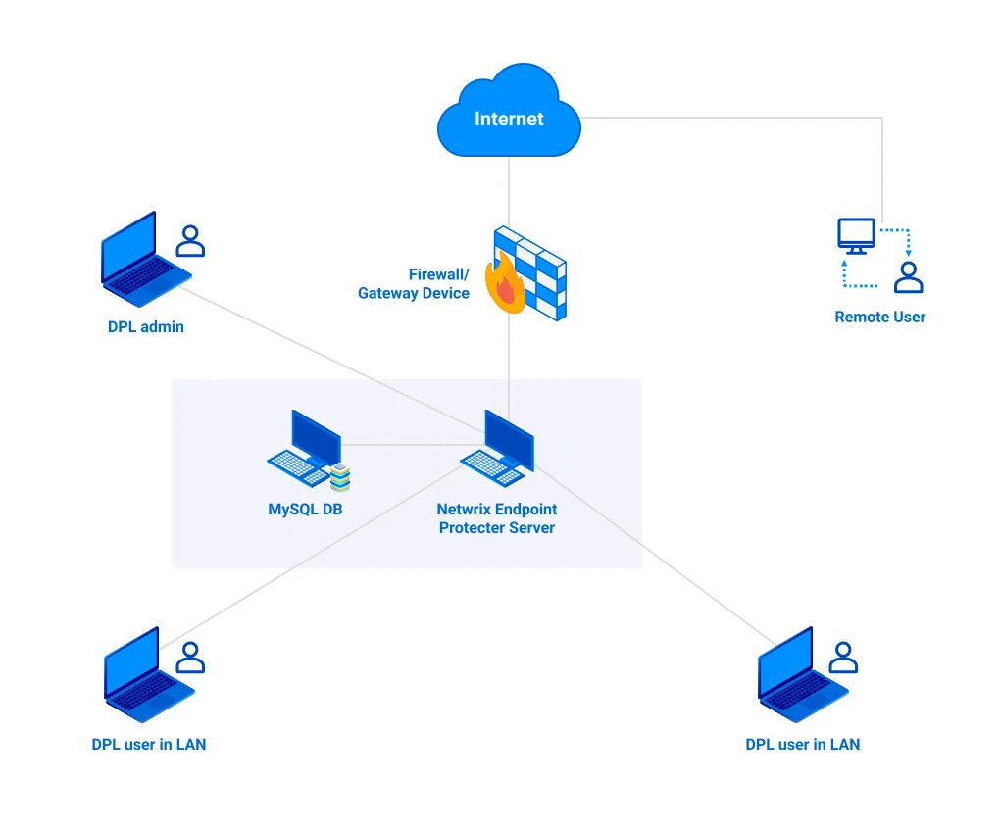

# Main Components

Endpoint Protector is designed around several physical entities:

- Computers – The Windows, Mac, and Linux workstations that have the Endpoint Protector Client
  installed.
- Devices – The devices that are currently supported by Endpoint Protector (USB devices, digital
  photo cameras, USB memory cards, etc).
- Users – The user who will be handling the devices and the computers.

The Server side of Endpoint Protector has different parts working close together:

- Endpoint Protector Hardware or Virtual Appliance – containing Operating System, Database, etc.
- Web Service – communicating with the Endpoint Protector Clients and storing the information
  received from them.
- Endpoint Protector User Interface – managing the existing devices, computers, users, groups, and
  their behavior in the entire system.

The Client-side of Endpoint Protector has two different components:

- Endpoint Protector Client – enforcing the rights and settings received from the Server on Windows,
  Mac, and Linux computers; it also automatically deploys Enforced Encryption on the USB storage
  devices.
- Enforced Encryption Client – enforcing FIPS 140-3 validated encryption on USB storage devices as specified from the Server; it is a stand-alone application compatible with Windows and Mac computers.

## Architecture Overview

The diagram below illustrates the network architecture for the Endpoint Protector system. This setup
enables comprehensive Data Loss Prevention (DLP) across both local and remote users, securing
sensitive information and ensuring compliance with security policies.

### Key Components and Data Flow

**Endpoint Protector Server**

This server is the core of Endpoint Protector, enforcing security policies and monitoring data flows
across the organization. It communicates with all endpoints to ensure compliance with data
protection rules and logs activity for auditing purposes.

**MySQL Database**

The Endpoint Protector server is integrated with a MySQL database that stores configuration data,
user activity logs, and incident reports. This allows for centralized data management, enabling
efficient policy enforcement and detailed reporting.

**Firewall/Gateway Device**

Acting as a security barrier, the firewall/gateway protects the network from external threats and
manages secure connections for remote users. It ensures that only authorized traffic reaches the
Endpoint Protector Server, safeguarding internal resources.

**DLP Admin**

The Data Loss Prevention (DLP) Admin manages the entire Endpoint Protector infrastructure. They
configure policies, monitor endpoint activity, and address potential data breaches. The admin uses
the server’s interface to adjust security rules and respond to incidents as they occur.

**DLP Users (LAN and Remote):**

- LAN Users – These internal users are connected to the organization’s Local Area Network (LAN), and
  their devices are monitored by the Endpoint Protector server to prevent unauthorized data
  transfers.
- Remote Users – Remote employees access the network through secure channels via the
  firewall/gateway. Their activities are also monitored by Endpoint Protector to ensure consistent
  enforcement of policies.
