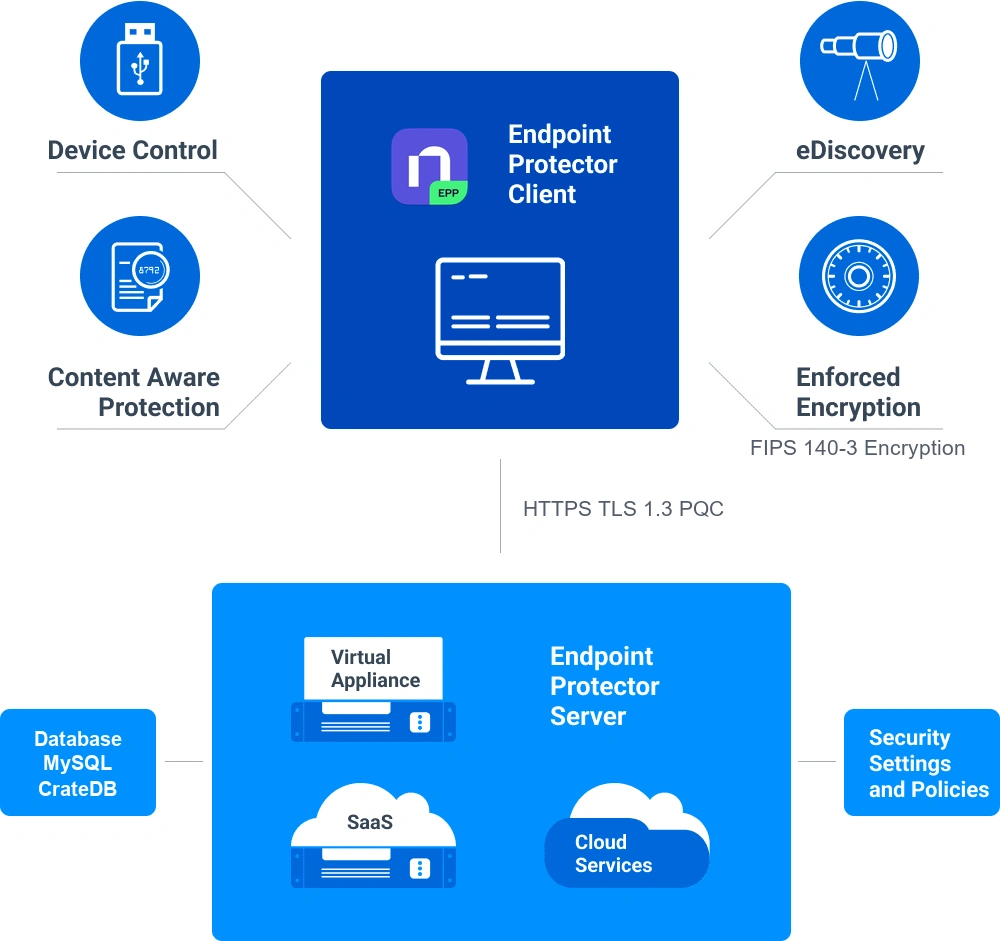
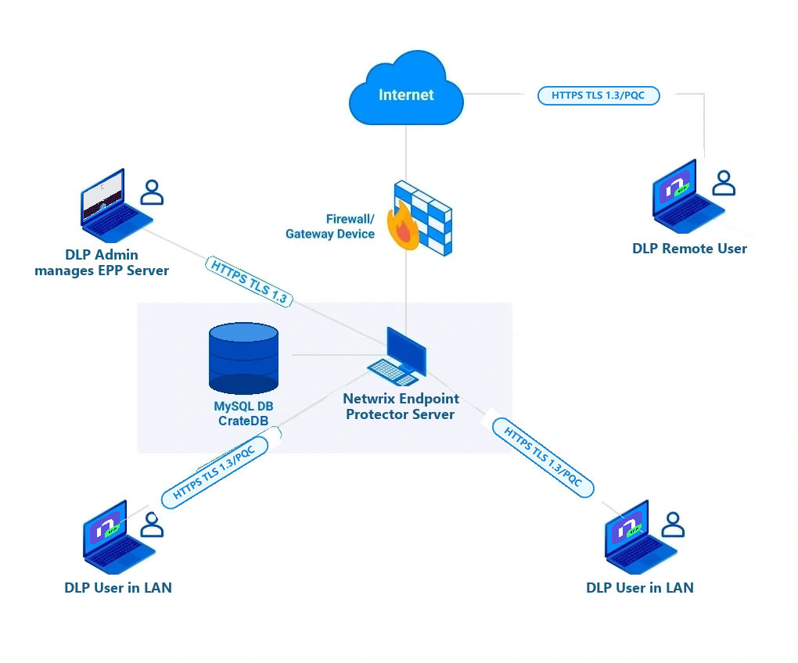

# Main components

Endpoint Protector's design centers on several physical entities:

- Computers—the Windows, macOS, and Linux workstations that run the Endpoint Protector Client
- Devices—the devices that Endpoint Protector supports (USB devices, digital photo cameras, USB memory cards, and others)
- Users—the users who handle the devices and the computers

The server side of Endpoint Protector has several parts working together:

- **Endpoint Protector Hardware or Virtual Appliance**—contains the operating system, database, and supporting services
- **MySQL Database**—stores configuration data, agent provisioning settings, information about users and groups, and policy definitions
- **CrateDB**—a distributed SQL database that stores Device Control, Content Aware Protection, and eDiscovery logs. CrateDB, optimized for time-series log data, provides faster queries and horizontal scalability for environments with high log volumes
- **Redis**—an in-memory data store that buffers incoming agent logs before Endpoint Protector ingests them into CrateDB
- **Web Service**—communicates with the Endpoint Protector Clients and stores the information they send
- **Endpoint Protector User Interface**—manages the existing devices, computers, users, groups, and their behavior in the system

The client side of Endpoint Protector has two components:

- **Endpoint Protector Client**—enforces the rights and settings the server sends on Windows, macOS, and Linux computers. The client also automatically deploys Enforced Encryption on USB storage devices.
- **Enforced Encryption Client**—enforces FIPS 140-3 validated encryption on USB storage devices as the server specifies. This is a standalone application compatible with Windows and macOS computers.

## Architecture overview

The following diagram illustrates the network architecture for the Endpoint Protector system. This setup
enables comprehensive Data Loss Prevention (DLP) across both local and remote users, securing
sensitive information and ensuring compliance with security policies.

### Key components and data flow

**Endpoint Protector server**

The server is the core of Endpoint Protector, enforcing security policies and monitoring data flows
across the organization. It communicates with all endpoints to ensure compliance with data
protection rules and logs activity for auditing purposes.

**MySQL database**

The Endpoint Protector server uses a MySQL 8.4 LTS database that stores configuration data, agent provisioning settings,
user activity logs, and incident reports. MySQL handles agent registration, policy definitions, entity management, and other provisioning data.

**CrateDB**

CrateDB is a distributed SQL database optimized for time-series log data. Endpoint Protector uses CrateDB to store Device Control, Content Aware Protection, and eDiscovery logs. You can deploy CrateDB as a single node on the Endpoint Protector (EPP) server appliance or as a multi-node cluster for environments that generate high log volumes. You can add cluster nodes with minimal downtime and availability impact.

**Redis**

Redis serves as an in-memory buffer for incoming agent logs. When endpoints send log data to the server, Redis temporarily caches the logs before Endpoint Protector ingests them into CrateDB. This replaces the previous disk-based caching mechanism, eliminating filesystem read and write bottlenecks and enabling higher throughput.

**Firewall/gateway device**

The firewall/gateway protects the network from external threats and
manages secure connections for remote users. It ensures that only authorized traffic reaches the
Endpoint Protector server, safeguarding internal resources.

**DLP administrator**

The Data Loss Prevention (DLP) administrator manages the Endpoint Protector infrastructure, configures policies, monitors endpoint activity, and addresses potential data breaches. The administrator uses the server's interface to adjust security rules and respond to incidents.

**DLP users (LAN and Remote):**

- LAN Users—internal users connected to the organization's Local Area Network (LAN), whose devices the Endpoint Protector server monitors to prevent unauthorized data transfers
- Remote Users—remote employees who access the network through secure channels via the firewall/gateway, whose activities Endpoint Protector monitors to ensure consistent policy enforcement

### Server runtime requirements

The Endpoint Protector server runs on the following runtime components:

| Component | Version |
|-----------|---------|
| PHP | 8.5 |
| MySQL | 8.4 LTS |
| CrateDB | Distributed SQL (configurable as single-node or cluster) |
| Redis | 7.x |
| Nginx | Web server and reverse proxy |
| Ubuntu | Server operating system |

### Client to server communication

This section describes how TLS encrypts communication between the Endpoint Protector Server and the Endpoint Protector Client.

- The Endpoint Protector Server enables TLS 1.2 and TLS 1.3 by default. Endpoint Protector always negotiates the highest TLS version available on both the Client and the Server, and selects the strongest cipher suite TLS 1.3 offers.
- Netwrix Support can enable TLS 1.1 upon request for backward compatibility with older agents and appliances.

### Endpoint Protector Client TLS

**TLS 1.3 Compatibility**

**Endpoint Protector (EPP)**

| OS      | Older version                                                         | Newer version                                                        | Endpoint Protector Client Features                                                                                                                    |
| ------- | ---------------------------------------------------------------------- | ------------------------------------------------------------------------ | -------------------------------------------------------------------------------------------------------------------------------------------------------- |
| Windows | Not compatible with Windows 7, XP, and versions older than Windows 10 | Compatible with Windows 10, version 1903 and higher, and Windows 11 | Version 2608 and later uses a custom bundled OpenSSL package.   Version 2605 and earlier uses Windows' built-in TLS encryption engine (Schannel). |
| macOS   | Compatible                                                              | Compatible                                                                | Uses a custom bundled OpenSSL package shipped with the Endpoint Protector Client.                                                                       |
| Linux   | Not compatible                                                          | Compatible                                                                | Uses Linux's built-in OpenSSL engine.                                                                                                                     |

**Enforced Encryption (EE)**

| OS      | Enforced Encryption Client Features          |
| ------- | --------------------------------------------- |
| Windows | TLS over wolfCrypt SSL, FIPS 140-3 Validated   |
| macOS   | TLS over wolfCrypt SSL, FIPS 140-3 Validated   |

### Endpoint Protector PQC encryption

Starting with the 2608 Client and Server release, Endpoint Protector supports Post-Quantum Cryptography (PQC) encryption for Client to Server communication.

You don't need to take any action to enable PQC. Endpoint Protector negotiates it transparently and automatically as the highest available encryption option when both the Client and the Server are on version **2608.x.x.x** or later. If either side runs an older version, Endpoint Protector falls back to the highest TLS version both sides support.
