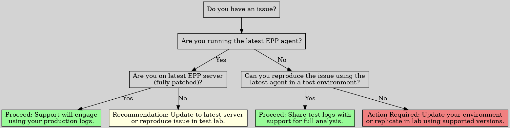
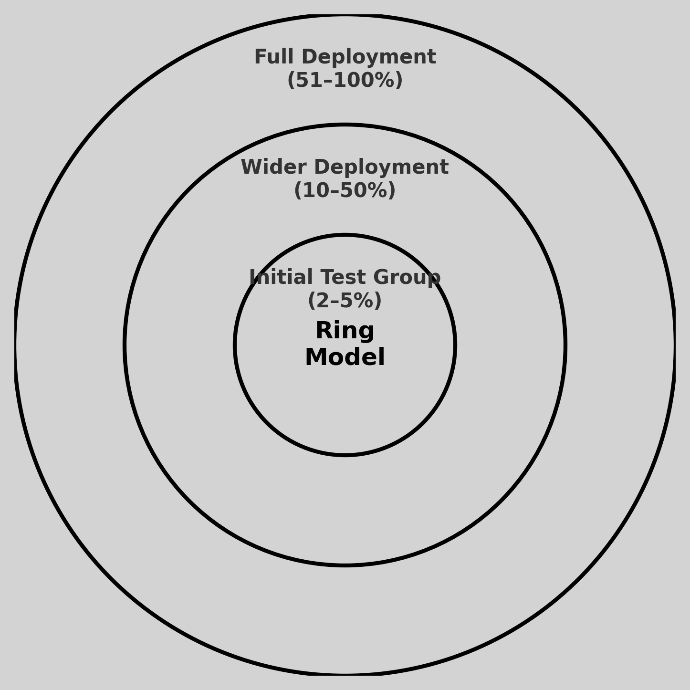

# Netwrix Endpoint Protector Agent Support Policy

At Netwrix, we are committed to providing high-performing solutions. To achieve this and to ensure the best experience for our customers, we support and enhance only the current shipping version of the Netwrix Endpoint Protector (EPP) agent.

The latest EPP agent for each OS (and the latest EasyLock client) can **only** be downloaded in the Netwrix portal. Note, some previous versions of EPP Server allowed you to acquire the agent directly from within the server. That has been phased out for this modern approach.

Below are key points about our support policy and recommendations for rolling out agent updates.

NOTE: This supportability document is only for the EPP agent and client components, and not about the Server. For a server specific supportability statement, read our companion guide “Netwrix Endpoint Protector Server-Side Support Policy.”

NOTE: EPP agents are really two parts, the actual EPP agent and the EasyLock client. This support guide applies to both the EPP agent and the Easy Lock client equally.

## Support Policy Overview

Here is the Agent support policy highlights:

- Current Shipping Version Only: Netwrix supports only the latest available version of the EPP agent for each client OS. This ensures access to the newest features, performance improvements, and bug fixes.
- Bug Fixes: Critical bugs are addressed immediately and then re-shipped to the Netwrix portal available for all customers. There is no specific timeline when the EPP agent will ship.
- Feature Updates: New features are generally introduced alongside EPP server releases (or patches to EPP servers). As such, the latest EPP client will be able to accept those new directives coming from the fully-patched server.
- Proactive Testing Encouraged: Customers are advised to maintain endpoints on EPP Agents versions released within the past year for optimal compatibility, bug fixes and security fixes.

Staying as close as possible to the latest release reduces the risk of encountering untested upgrade paths or outdated behaviors.

But again: Only the latest EPP Agent (including Easylock Client) is actually supported and all fixes (bugs, security updates, etc) will be performed on the latest agent and re-shipped to the Netwrix portal.

## How to Stay Supported (Fully)

To maintain full support and avoid disruptions, we recommend:

- Regular Updates: Keep both the EPP server and agent versions current. Staying within one version of the latest EPP server release ensures continued access to new features and fixes.
- EPP Cumulative updates: When a new patch for EPP server version is available, test the update in your environment promptly to ensure compatibility and performance.
- Issue Reproduction: To ensure the most accurate troubleshooting, Netwrix Support will request that issues be reproduced using the latest agent (and server, if applicable). This ensures we’re testing against the supported configuration and can deliver a fix more quickly. If your production environment cannot immediately be updated, we recommend validating the issue in a test environment using current versions.”
- Here is a decision tree to help understand how we can help you fastest:

## How to Get the Best Support Experience

We understand that upgrading every server and endpoint in your environment to the very latest version is not always possible immediately. However, for the most accurate diagnosis and resolution of issues, our support engineers work from environments running a currently supported EPP Server (with the latest cumulative patches) together with the latest EPP Agent.

To make troubleshooting easier without disrupting your production environment, many customers choose to maintain a small test lab. This approach allows you to:

- Validate updates and patches in a safe setting before full deployment
- Test new major versions and Offline Patches ahead of time
- Verify the latest agent’s compatibility with your systems

If needed, we can usually provide complimentary licenses for this type of lab environment.

As long as you’re able to replicate a concern with a supported server (with latest patch) and latest client (in production or a test environment), we will then endeavor to fix the concern.

By replicating an issue in this “latest environment” — whether in production or in your lab — our support team can work more quickly and effectively to help resolve it.

## Testing and Rolling Out EPP Agent Updates

Once you are ready to deploy the EPP Agent updates to your estate, we recommend a specific method to to minimize disruption and maximize confidence in your deployment.

We strongly recommend using a phased rollout strategy—commonly known as the “ring deployment model”—for agent updates. This approach allows you to identify potential issues early and isolate them before full-scale deployment.

**Recommended Phased Rollout Model (Ring-Based):**

This staged process helps reduce risk, allows validation across diverse environments, and limits blast radius if unexpected behavior occurs.

1. **Initial Test Group (2–5%)**
    Begin by deploying the new agent version to a small, controlled group of endpoints (e.g., IT staff or low-risk devices). Use this group to evaluate basic functionality, check for regressions, and validate compatibility in your environment.
2. **Wider Deployment (10–50%)**
    If no significant issues are found in the test group, expand the rollout to a larger segment of your organization. This middle ring can include a broader cross-section of users and departments to ensure confidence across varied use cases and endpoint types.
3. **Full Deployment (51–100%)**
    Once the agent has been verified in real-world conditions and has met internal validation criteria, proceed with full deployment to the remaining environment.

Here's a diagram which visually expresses the ring model for agent deployment.

You may define your own rings using **EPP Smartgroups**, **MDM**, **SCCM**, or any other deployment method that supports targeted rollouts. The exact percentages and ring boundaries are flexible—adapt them based on your organization's risk tolerance, endpoint diversity, and operational goals.

For more detail on the “ring” model and how it can be adapted to Endpoint Protector rollouts, refer to this Netwrix resource: [Using Rings to Test and Update the Endpoint Policy Manager Client-Side Extension and/or Cloud Client (And How to Stay Supported)](https://helpcenter.netwrix.com/bundle/PolicyPak/page/Content/PolicyPak/Install/Rings.htm)

**Note**: While this guide references Netwrix Endpoint Policy Manager, the same ring-based principles apply to Netwrix Endpoint Protector agent deployments.

## How to Stay Supported

While we understand that not all customers can update immediately, please note:

- The latest EPP server will always have newest features and directives which can be delivered to the agent. Therefore the latest agent is always the best choice.
- Reproduction of Issues: If you encounter a bug or problem, our support team will require you to replicate the issue on the latest agent version. Logs from this latest agent version will be needed to proceed with troubleshooting.
- Regular Updates Recommended: While you can continue to use older agent versions, staying (at least) on versions released within the past six months or earlier is highly recommended. This ensures you benefit from the latest fixes and features. But again, only the very latest EPP agent is within Full Support.
- Testing on Clean Machines: To facilitate accurate troubleshooting, we recommend maintaining a 'clean' testing machine with minimal software installed, which can be used for pre-rollout testing and issue validation.

## Lifecycle of Updates

For planning purposes here is our typical cadence for shipping:

- Regular Agent Updates: New agent versions are released approximately every 4–6 weeks and include bug fixes, performance improvements, and feature updates (where no server update is required.)
- Agent updates along with EPP server: If a new feature ships in EPP server which requires the EPP agent, our goal is to ship another EPP agent very closely in conjunction with the EPP server.

Note: This could mean that a bugfix for the agent is released on a Monday and if EPP server ships with a new feature, the agent could be replaced in the Netwrix portal the same week. This likely won’t happen often, but it’s possible. In this case, you’re welcome to use the “bugfix only” release, or the newest EPP agent which shipped with the ability to take advantage of any new EPP server features.

- Notification of Updates: Customers will be notified of new versions via the Netwrix Community only
- Hotfixes: Critical issues may be addressed via hotfix releases which may affect one customer in a particular unusual scenario. These hotfix releases are really no different than any other EPP agent release. It just means the existing EPP agent version is replaced in the portal with a fix that will help this one customer and anyone else effected by a bug. In these cases, the latest EPP agent is made available immediately in the Netwrix portal and may or may not be conjoined with a broad announcement if it doesn’t affect many customers and is not a security concern.

## Client OS Supportability Statement

Netwrix Endpoint Protector (EPP) Agents are developed and tested against actively supported operating systems to ensure security, compatibility, and reliability. This means we align our agent support lifecycle with the vendor‑published support timelines for each platform.

By following the official operating system vendor policies, we can:

- Deliver updates that are stable and fully tested
- Ensure compatibility with the latest OS features and security updates
- Avoid security and reliability risks associated with unsupported operating systems

The following outlines our current OS support approach for Windows, macOS, and Linux environments, including version requirements, exceptions, and links to vendor documentation for up‑to‑date lifecycle information.

## Windows Client and Server OS Support

Netwrix Endpoint Protector (EPP) Agent supports all **Microsoft Windows client and server operating systems** that remain within Microsoft’s **Mainstream Support** or **Extended Security Update (ESU)** phase. This includes:

- **Client OS**: [Microsoft Supported Versions – Windows Client](https://learn.microsoft.com/en-us/windows/release-health/supported-versions-windows-client)
- **Server OS**: [Microsoft Supported Versions – Windows Server](https://learn.microsoft.com/en-us/windows/release-health/windows-server-release-info)

_Extended Support Behavior_

When a Windows OS transitions from **Mainstream** to **Extended Support**, Netwrix will adopt a **“Best Effort” support model**, which includes:

- Providing assistance with known issues, where possible
- Continuing agent operation, assuming compatibility
- Avoiding development of new fixes or enhancements for those platforms

However, customers should be aware that **legacy operating systems may lack compatibility with modern security components**—such as updated encryption libraries or secure communications mechanisms—which are increasingly required in current environments. These limitations are outside our control and may impact agent reliability or feature availability.

_Windows 10 End of Life Note_

Windows 10 is currently in the final stages of support, with official end-of-service dates approaching for various editions. Once these dates pass, Netwrix will treat Windows 10 the same as other Extended Support operating systems:

- No development fixes will be committed for OS-specific issues
- Operation is “best effort” only
- Any known incompatibilities will be noted in the Netwrix Community Release Notes

_General Guidance_

Customers are strongly encouraged to plan migrations to supported operating systems ahead of published Microsoft EOL timelines. This ensures continued compatibility, access to full product capabilities, and ongoing support.

**Important:**
Netwrix EPP is **not supported** on of Windows Server 2019, Windows Server 2016, Windows Server 2012 R2, Windows Server 2008, Windows 7, Windows XP, or any earlier versions. The final EPP Agent build with “best effort” support for these operating systems is 5.9.4.0 (Windows version 6.2.3.1010). No future builds will be produced for them.

### macOS Clients

For macOS endpoints, Netwrix follows Apple’s official macOS support policy. Each EPP Client release is tested and certified against the current macOS release and the three prior major versions (n‑3), consistent with Apple’s three‑year maintenance cycle.

More information:

- [Apple macOS Release Notes](https://developer.apple.com/documentation/macos-release-notes)
- [macOS End‑of‑Life Dates](https://endoflife.date/macos)

### Linux Clients

The EPP Client for Linux is tested and certified for:

- Ubuntu LTS versions that are still within their official support lifecycle
- Red Hat Enterprise Linux versions that are still within their official support lifecycle (highest minor release for each version only.)

References:

- [Ubuntu Release Cycle](https://ubuntu.com/about/release-cycle)
- [Red Hat Updates and Support Policy](https://access.redhat.com/support/policy/updates/errata)

Other Linux distributions are not supported by default but can be considered as a **Feature Request (FR)** via Netwrix Support. If approved, Netwrix will build the requested Linux client using a “Quick Test” process in QA. In such cases, the customer is responsible for verifying that all functionality works as expected.

These requests are reviewed and prioritized by Netwrix Product Management and may be a billable service.

## Final Thoughts

Using a supported operating system and staying up to date with the latest version of the Netwrix Endpoint Protector agent ensures optimal performance, access to the latest features, and a smoother support experience. By leveraging a phased rollout strategy and maintaining a proactive update schedule, your organization can confidently manage EPP updates and maintain robust data protection.
 For more information or assistance with your rollout strategy, please contact the Netwrix support team.
