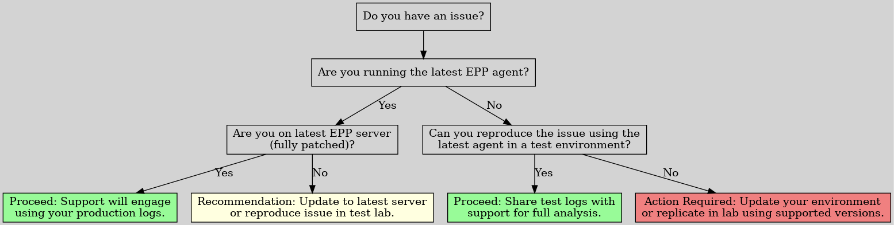
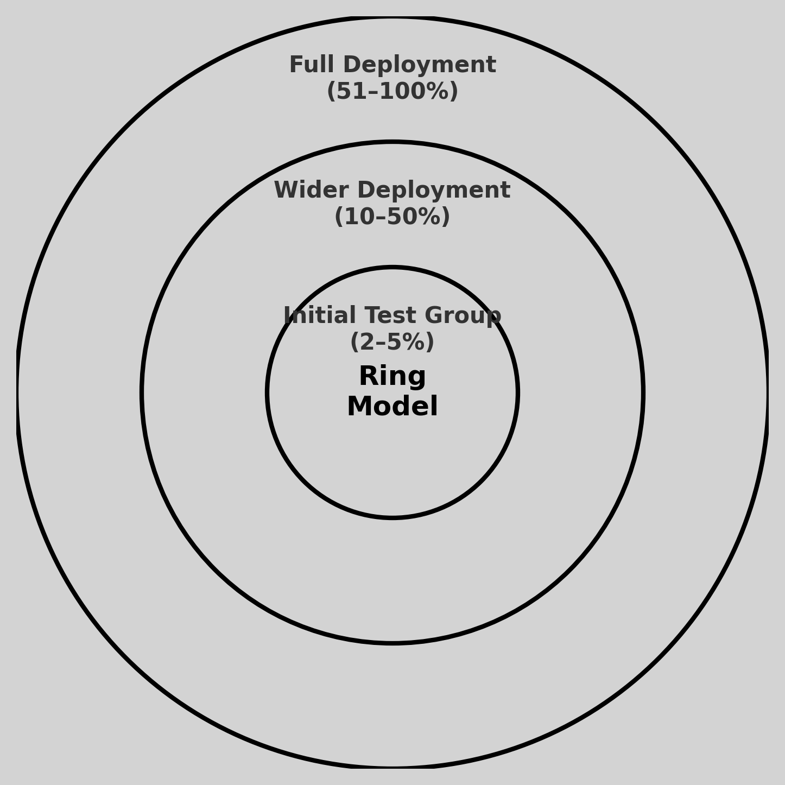

# Netwrix Endpoint Protector Agent Support Policy

Netwrix is committed to providing high-performing solutions. To achieve this and to ensure the best experience for customers, Netwrix supports and enhances only the current shipping version of the Netwrix Endpoint Protector (EPP) agent.

You can download the latest EPP agent for each OS (and the latest EasyLock client) **only** from the Netwrix portal. Note, some previous versions of EPP Server allowed you to acquire the agent directly from within the server. Netwrix has phased out that option in favor of this modern approach.

The following sections cover key points about the support policy and recommendations for rolling out agent updates.

:::note
This supportability document is only for the EPP agent and client components, and not about the Server. For a server specific supportability statement, read the companion guide “Netwrix Endpoint Protector Server-Side Support Policy.”
:::

:::note
EPP agents consist of two parts, the EPP agent itself and the EasyLock client. This support guide applies to both the EPP agent and the EasyLock client equally.
:::

## Support Policy Overview

Here are the agent support policy highlights:

- Current Shipping Version Only: Netwrix supports only the latest available version of the EPP agent for each client OS. This ensures access to the newest features, performance improvements, and bug fixes.
- Bug Fixes: Netwrix addresses critical bugs immediately and then re-ships the agent to the Netwrix portal, where it's available for all customers. There is no specific timeline when the EPP agent will ship.
- Feature Updates: Netwrix generally introduces new features alongside EPP server releases (or patches to EPP servers). As such, the latest EPP client can accept those new directives coming from the fully-patched server.
- Proactive Testing Encouraged: Netwrix advises customers to maintain endpoints on EPP agent versions released within the past year for optimal compatibility, bug fixes, and security fixes.

Staying as close as possible to the latest release reduces the risk of encountering untested upgrade paths or outdated behaviors.

But again: Netwrix supports only the latest EPP Agent (including the EasyLock client), and applies all fixes (bugs, security updates, and so on) to the latest agent before re-shipping it to the Netwrix portal.

## How to Stay Supported (Fully)

To maintain full support and avoid disruptions, follow these recommendations:

- Regular Updates: Keep both the EPP server and agent versions current. Staying within one version of the latest EPP server release ensures continued access to new features and fixes.
- EPP Cumulative updates: When a new patch for EPP server version is available, test the update in your environment promptly to ensure compatibility and performance.
- Issue Reproduction: To ensure the most accurate troubleshooting, Netwrix Support will ask you to reproduce issues using the latest agent (and server, if applicable). This ensures Netwrix is testing against the supported configuration and can deliver a fix more quickly. If you can't update your production environment immediately, validate the issue in a test environment using current versions.
- Here is a decision tree to help understand how Netwrix can help you fastest:

## How to Get the Best Support Experience

Upgrading every server and endpoint in your environment to the very latest version isn't always possible immediately. However, for the most accurate diagnosis and resolution of issues, Netwrix support engineers work from environments running a supported EPP Server (with the latest cumulative patches) together with the latest EPP Agent.

To make troubleshooting easier without disrupting your production environment, many customers choose to maintain a small test lab. With this approach, you can:

- Validate updates and patches in a safe setting before full deployment
- Test new major versions and Offline Patches ahead of time
- Verify the latest agent’s compatibility with your systems

If needed, Netwrix can usually provide complimentary licenses for this type of lab environment.

As long as you can replicate a concern with a supported server (with latest patch) and latest client (in production or a test environment), Netwrix will then endeavor to fix the concern.

By replicating an issue in this “latest environment” — whether in production or in your lab — the Netwrix support team can work more quickly and effectively to help resolve it.

## Testing and Rolling Out EPP Agent Updates

When you are ready to deploy the EPP Agent updates to your estate, Netwrix recommends a specific method to minimize disruption and maximize confidence in your deployment.

Netwrix strongly recommends using a phased rollout strategy—commonly known as the “ring deployment model”—for agent updates. With this approach, you can identify potential issues early and isolate them before full-scale deployment.

**Recommended Phased Rollout Model (Ring-Based):**

This staged process helps reduce risk, allows validation across diverse environments, and limits the scope of impact if unexpected behavior occurs.

1. **Initial Test Group (2–5%)**
    Begin by deploying the new agent version to a small, controlled group of endpoints (e.g., IT staff or low-risk devices). Use this group to evaluate basic functionality, check for regressions, and validate compatibility in your environment.
2. **Wider Deployment (10–50%)**
    If you find no significant issues in the test group, expand the rollout to a larger segment of your organization. This middle ring can include a broader cross-section of users and departments to ensure confidence across varied use cases and endpoint types.
3. **Full Deployment (51–100%)**
    After you verify the agent in real-world conditions and it meets your internal validation criteria, proceed with full deployment to the remaining environment.

The following diagram shows the ring model for agent deployment.

You may define your own rings using **EPP Smartgroups**, **MDM**, **SCCM**, or any other deployment method that supports targeted rollouts. The exact percentages and ring boundaries are flexible—adapt them based on your organization's risk tolerance, endpoint diversity, and operational goals.

For more detail on the “ring” model and how it can be adapted to Endpoint Protector rollouts, refer to this Netwrix resource: [Using Rings to Test and Update the Endpoint Policy Manager Client-Side Extension and/or Cloud Client (And How to Stay Supported)](https://helpcenter.netwrix.com/bundle/PolicyPak/page/Content/PolicyPak/Install/Rings.htm)

**Note**: While this guide references Netwrix Endpoint Policy Manager, the same ring-based principles apply to Netwrix Endpoint Protector agent deployments.

## How to Stay Supported

Not all customers can update immediately. Keep the following in mind:

- The latest EPP server always has the newest features and directives that it can deliver to the agent. Therefore the latest agent is always the best choice.
- Reproduction of Issues: If you encounter a bug or problem, the Netwrix support team will require you to replicate the issue on the latest agent version. Netwrix Support needs logs from this latest agent version to proceed with troubleshooting.
- Regular Updates Recommended: While you can continue to use older agent versions, Netwrix highly recommends staying (at least) on versions released within the past six months. This ensures you benefit from the latest fixes and features. But again, only the very latest EPP agent is within Full Support.
- Testing on Clean Machines: To facilitate accurate troubleshooting, maintain a 'clean' testing machine with minimal software installed, and use it for pre-rollout testing and issue validation.

## Lifecycle of Updates

For planning purposes here is the typical Netwrix cadence for shipping:

- Regular Agent Updates: Netwrix releases new agent versions approximately every 4–6 weeks. These releases include bug fixes, performance improvements, and feature updates that don't require a server update.
- Agent updates along with EPP server: If a new feature ships in EPP server which requires the EPP agent, Netwrix aims to ship another EPP agent very closely in conjunction with the EPP server.

Note: This could mean that Netwrix releases a bugfix for the agent on a Monday and, if EPP server ships with a new feature, replaces the agent in the Netwrix portal the same week. This likely won’t happen often, but it’s possible. In this case, you’re welcome to use the “bugfix only” release, or the newest EPP agent which shipped with the ability to take advantage of any new EPP server features.

- Notification of Updates: Netwrix notifies customers of new versions via the Netwrix Community only
- Hotfixes: Netwrix may address critical issues that affect a single customer in a particular unusual scenario through hotfix releases. These hotfix releases are really no different than any other EPP agent release. It just means Netwrix replaces the existing EPP agent version in the portal with a fix that helps this one customer and anyone else affected by the bug. In these cases, Netwrix makes the latest EPP agent available immediately in the Netwrix portal and may or may not pair it with a broad announcement if it doesn’t affect many customers and isn't a security concern.

## Client OS Supportability Statement

Netwrix develops and tests Netwrix Endpoint Protector (EPP) Agents against actively supported operating systems to ensure security, compatibility, and reliability. This means Netwrix aligns the agent support lifecycle with the vendor‑published support timelines for each platform.

By following the official operating system vendor policies, Netwrix can:

- Deliver updates that are stable and fully tested
- Ensure compatibility with the latest OS features and security updates
- Avoid security and reliability risks associated with unsupported operating systems

The following outlines the current OS support approach for Windows, macOS, and Linux environments, including version requirements, exceptions, and links to vendor documentation for up‑to‑date lifecycle information.

### Windows Client and Server OS Support

Netwrix Endpoint Protector (EPP) Agent supports all **Microsoft Windows client and server operating systems** that remain within Microsoft’s **Mainstream Support** or **Extended Security Update (ESU)** phase. This includes:

- **Client OS**: [Microsoft Supported Versions – Windows Client](https://learn.microsoft.com/en-us/windows/release-health/supported-versions-windows-client)
- **Server OS**: [Microsoft Supported Versions – Windows Server](https://learn.microsoft.com/en-us/windows/release-health/windows-server-release-info)

_Extended Support Behavior_

When a Windows OS transitions from **Mainstream** to **Extended Support**, Netwrix will adopt a **“Best Effort” support model**, which includes:

- Providing assistance with known issues, where possible
- Continuing agent operation, assuming compatibility
- Avoiding development of new fixes or enhancements for those platforms

However, **legacy operating systems may lack compatibility with modern security components**—such as updated encryption libraries or secure communications mechanisms—that current environments increasingly require. These limitations are outside the control of Netwrix and may impact agent reliability or feature availability.

#### Windows 10 End of Life Note

Windows 10 has reached end of support. Netwrix will treat Windows 10 the same as other Extended Support operating systems:

- Netwrix won't commit development fixes for OS-specific issues
- Operation is “best effort” only
- Netwrix notes any known incompatibilities in the Netwrix Community Release Notes

[Source: Microsoft announcement](https://support.microsoft.com/en-us/windows/windows-10-support-has-ended-on-october-14-2025-2ca8b313-1946-43d3-b55c-2b95b107f281#:~:text=Windows%2010%20support%20has%20ended%20on%20October%2014%2C%202025%20%2D%20Microsoft%20Support.)

_General Guidance_

Netwrix strongly encourages customers to plan migrations to supported operating systems ahead of published Microsoft end-of-life (EOL) timelines. This ensures continued compatibility, access to full product capabilities, and ongoing support.

**Important:**
Netwrix **doesn't support** EPP on early builds of Windows 10 64bit, Windows 10 32bit, Windows Server 2019, Windows Server 2016, Windows Server 2012 R2, Windows Server 2008, Windows 7, Windows XP, or any earlier versions. The final EPP Agent build with “best effort” support for these operating systems is 5.9.4.0 (Windows version 6.2.3.1010). Netwrix won't produce future builds for them.

### macOS Clients

For macOS endpoints, Netwrix follows Apple’s official macOS support policy. Netwrix tests and certifies each EPP Client release against the current macOS release and the three prior major versions (n‑3), consistent with Apple’s three‑year maintenance cycle.

More information:

- [Apple macOS Release Notes](https://developer.apple.com/documentation/macos-release-notes)
- [macOS End‑of‑Life Dates](https://endoflife.date/macos)

### Linux Clients

Netwrix tests and certifies the EPP Client for Linux for:

- Ubuntu LTS versions that are still within their official support lifecycle
- Red Hat Enterprise Linux versions that are still within their official support lifecycle (highest minor release for each version only.)

References:

- [Ubuntu Release Cycle](https://ubuntu.com/about/release-cycle)
- [Red Hat Updates and Support Policy](https://access.redhat.com/support/policy/updates/errata)

Netwrix doesn't build an EPP Client for the following Linux distributions by default, but you can request one, or a custom Linux distribution, as a **Feature Request (FR)** through Netwrix Support:

- Debian
- Fedora
- SUSE
- OpenSUSE
- SLED Linux Enterprise Server
- Pardus OS
- AWS Linux 2

Netwrix Product Management reviews and prioritizes these requests, which may involve a billable service. After approval, Netwrix builds the client using a **Quick Test** process in QA, and you're responsible for verifying that all functionality works as expected.

:::note
For Ubuntu-based distributions outside the officially tested and certified list, such as Mint Linux, and RHEL-based distributions such as Rocky Linux, Oracle Linux, or CentOS, the EPP Client installer built for the corresponding base version generally works without additional configuration. In some cases, the Linux administrator might need to manually adjust dependencies to match the base distribution. For installation steps, see [Linux](/docs/endpointprotector/admin/agent.md#linux) install guide under Agent Install Parameters in the Agent documentation.
:::

## Final Thoughts

Using a supported operating system and staying up to date with the latest version of the Netwrix Endpoint Protector agent ensures optimal performance, access to the latest features, and a smoother support experience. By leveraging a phased rollout strategy and maintaining a proactive update schedule, your organization can confidently manage EPP updates and maintain robust data protection.
 For assistance with your rollout strategy, contact the Netwrix support team.
