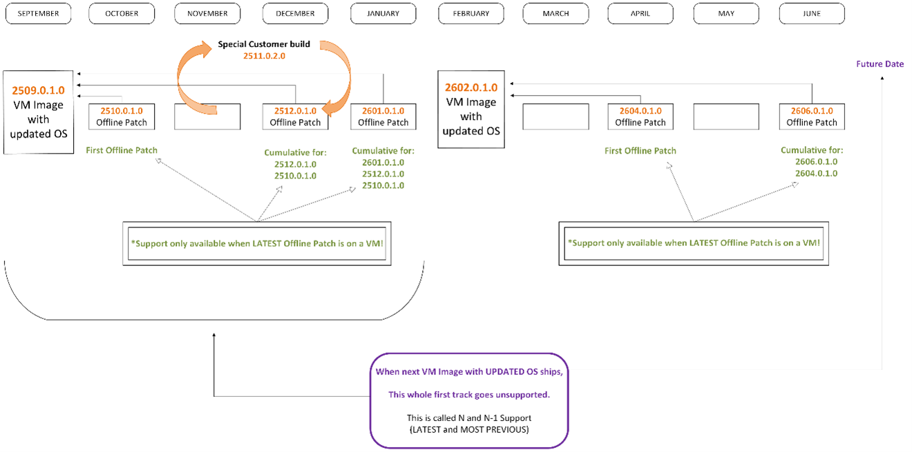

# Netwrix Endpoint Protector Server-Side Support Policy

At Netwrix, we are committed to providing high-performing solutions. To achieve this, our support policy focuses on maintaining compatibility with recent software versions. Staying current with both the server and the agent is critical to accessing full support, ensuring end-to-end functionality, and maintaining optimal security.

This document defines how Endpoint Protector server updates are released, supported, and how customers can stay fully supported.

In plain terms, a version is considered supported if it is either the most recent (“N”) or the previous (“N-1”) major version—and fully patched. Additionally, environments must ideally use the latest Endpoint Protector Agent to get active support when reporting issues.

Here is the current state of all versions of Endpoint Protector Server.

**Currently Supported Versions Matrix**

| **Discontinued Support** | **Limited Support** | **N-1 Track (Active Support)** | **N Track (Active Support)** |
| --- | --- | --- | --- |
| All versions prior to 5.9.4.1 | 5.9.4.2 (5942)  In Limited Support from Oct 14, 2025 to Feb 11, 2026. (120 days)  No new feature development or critical fixes.  Support is limited to configuration guidance for 5942. | There is no N-1 track at this time. | 2509.0.1.0 (25.9)  Released Oct 14, 2025. Full Active Support. [Link to release notes](https://community.netwrix.com/t/major-version-announcement-endpoint-protector-server-version-2509/114025) |

# Support Definitions Used In This Document

## This section builds on the official Netwrix support tier definitions: Active, Limited, and Discontinued Support

While those terms apply across all Netwrix products, the definitions below explain how they apply specifically to Endpoint Protector Server—with detailed guidance on patching, version status, and compatibility requirements.

Additionally in this section, you will understand the Endpoint Protector Server specific vocabulary around versions, patches and so on.

## Understanding Active, Limited and Discontinued Support

The following is a summary of Netwrix's standard support lifecycle stages. These definitions apply across all Netwrix products and set the baseline for what kind of assistance and updates a customer can expect at each stage of the product version lifecycle.

### Active Support

A product version that is in its **active support** phase is actively developed and maintained by the Netwrix development team and is eligible to receive support assistance from the Netwrix technical support team. A product in its active support phase:

- Receives updates to introduce new features and fix defects
- Receives security updates to address vulnerabilities or improve security features
- Is eligible for support from the Netwrix technical support team
- Is eligible for assistance from the Netwrix professional services team, including for the creation of new customizations
- Is generally available for download from the Netwrix Customer Portal

### Limited Support

A product version in its **limited support** phase is eligible to receive support assistance from the Netwrix technical support team, however it is subject to reduced support from the Netwrix development team. A product in its limited support phase:

- Does not receive new feature updates
- May, at Netwrix’s discretion, receive bug fixes for critical defects, such as those that cause an outage
- Receives security updates for high and critical severity vulnerabilities
- Receives best-effort support from the Netwrix technical support team
- Is eligible to receive assistance from the Netwrix professional services team, including support for existing customizations
- May remain available for download in the Netwrix Customer Portal, but is ineligible to receive support for new installations

In short, we will try to help you, but our resolution is only limited to configurable items already in that version since no new code updates will be considered.

### Discontinued Support

A product or product version that is **discontinued** is not maintained by Netwrix and is not eligible to receive technical support assistance or updates of any kind. Customers are required to update to an actively supported version to obtain assistance or receive updates. An end-of-life product:

- Does not receive new feature releases, bug fixes, or security fixes
- Is ineligible for assistance from the Netwrix technical support team
- Is ineligible for assistance from the Netwrix professional services team, with the exception of providing support for upgrading to an actively supported version
- Is not available for download in the Netwrix Customer Portal

## Endpoint Protector Specific Definitions

The table below defines the key lifecycle stages for each Endpoint Protector Server version and what level of support is offered at each stage. These milestones reflect how versions are managed over time, how updates are delivered, and what patching behavior is expected.

To remain fully supported, customers must stay within the actively supported “N” or “N-1” version tracks and have the latest Fixes & Features (F&F) and Critical Security Patch (CSP) updates applied.

The table below defines how long different versions remain eligible for support based on their patch state.

| **Definition** | **Description** | **Support Details** |
| --- | --- | --- |
| Product Release | A new major version of Endpoint Protector Server is made generally available. | Active support. Customers should apply future patches as they are released to maintain Active support status. |
| Offline Patch | A downloadable installer applied manually to your self-hosted system. | Offline Patches may be F&F or CSP type. |
| Initial Fixes & Features (F&F) Patch | The first cumulative Fixes & Features patch for a major version. | Required for Active Support. Contains all fixes, improvements, and CSPs from the initial release. |
| Subsequent F&F Patches | Additional cumulative F&F updates for that version line. | Required for Active Support. Each F&F patch includes all earlier F&F patches and any CSPs from its cycle. |
| Critical Security Patch (CSP) | Released between F&F patches to address urgent security issues. | Must be applied on top of the latest F&F patch. Required for Active Support.  Cumulative only within that version. Cannot be applied independently. |
| Next Version (N+1) | A new major version is triggered when a required change (security or functional) cannot be delivered via an offline patch. | Active Support. This marks a new baseline; prior N and N-1 tracks may transition based on policy. |
| Second Subsequent Version (N+2) | A version now two major cycles newer than the most current version. | Original N track receives limited Support for 30 days.  On the 31st day, the support for that original N track transitions to Discontinued Support. |

## Important Clarifications Explored In this Document

The following key behaviors apply throughout this policy and will be referenced in more detail across sections:

- **F&F patches are cumulative**: Each one includes all prior fixes and features from that version track, plus any CSPs from that line.
- **CSPs are scoped**: They are cumulative only within their associated F&F version. They cannot be applied unless you’ve first installed the associated F&F patch.
- **N+1 is not time-based**: It’s triggered when a change (security or feature) cannot be delivered via a cumulative offline patch. This may be due to architecture changes, infrastructure updates, or incompatible shifts that require a new appliance or server image. Tip: See the section “When Is a New Major “N” Server Version (“Next Version”) Triggered?” for more details.

If you fall behind on F&F or CSPs, applying the latest F&F patch will bring you up to date with all prior non-security and security content from that version line. However, some changes may require transitioning to the next major version (N+1) to remain fully supported.

# Patch Composition and Strategy for Endpoint Protector Server

Netwrix Endpoint Protector Server uses a structured patching model that separates planned product improvements from urgent security updates, while ensuring systems remain secure, supportable, and consistent.

## Patch Types

There are exactly two patch types:

- Fixes & Features
- Critical Security Patches

The two patch types are described below.

### Fixes & Features (F&F) Patches

Fixes & Features (F&F) patches are planned releases that include new product functionality and improvements. These may contain:

- New features
- Bug fixes and performance improvements
- Protocol or security hardening enhancements
- All previously released security patches (from the prior release cycle)

F&F patches are cumulative. Installing the latest F&F patch ensures your system is up to date with all previous features, fixes, and security updates from earlier cycles.

### Critical Security Patches (CSPs)

Critical Security Patches (CSPs) are released between F&F updates to address urgent security vulnerabilities.
 Each CSP is:

- Specific to the latest F&F release (e.g., **October Security Patch** requires the **October F&F Patch**)
- Cumulative within that release line—so each new CSP includes all prior CSPs from the same F&F base
- Independent of prior release cycles—CSPs from previous F&F cycles are not included

When a new F&F patch is released, the CSP chain resets. New CSPs will apply only to that new F&F baseline.

## How Patch Dependencies Work

- Each security patch released after a Fixes & Features patch depends on that F&F version.
- Example: You cannot apply the October CSP unless the October F&F Patch is already installed.
- If you skip one or more CSPs and later apply the next F&F patch, all prior CSPs from that F&F cycle are automatically included
- F&F patches establish a new baseline. All CSPs released after that point apply only to that version.

## Example Scenarios

### Scenario 1 – You skip a Fixes & Features patch, then apply a security patch

You skip the August Fixes & Features Patch, which included:

- Updated policy interface
- Faster sync engine
- Several resolved bugs
- The August Security Patch (already bundled in)

Later, in September, a critical CSP is released.
 **Result**: You cannot apply the September CSP unless you've first installed the August F&F Patch. Security patches are always tied to their corresponding F&F baseline.

### Scenario 2 – You skip several CSPs, then apply the next F&F patch

You miss three monthly security patches tied to the August Fixes & Features release.
 In October, a new Fixes & Features patch is released.
 **Result:** When you apply the October F&F patch, you automatically receive all prior August- and September-era security fixes as part of that cumulative F&F update. You're now fully caught up on both security and functionality.

## Key Takeaways

- Fixes & Features (F&F) patches are cumulative and reset the patching baseline.
- Critical Security Patches (CSPs) are tied to a specific F&F release and cumulative only within that line.
- You must be on the latest F&F patch to install the corresponding security updates.
- F&F patches include **all previous security fixes**—so if you're behind, install the latest F&F patch to bring your system back to a supported baseline.

## Best Practices

- Apply CSP (Critical Security Patches) patches as soon as they are released.
- Install Fixes & Features (F&F) patches regularly to stay aligned with the current support baseline.
- Use a staging environment to validate behavior and compatibility.
- Review the release notes before any patch.
- Maintain a tested backup and restore plan before updating.
- Use a staging environment to validate behavior with both the latest server and agent versions, especially if you’re rolling out the latest agent incrementally.

## End-to-End Compatibility

When a new server version or Patch Release is released, any new server-side features requiring updated functionality will only be truly 100% compatible with the latest agent version. This means that to achieve true end-to-end compatibility, security, and support, both the server and agent must be updated to their latest versions.

- Agent Compatibility: The latest server-side updates may introduce features or fixes that require the latest agent version. Using outdated agents could lead to functionality gaps or unsupported configurations. Older agents may continue to function but may not support new policy directives or features introduced in recent server updates.

Note: Older agents will not “stop working” with newer server versions unless expressly specified in the release notes.

- One Supported Agent: At any given time, the only fully (Active) supported agent version is the latest version available for download. This ensures that all new features, bug fixes, and security enhancements are included. All other endpoint agents are in Limited or Discontinued support.

## Deployment Models: SaaS vs. Self-Hosted Update Cadence

Netwrix Endpoint Protector is available in two deployment models: **Netwrix-hosted SaaS** and **Customer-managed Self-Hosted (On-Premises)**. Each model offers different levels of control over patching, update schedules, and rollout validation.

### Security Patches – Universal and Immediate

For both SaaS and Self-Hosted deployments:

- Critical Security Patches (CSPs) are considered mandatory and are applied automatically to **all environments**, including staging and production.
- Customers cannot defer or opt out of Critical Security Patches in SaaS environments.
- Organizations with strict change control requirements should consider the Self-Hosted model, where updates are manually applied under customer-defined conditions.

### Feature and Non-Security Fix Rollouts – Tiered Delivery for SaaS Customers

To balance stability with early access, Netwrix applies a tiered rollout strategy for non-security patches in SaaS environments.

**1\. SaaS Customers with Staging Environments**

- Customers with paid staging environments receive F&F patches **first**, typically through a release candidate (RC) build.
- These builds are deployed to preview environments based on a dedicated release branch.
- Subsequent updates to the RC branch may occur daily or weekly depending on the scope of ongoing bugfixes or refinements.
- This model allows participating customers to validate updates and identify issues before full rollout.

**2\. General SaaS Customers**

- After successful validation in staging environments, the same F&F patch is **deployed to all other SaaS production environments**.
- This reduces risk while ensuring broader availability of new features and fixes.

**3\. Deployment Operations**

- As lifecycle and automation tooling evolves, our mechanisms may expand to support more granular targeting and faster feedback loops; but right now all SaaS Staging Customers will get updates at the same time.

**Self-Hosted (On-Premises) Customers**

- Self-Hosted customers maintain **full control** over when and how all patches—both security and non-security—are applied.
- Security patches are not automatically applied; instead, they are made available as Offline Patch installers.
- This model is recommended for organizations that:
  - Operate in regulated industries
  - Require scheduled maintenance windows
  - Need to validate changes before deployment

Summary Comparison Table

| **Update Type** | **SaaS - Staging Customers** | **SaaS - General Customers** | **Self-Hosted Customers** |
| --- | --- | --- | --- |
| **CSP Security Patches** | Immediate and mandatory | Immediate and mandatory | Manual install (customer-controlled) |
| **Feature/Fix Patches** | Preview build first | Rolled out post-staging | Manual install (customer-controlled) |
| **Control Level** | Moderate | Low | Full |
| **Recommended For** | Customers seeking early access | Customers preferring automation | Customers requiring strict patch scheduling |

Security patches (CSPs) are mandatory in SaaS. In Self-Hosted deployments, CSPs must be manually applied.

# General Supportability Guidelines and Definitions

To maintain full, Active support and avoid disruptions, we recommend:

- Regular Updates: Keep both the EPP server and agent versions current. Staying in the N or N-1 track plus keeping CSP and F&F patches updated ensures continued access to all security plus new features and fixes.
- EPP Server updates: When a new patch for EPP server version is available, test the update in your environment promptly to ensure compatibility and performance.
- Issue Reproduction: If a bug or issue arises, our support team AT LEAST requires that the latest agent version be installed and the issue reproduced on that version, before proceeding with a support case. If you’re using an outdated EPP server, support may also require you to update EPP server to the latest F&F and/or CSP for full end-to-end checking before a case is permitted to proceed.

## How to Get Ideal Support (Practical)

We realize many customers cannot upgrade their entire estate to the latest versions of server (with the latest patches) and/or have the latest client release on every endpoint.

But from a “problem validation” point you will need to be on a currently supported Server version with the latest cumulative patches as well as the latest client.

This is the only configuration our support engineers will be testing against your concern.

As such you might want to maintain a small scale test lab which enables you to test your concern in the “latest environment.” _We will provide some free licenses under most circumstances (subject to approval)._

By having a small test lab, you can do all your pre-flight testing of upgrading to latest Offline Patch, perform pre-flight transitions to latest major versions, and test the latest agent before a mass agent rollout.

TIP: You can learn more about a mass agent rollout using the “Ring Philosophy” (wherein a small amount of computers gets latest agents in a controlled manner.) Learn more about this in our “Netwrix Endpoint Protector Agent Support Policy” companion document.

As long as you’re able to replicate a concern with a supported server (with latest patch) and latest client (in production or a test environment), we will then endeavor fix the concern.

# When Is a New Major “N” Server Version (“Next Version”) Triggered?

Netwrix Endpoint Protector (EPP) follows a support model where the current (“N”) and previous (“N-1”) major server versions are fully supported, as long as they are fully patched. However, customers may ask: _When does a new version get designated as a “Next Version,” replacing the previous N and N-1?_

A new major version is triggered only under specific technical conditions—not merely because a new server image or patch has been released.

A version is designated as a new major version (“Next Version”) when one or more of the following triggering conditions occur:

- Operating System Foundation Changes: The underlying OS (typically Ubuntu) is upgraded to a new LTS or version that introduces fundamental changes that cannot be backported.
- Core Component Shifts: Replacement or major revision of critical third-party components (e.g., database engines, libraries, middleware) that materially alter how the system operates.
- Architecture or Platform Shifts: The server undergoes a material infrastructure or deployment change such as data storage or supporting areas
- A major new feature which cannot be back-ported to the N-1 version.

Note: In rare cases where a significant security vulnerability may be discovered and remediated in a way that cannot be delivered through an Offline Patch to the current image. In these cases, Netwrix will mark the new release as the start of a new N-track. At the same time, both the previous N and N-1 tracks will be transitioned to Limited Support, regardless of patch status.

What _Does Not_ Trigger a “Next Version” Event:

- A regular Offline Patch to address bugs or introduce minor feature updates
- Server image refreshes that do not change core OS or system components. (Typically provided to new Endpoint Protector customers; but existing Endpoint Protector customers are welcome to use them.)
- Performance optimizations or configuration adjustments
- Security enhancements that _can_ be delivered through the standard offline patching mechanism

This means not every new image we produce or patch will bump the major version designation. Customers can continue using N and N-1 versions with confidence, as long as they apply the latest cumulative Offline Patches.

At the top of this document, we will always express the current N and N-1 versions which are in support, so it can be clear at all times.

Our goal is (generally) around one N version per year; but could change if any of the triggering events occur above.

# Diagram toward understanding EPP Server Support

As previously stated, EPP will support N and N-1 versions as long as they are fully patched.

In this theoretical diagram (also where the version numbers and release dates may be different than any real life counterparts):

- Version N is 2509.0.1.0 (25.9)
- Version N-1 is currently not available

Both "tracks" are fully supported as long as the latest Offline Patch is applied to that track. In this theoretical diagram, if the date is currently June 2026 the actual supported configuration would be:

- 2509.0.1.0 (25.9) with any applicable Offline Patches and CSPs

… PLUS any corresponding CSPs which were generated after those Fixes & Features Patches.

In some future date, should a new major N release ships, then and only then does:

- The "Track" of 2509.0.1.0 go to Limited Support (for 120 days), then Discontinued support (after 120 days)
- The new N+1 version becomes the current N track, and 2509.0.1.0 (25.9) transitions to N-1 support (immediately.)

# Final Thoughts

Staying current with both server and agent versions ensures optimal performance, full feature compatibility, and robust security. Netwrix is committed to supporting your transition to newer versions and helping you ensure your Endpoint Protector environment stays secure, up-to-date, and fully supported.
 If you have questions about updates or need assistance with your upgrade process, please contact the Netwrix support team.
