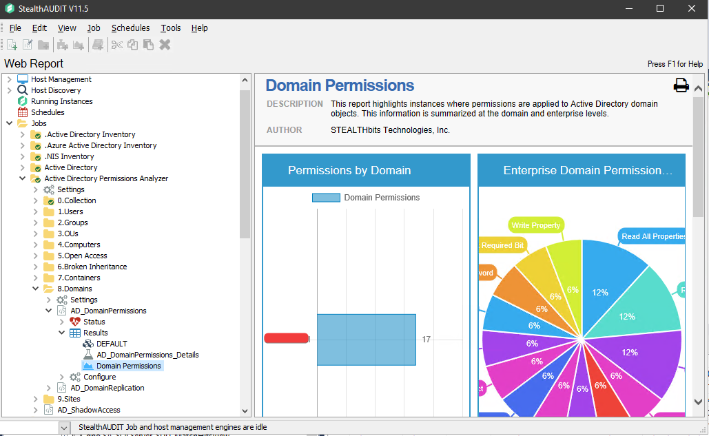
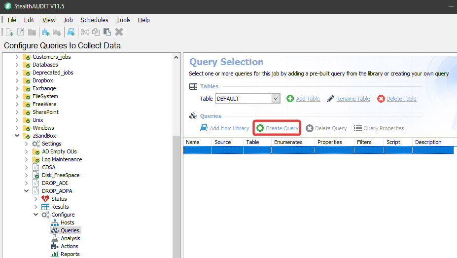
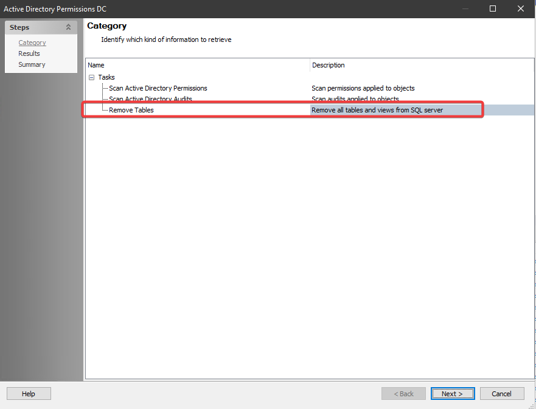
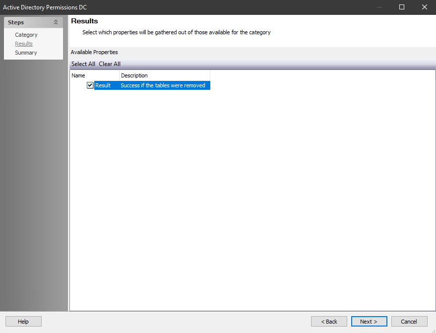

# Active Directory Permissions Analyzer reports are outdated

## Symptoms

Old data in the Active Directory Permissions Analyzer **(ADPA)** reports from deprecated Domains.  
Example of the incorrect data:  

## Cause

ADPA Data is not cleared when running only the ADInventory (ADI): Category >> Drop Domain – Remove host domain related data from SQL server option seen under the following:  
[Remove Domain Audit Data from Reports − Drop Domains](https://docs.netwrix.com/docs/accessanalyzer/12_0/kb/active-directory-auditing/remove-domain-audit-data-from-reports-drop-domains)

## Resolution

We will need to create a new Job to work with the APDA data in question.  
To do so you can follow the steps below.

1. Create a new Job in the Netwrix Access Analyzer console: right click the **Jobs Node** in the left-hand window and select **Create Job**:

   

   Select the **Local host** in the jobs host list:

   

2. Click on the **Create Query**:

   

3. Configure the jobs query Properties.  
   Under the **Data Sources** tab, select the **ADPERMISSIONS** option from the dropdown menu then click on **Configure**.

   

   Select **Remove Tables** and click **Next**:

   

   Check the Results option: Click **Next** → **Finish** → **Ok**.

   

4. Now run the new Job.

5. Once the job completes run the ADPA report; it should complete with an error.  
   Examples:
   `Invalid object name 'dbo.SA_ADPerms_PermissionsView'.`  
   `Invalid object name 'dbo.SA_ADPerms_Permissions*View'.`

Now you can run the Active Directory Permissions Analyzer Job Group to repopulate for the active Domains.

This will recreate the needed ADPA Tables and Views needed for the Reports.
