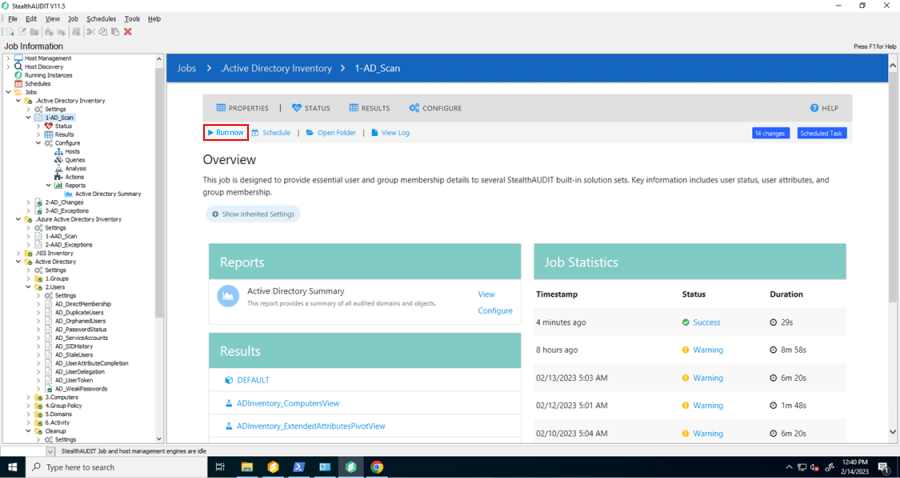
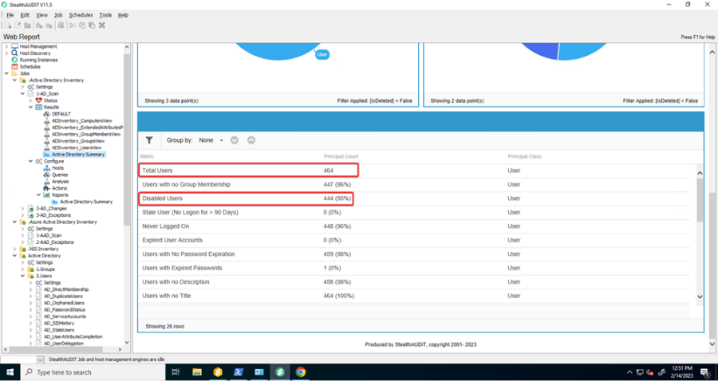

# Collecting AD Summary

## Overview

Licensing of Netwrix Access Analyzer is based on the quantity of enabled AD users in the audited environments. Periodically, you are asked to submit the results of the AD Summary report, specifically the difference between the **Total Users** and **Disabled Users**, to ensure compliance with your licensing agreement.

## Instructions

To find this data:

1. Ensure **.Active Directory Inventory** has recently run or run now. Navigate to **Jobs** > **.Active Directory Inventory** > **1-AD_Scan** and click **Run Now**  
   

2. Navigate to **Jobs** > **.Active Directory Inventory** > **1-AD_Scan** > **Results** > **Active Directory Summary**

3. Take a screenshot or otherwise capture the values displayed in **Total Users** and **Disabled Users**  
   
