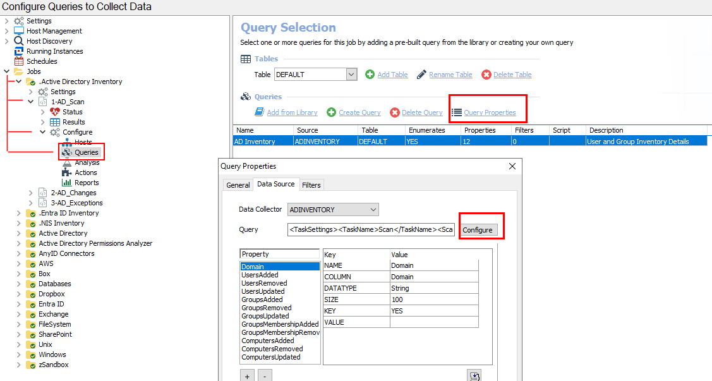
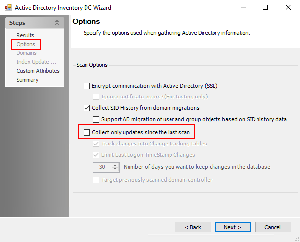

# Deleted AD User(s) Still Show In Netwrix Access Analyzer Reports

## Symptom

A deleted user account(s) from AD still shows in Netwrix Access Analyzer Reports and is not flagged as deleted.

## Cause

A failure on the ADI scan that could be caused by a myriad of reasons.

## Resolution

Run a full **AD Inventory Scan** by disabling differential scanning for the **1-AD_Scan** job using the steps below:

1. Navigate to **Access Analyzer > Jobs > .Active Directory Inventory > 1-AD_Scan > Configure > Queries > Query Properties > Configure > Options**.  
   
2. Uncheck the box for **Collect only updates since the last scan**.  
   
3. Click **Next** through the end of the Active Directory Inventory DC Wizard.
4. Re-run the **1-AD_Scan** job.
5. Select the previously-unchecked box for **Collect only updates since the last scan**.
6. Re-run the **1-AD_Scan** job.
7. To determine whether the job was successful, verify the results in the `SA_ADInventory_UsersView`. Search for the deleted user to confirm whether it exists or is marked `IsDeleted`.
8. If the deleted user does not exist or is not marked `IsDeleted`, then verify the permissions on the scan account. The permissions must have **List contents & read Property** on the **Deleted Objects** container.
9. For more information, please see the following article: ADInventory Data Collector.
