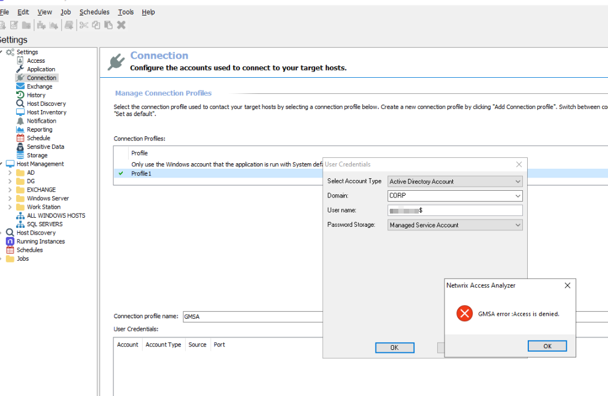

# Error: GMSA Error Access Is Denied

## Symptom

When you add a group Managed Service Account (gMSA) connection profile in Netwrix Access Analyzer, the following error message appears:

```text
Netwrix Access Analyzer
GMSA error: Access is denied.
```



## Cause

The account running the Netwrix Access Analyzer console is the account that retrieves the gMSA password when the connection profile is created. This account does not have permission to retrieve the password for the gMSA account being added.

By default, only the account that created the gMSA, or an account or group explicitly listed in the gMSA's `PrincipalsAllowedToRetrieveManagedPassword` property, can retrieve its password. If the console account is not included in that list, Active Directory denies the password retrieval request, and Access Analyzer returns this error.

## Resolution

1. Identify the account that is running the Netwrix Access Analyzer console.
2. Add that account (or a group it belongs to) to the gMSA's `PrincipalsAllowedToRetrieveManagedPassword` property. For example, using PowerShell on a domain controller:

   ```powershell
   Set-ADServiceAccount -Identity <gMSAName> -PrincipalsAllowedToRetrieveManagedPassword <ConsoleAccountOrGroup>
   ```

3. Allow time for the change to replicate across domain controllers, or run `Get-ADServiceAccount -Identity <gMSAName> -Properties PrincipalsAllowedToRetrieveManagedPassword` to confirm the update.
4. Retry adding the gMSA connection profile in Access Analyzer.

> **NOTE:** The console account only needs `PrincipalsAllowedToRetrieveManagedPassword` permission long enough to add the connection profile. After the profile is added, you can remove the console account from that property. The Netwrix Access Analyzer console server's computer account still needs permission to retrieve the gMSA password, since that is the account the connection actually authenticates as at runtime.

Review the full set of gMSA prerequisites before configuring the connection profile.

## Related Link

- [Group Managed Service Accounts (gMSA) Configuration ⸱ Netwrix](https://docs.netwrix.com/docs/accessanalyzer/12_0/admin/settings/connection/gmsa)
