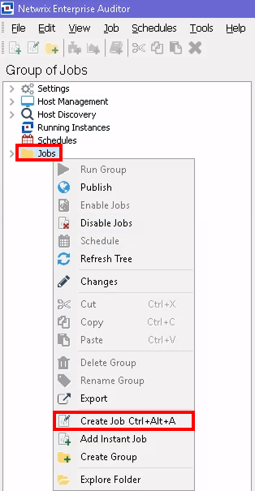
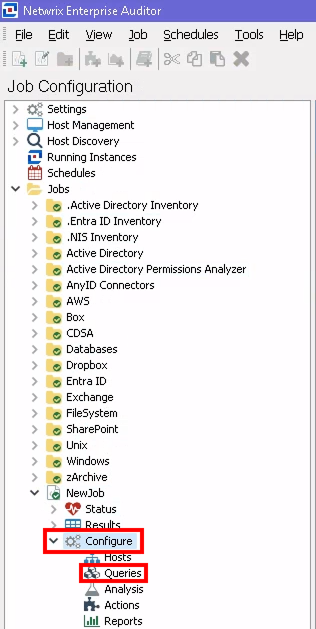
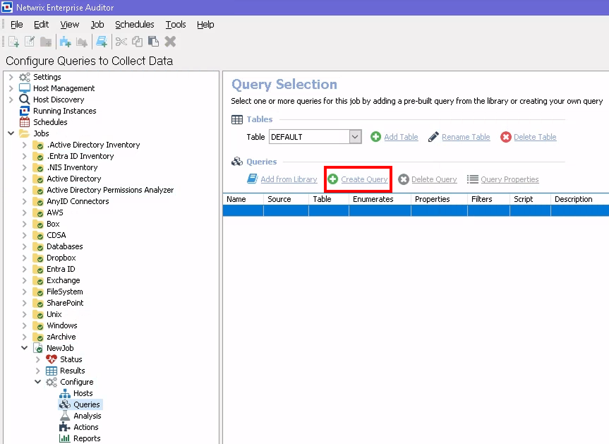
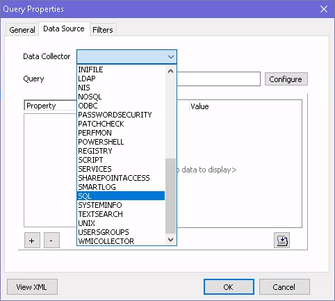
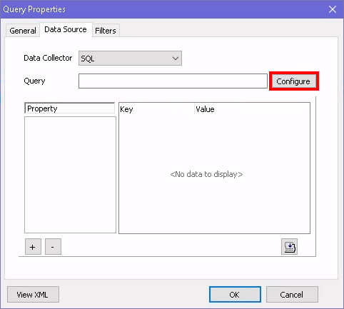
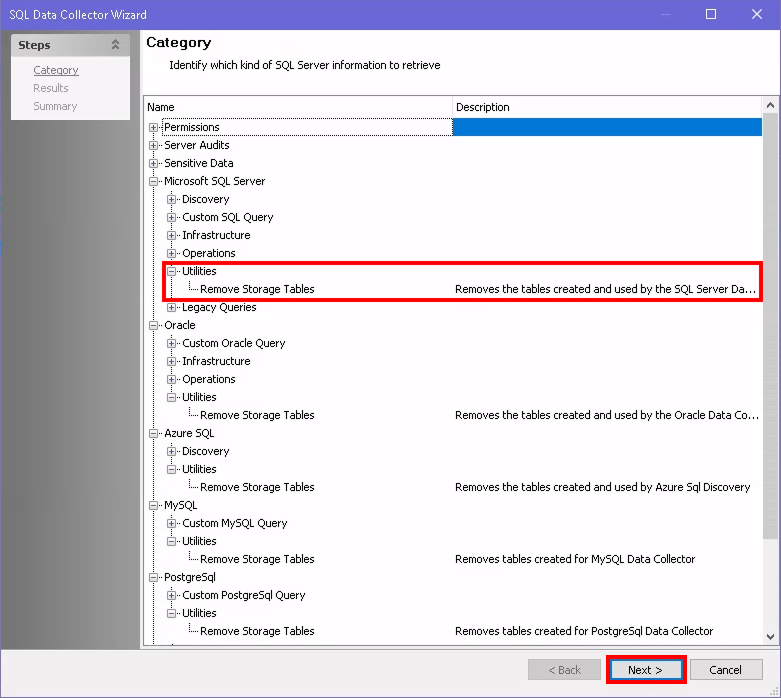
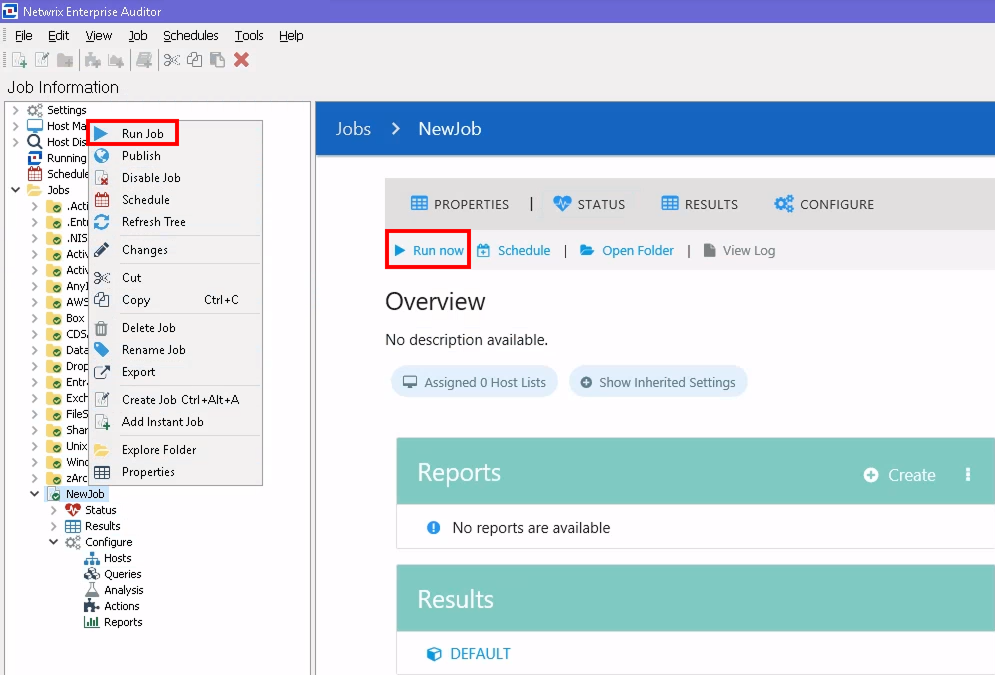
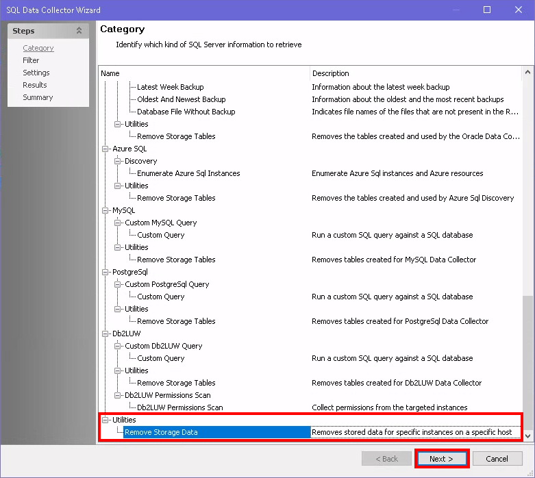
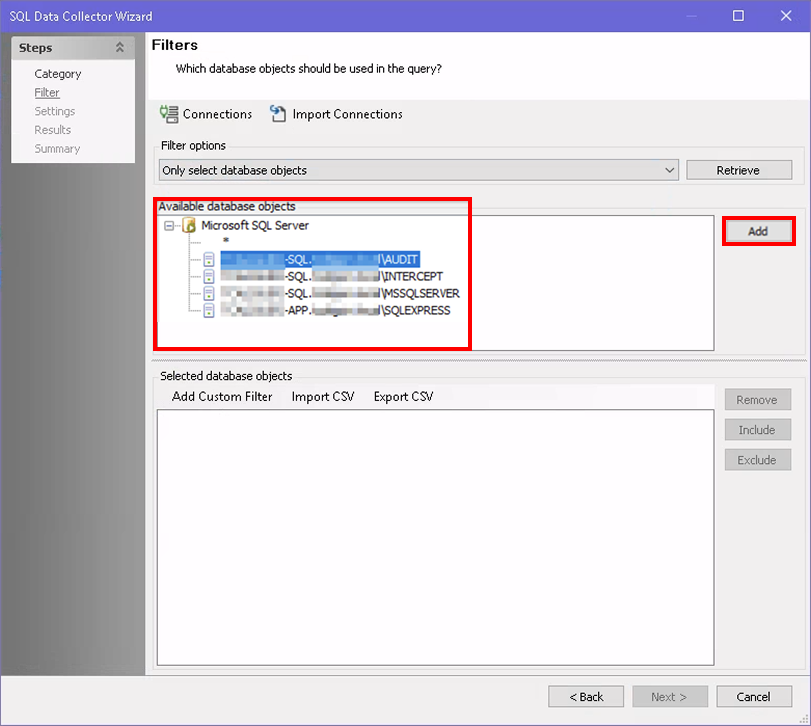

# How to Drop Data Collected from SQL Servers Using the Databases Module

## Overview

This article explains how to drop data collected from SQL Servers using the Databases Module. Follow the instructions below to drop data for all SQL Servers or for specific hosts/instances.

## Instructions

### Drop All Data for SQL Servers

> **NOTE:** You can create a separate folder (e.g., Sandbox) for custom jobs.

1. Right-click the **custom** or **Jobs** folder and select **Create Job** `Ctrl+Alt+A`.  
   
2. Navigate to the **Configure** node of the NewJob and select the **Queries** node.  
   
3. Click the **Create Query** button.  
   
4. In the General tab, designate a clear **Name** and **Description** (e.g., `DropSQLHostData`).
5. In the Data Source tab, select **SQL** from the **Data Collector** dropdown menu.  
   
6. Click **Configure** to launch the SQL Data Collector Configuration Wizard.  
   
7. On the Wizard Category page, select the **Utilities > Remove Storage Tables** option under the appropriate database type and click **Next** to drop all collected SQL data for SQL Servers.  
   
8. To complete the query, ensure you have selected the desired Available Properties, click **Next**, and then **Finish**. Last, click **OK**.
9. To run the job, you can either select **Run now** from the job windowpane or right-click the job and select **Run Job**.  
   

### Drop Data for Specific Hosts/Instances for SQL Servers or Drop Specific Data for SQL Hosts/Instances

1. Follow steps 1–6 detailed above.
2. On the SQL Data Collector Configuration Wizard Category page, select the **Utilities > Remove Storage Data** option and click **Next**.  
   
3. On the Filters page, select the databases/instances via the **Filter Options** drop-down menu:
   - All database objects
   - Only select database objects
     - When using this option, select the database objects you want to delete in the **Available database objects** pane, then click **Add**.  
       
4. On the Settings page, select the type of data you would like to remove for your specified hosts:
   - Permissions
   - Audits
   - Sensitive Data
   - Orphaned Rows
5. On the Results page, enable all of the available properties.
6. Run the job.
