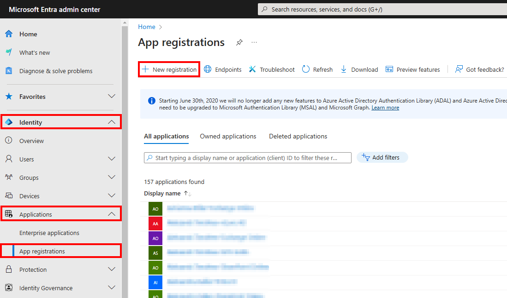
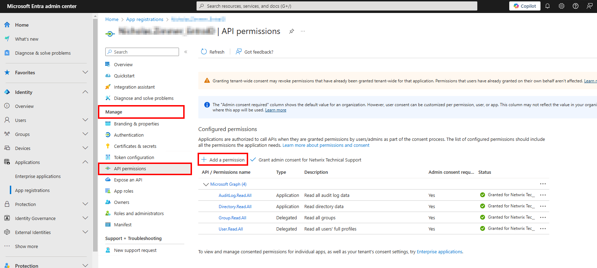
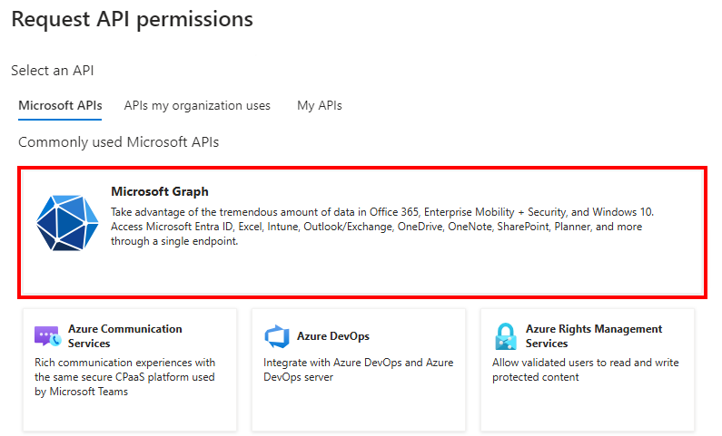
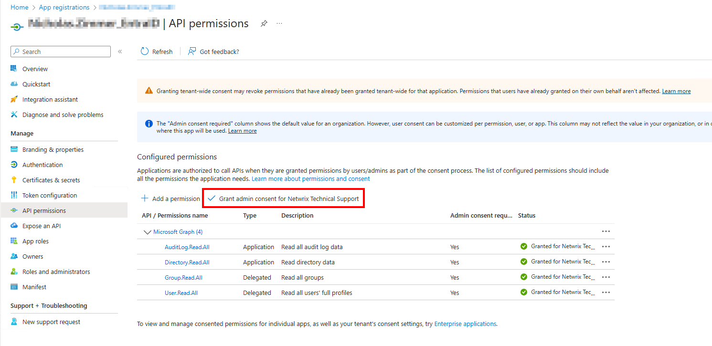
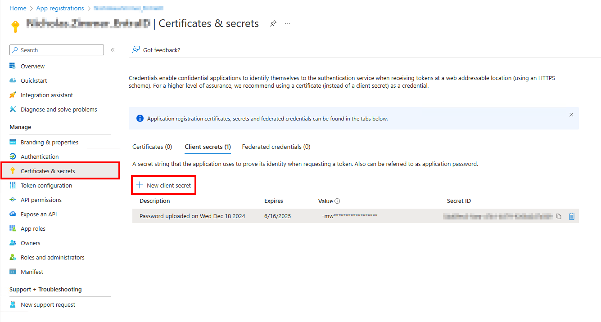
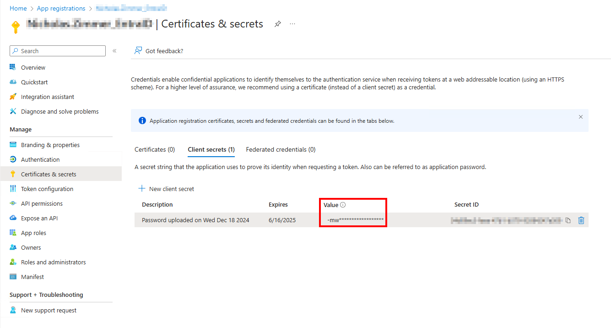
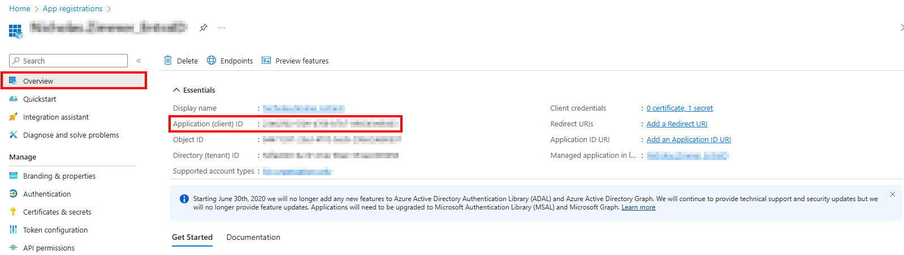

# Manually Setting Up Entra ID Auditing for Netwrix Access Analyzer

## Question

How do I set up Entra ID Auditing without using the `AZ_RegisterAzureAppAuth` instant job?

## Answer

While it is always recommended to use the `AZ_RegisterAzureAppAuth` instant job to set up the Entra app for auditing, it can be done manually if necessary (e.g., when MFA cannot be temporarily disabled for a Global Admin account).

## Entra ID Inventory Scans & Entra ID Reports

1. Open the Microsoft Entra admin center: https://entra.microsoft.com/#home.

2. Navigate to **Identity > Applications > App registrations** and select **+ New registration**.  
   

3. On the **Register an application** page, set the following:
   - **Name:** Something meaningful, e.g., `NEA_EntraID`.
   - **Support account types:** Accounts in this org. directory only.

4. From the **Application Overview** page, navigate to **Manage > API Permissions** and select **Add a permission**.  
   

5. From the **Request API permissions** page, select **Microsoft Graph**.  
   

   - Add the following **Delegated Permissions**:
     - `Group.Read.All` – Read all groups
     - `User.Read.All` – Read all users' full profiles
   - Add the following **Application Permissions**:
     - `AuditLog.Read.All` – Read all audit log data
     - `Directory.Read.All` – Read directory data

6. After adding the aforementioned permissions, grant them admin consent by selecting **Grant admin consent for `\{TENANT NAME\}`**.  
   

7. Navigate to the Entra app registration and on the **Certificates & secrets** page, select **+ New client secret**.  
   

8. On the **Add a client secret** page, add the following:
   - **Description:** Something meaningful, e.g., `Access Analyzer Entra ID`.
   - **Expires:** Usually recommended to set this to the longest option OR per the organization’s internal certificate expiration timeframe.

9. After creating the client secret, copy the secret **Value** to a notepad.  
   

10. Next, navigate to the **Overview** tab and copy the **Application (client) ID** which is needed for the Netwrix Access Analyzer Connection Profile.  
    

## Netwrix Access Analyzer Connection Profile

1. In Netwrix Access Analyzer, navigate to **Global Options > Connection** and create a connection profile with the same name as the Entra app registration, using the following:
   - **Account Type:** Azure Active Directory
   - **Client ID:** Application (client) ID from Entra App Registration
   - **Key:** Secret Value

2. Create a host list with the Entra site, e.g., https://nwxsupport.sharepoint.com/.

3. Set the Entra ID Inventory job group to run against the Entra host list.

4. Set the Entra ID Inventory job group to use the Entra Connection Profile.

5. Schedule the Entra ID Inventory job group to run every day, or at least before the Entra ID job group.

> **NOTE:** This job is also required in order to run Exchange Online & SharePoint Online modules.
