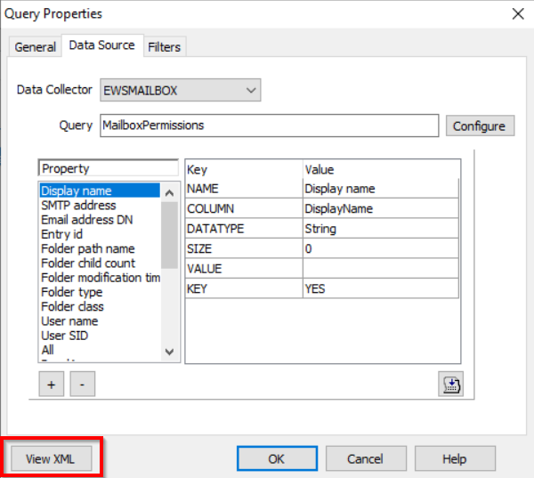
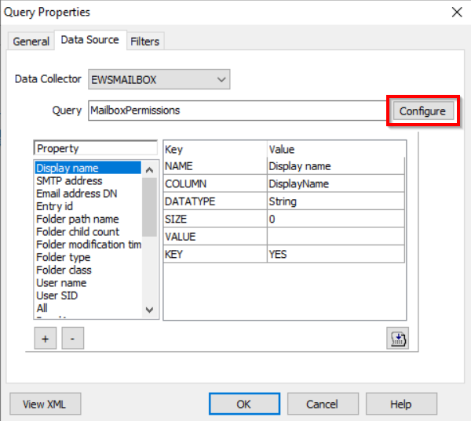

# The Autodiscover Service Couldn't Be Located

## Symptom

When running a job that uses **EWSMailbox Data Collector**, the following error appears:

```
The Autodiscover service couldn't be located
```

## Cause

This error populates due to missing or incorrect Autodiscover settings in the job XML.

## Resolution

To resolve this error, follow the steps below:

1. Open the **Query Properties** for the EWSMailbox task.
2. Select **View XML**.



3. Insert the following code that best matches your environment within the ` <EWS_PROPERTIES></EWS_PROPERTIES> ` tags. This is located near the bottom of the XML.

> **NOTE:** The XML will automatically reformat itself upon saving.

- SCP Disable Variable
```xml
<HTTP_HEADERS/> 
<SERVICE_PROPERTIES/> 
<AUTODISCOVER_PROPERTIES> 
<EnableScpLookup>False</EnableScpLookup> 
</AUTODISCOVER_PROPERTIES> 
```

- Office Online Only
```xml
<HTTP_HEADERS/>
<SERVICE_PROPERTIES>
<Url>https://outlook.office365.com/EWS/Exchange.asmx</Url>
</SERVICE_PROPERTIES>
<AUTODISCOVER_PROPERTIES>
<Url>https://autodiscover-s.outlook.com/autodiscover/autodiscover.svc</Url>
</AUTODISCOVER_PROPERTIES>
```

- Hybrid Environment (On-Prem & Online)
```xml
<HTTP_HEADERS/>
<SERVICE_PROPERTIES>
<Url>https://outlook.office365.com/EWS/Exchange.asmx</Url>
</SERVICE_PROPERTIES>
<AUTODISCOVER_PROPERTIES>
<EnableScpLookup>False</EnableScpLookup>
<Url>https://autodiscover-s.outlook.com/autodiscover/autodiscover.svc</Url>
</AUTODISCOVER_PROPERTIES>
```

4. On the **Query Properties** window, select **Configure**.



5. On the **Scan options** window, uncheck the option for **Match job host against autodiscovered host**.


6. Proceed through the wizard by selecting **Next** and complete the process by clicking **Finish** to close out the **EWSMailbox DC Wizard**.
7. Select **OK** to close the **Query Properties** window.
