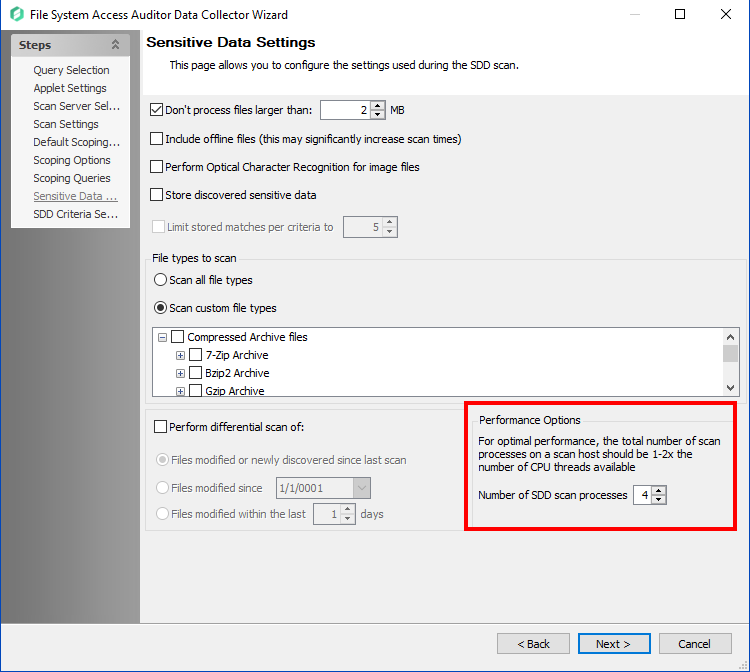

# How to Optimize SEEK System Scans with System Resources

## Related Query

- "SEEK scans are taking a long time. Some scans are taking 70-80-90 hours. Looking for improvements and recommendations."

## Question

How can you improve SEEK scan performance?

## Answer

If running SDD scans, you must increase the minimum amount of RAM. Each thread requires a minimum of `2GB` of RAM per host (example configuration below). To improve SEEK scan performance, verify the resources and job query configuration, and tweak the job query.

### Example

To comfortably scan 4 file systems using a dedicated proxy server, the optimized resource configuration should reflect:

- **Proxy Server System Resources**  
  `CPU: 4 Core | 8 Threads`  
  `RAM: 32GB` (`4 Target Hosts x 4 SDD Scan Processes x 2GB RAM per Target Host`)

- **FSAA Data Collector Query Settings**  
  `Number of SDD Scan Processes: 4`

### Verify Resources and Job Query Configuration

1. Verify that the Netwrix Access Analyzer (NEA) database has the appropriate resource allotment according to our product requirements.
   - If running multiple solutions simultaneously, compile the required resources.
   - Additional requirements for File Activity, SDD, and File Tag collection can be found below the requirements table.

2. Verify the number of SDD scan processes:
   - On the **Sensitive Data Settings** page of the FSAA Data Collector query settings, set the **Number of SDD Scan Processes** to reflect the available CPU threads on the scanning server. This number should not exceed `1-2x` the number of available CPU threads. By default, this is set to `2`.

   

   > **NOTE:** If the scan server has other responsibilities (e.g., NEA Console server, busy file server, SQL server), take those into account when configuring how many CPU threads should be allocated for SDD scan processes.

3. Verify the total amount of RAM on the Scan Server:
   - For SEEK scanning, each SDD scan process requires `2GB` per Target Host being concurrently scanned. Ensure that the minimum RAM requirements are met for optimal performance.

### Tweaking Job Query

1. Review the FSAA Data Collector query settings and adjust the following parameters:
   - Set the **Number of SDD Scan Processes** to reflect the available CPU threads on the server, ensuring it does not exceed `1-2x` the available threads.
   - Reduce the scope of the scan to focus on specific directories or file types if possible. This can help reduce the overall resource load.
   - Schedule scans during off-peak hours to avoid conflicts with other server processes.

2. Enable logging and review the logs to identify bottlenecks or errors during the scan process. Adjust the query settings based on the findings.
