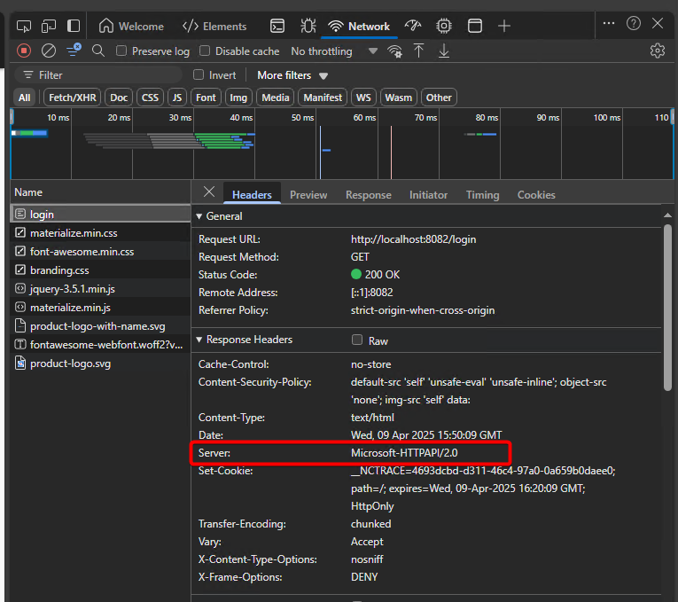
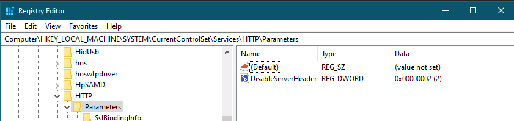
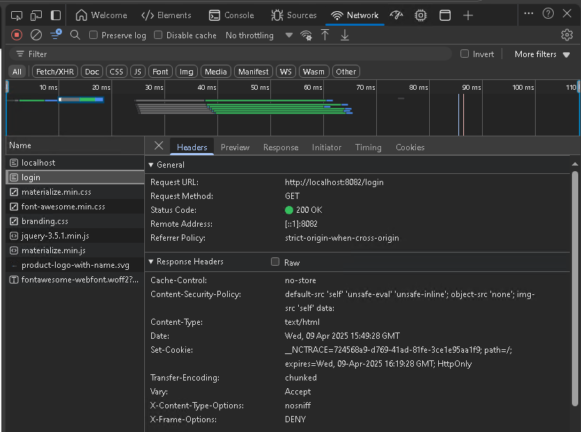

# Disabling the Server Header

## Overview

This article explains how to disable the server header in Netwrix Access Analyzer to prevent banner grabbing, which can expose server information. Banner grabbing can occur if the Windows registry `DisableServerHeader` setting is not configured correctly on the host.

> **NOTE:** Banner grabbing is the process of capturing banner information, such as application type and version, that is transmitted by a remote port when a connection is initiated. For more information, see Banner Grabbing ⸱ NIST 🔗  
> https://csrc.nist.gov/glossary/term/banner_grabbing
>
> 

## Instructions

Follow these steps to disable the server header in Netwrix Access Analyzer:

1. Navigate to the **Windows Registry Editor**.
2. Add or update the following registry key:
   `HKEY_LOCAL_MACHINE\System\CurrentControlSet\Services\HTTP\Parameters\DisableServerHeader`
3. Set the value to:
   `DWORD: 000002`
   
   
4. Reboot the server to apply the changes.
5. After the reboot, the result should resemble the Edge example below, in which the Server node is no longer listed.

> **IMPORTANT:** Modifications to this registry setting may occur due to the following reasons:
> - Netwrix Access Analyzer and Netwrix Access Information Center do not modify this setting during patching.
> - Microsoft may release a patch that changes its behavior, or internal configurations may enforce changes to the operating system, altering this setting.
> - Operating system configurations, such as group policy settings, may impact this setting or product functionality. Configuring the operating system is the customer's responsibility.

## Related Article

- Banner Grabbing ⸱ NIST 🔗  
  https://csrc.nist.gov/glossary/term/banner_grabbing
