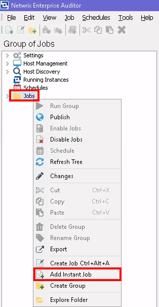
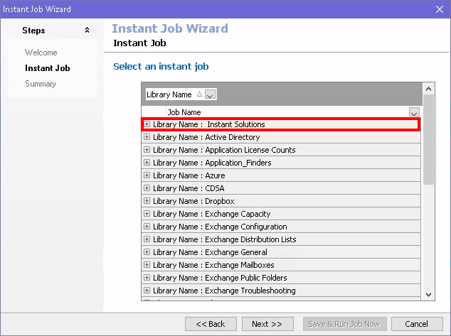
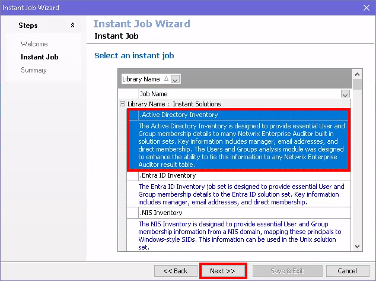
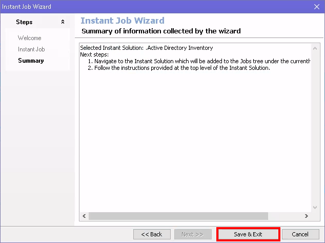
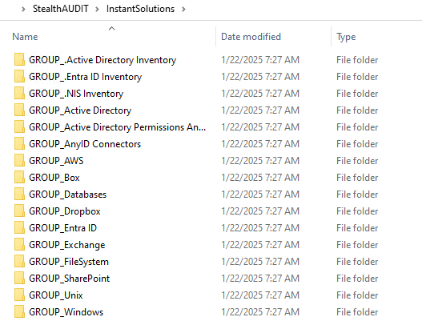

# How To Add the Jobs for a Newly Licensed Solution to an Existing Application Installation

## Overview

This article explains how to add jobs for a newly licensed solution to an existing Netwrix Access Analyzer installation. You can use one of the two methods described below after applying the new license file.

> **NOTE:** For instructions on how to apply a new license key to Netwrix Access Analyzer, please visit: How to Update the License Key in Access Analyzer.

## Instructions

### Add Solution via Instant Solutions

1. Open the Netwrix Access Analyzer console, right-click the **Jobs** folder, and select **Add Instant Job**.  
   

2. In the Instant Job Wizard, expand **Library Name: Instant Solutions** by clicking the **+** icon.
   

3. Select the newly licensed module (e.g., `.Active Directory Inventory`), then click **Next**.  
   

4. On the Summary page of the Instant Job Wizard, select **Save & Exit**.  
   

5. Your newly licensed module should now appear in the Netwrix Access Analyzer Job Tree.

### Add Solution via File Explorer

1. With the Netwrix Access Analyzer console closed, navigate to the **Instant Solutions** folder in Netwrix Access Analyzer's installation directory (`%SAInstallDir%InstantSolutions`).  
   

2. Locate the **GROUP_** folder for the new solution and copy it to the Jobs folder (`%SAInstallDir%Jobs`).

   - Example: Adding the Windows Solution
     - From: `%SAInstallDir%InstantSolutions\GROUP_Windows`
     - To: `%SAInstallDir%Jobs\GROUP_Windows`

3. Launch Netwrix Access Analyzer, and your newly licensed module should now appear in the Netwrix Access Analyzer Job Tree.

> **NOTE:** For further details on job configuration, see Netwrix Access Analyzer Solutions Overview.

## Related Articles

- How to Update the License Key in Access Analyzer
- Netwrix Access Analyzer Solutions Overview
