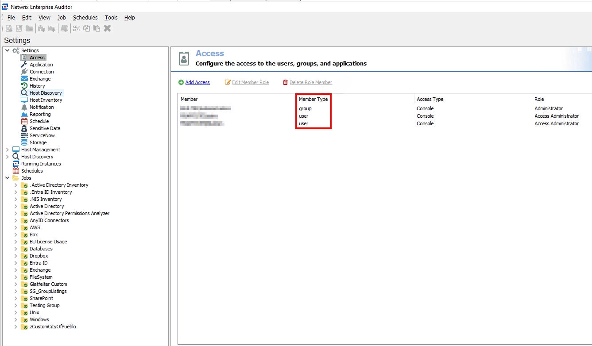

# Resolving Insecure Permissions for Service Executables

## Overview

This article explains how to resolve insecure permissions for Windows service executables in Netwrix Access Analyzer. Services using executables with weak permissions are at risk of privilege escalation attacks. An unprivileged user could modify or overwrite the executable with arbitrary code, which would then execute the next time the service starts.

This issue occurs when groups such as `Users` have modify or write access to service executables, and the **Access** node in the Global Settings controls these permissions. You should check permissions both before and after installation to ensure no changes have been made and proper permissions are in place.

In Netwrix Access Analyzer, the `Users` group does not have **Full Control** over these files (`WebServer.exe` or `VaultService.exe`) by default. Permissions are only assigned if configured manually under **Settings** > **Access**.

Examples of insecure permissions include:

- Path: `%stealthaudit%\vaultservice.exe`  
  Used by services: Netwrix Access Analyzer Vault  
  File write allowed for groups: `Users` (S-1-5-32-545)

- Path: `%stealthaudit%\web\webserver.exe`  
  Used by services: Netwrix Access Analyzer Web  
  File write allowed for groups: `Users` (S-1-5-32-545)

## Instructions

Follow the steps below to resolve this issue:

1. To review the permissions for the service executables identified by the security scanner, navigate to the affected file path. For example, `WebServer.exe` or `VaultService.exe`.
2. Right-click the file, select **Properties** and review the **Security** tab.
3. Remove permissions for groups such as `Users` (S-1-5-32-545) to ensure they cannot modify or write to these files.
4. Ensure groups like `Users` do not have **Full Control** over directories containing these service executables.

> **NOTE:** This approach ensures secure operation and mitigates the risk of privilege escalation.

