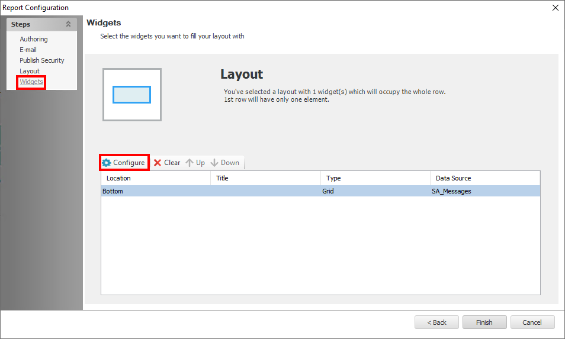

# Access Information Center Not Reporting Attribute Changes

## Symptom

When viewing the **Attribute Changes** in the **Reports** section of the Access Information Center (AIC), no updates appear for users, even though changes have been made since the last Active Directory (AD) Inventory scan.

## Cause

When differential scans for AD Inventory are not running, attribute changes are not collected.

## Resolution

Ensure that differential scans for AD Inventory are enabled and running. This will allow the AIC to capture and report any changes made to AD user attributes.

- To enable differential scanning of AD Inventory, enable the **Collect only updates since the last scan** option in the query configuration as shown below:

  

- For further information on customizing the `AD > 1-AD_Scan` job, please visit: https://docs.netwrix.com/docs/auditor/10_8

> Note: This article refers to the Access Information Center within Netwrix Access Analyzer product functionality.

## Related Article

- https://docs.netwrix.com/docs/auditor/10_8
