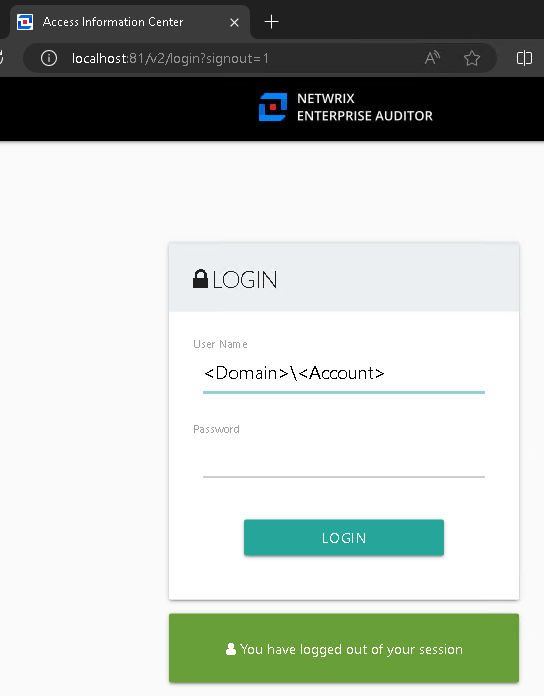

# Access Information Center Requiring Domain Prefix to Log In to Web Page

## Symptom
You receive the following error when Domain Prefix is required for log-in:

## Cause
Due to the change from IIS to a new web server, subdomain users will now need to include their domain prefix before their username when logging in.

> **NOTE:** You can create a more uniform and consistent log-in experience across all domains connected to the AIC by leaving it as is and requiring the domain prefix.

## Resolution
Ensure that the **Default Domain** is based on the AIC **Use the following Active Directory account** setting, which must be the desired domain.

> **NOTE:** All domains enabled to access the AIC must also have data collected by the Netwrix Access Analyzer Active Directory Inventory solution as per the following article: Active Directory—Multiple Domains.
