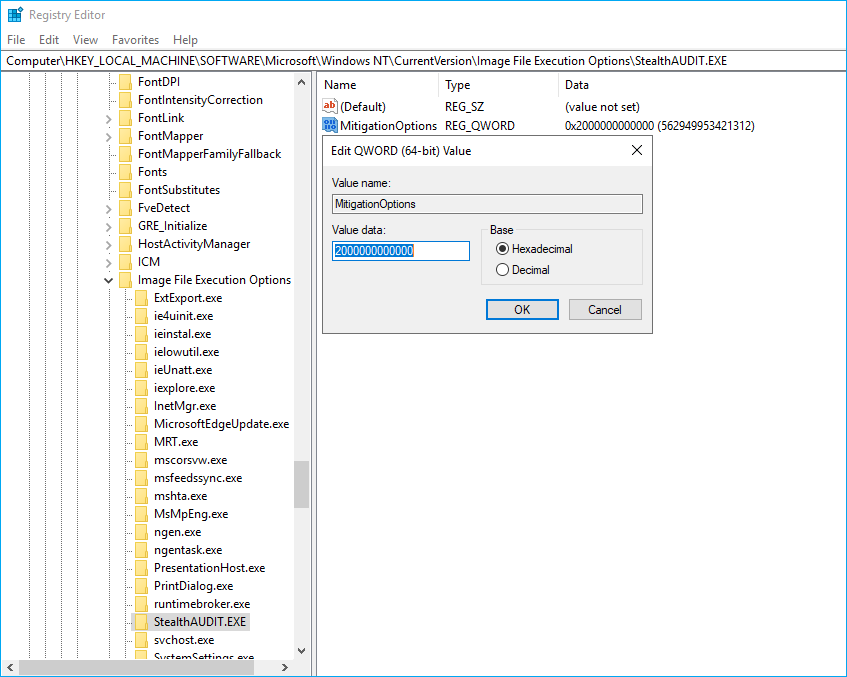

# Missing Icons and Graphical Elements in Netwrix Access Analyzer Web Console

## Symptom

You may see icons missing in the Netwrix Access Analyzer Web Console.

## Causes

- Local browser extensions are conflicting with the Netwrix Access Analyzer Web Console and are blocking the console elements.
- A GPO to block untrusted fonts is enforced.

## Resolutions

- Review the browser extensions blocking web fonts or JavaScript and disable them.
- Exclude Access Analyzer from the GPO blocking untrusted fonts:

  1. In the Netwrix Access Analyzer server, open Registry Editor, and follow the key provided below:

     ```Registry
     Computer\HKEY_LOCAL_MACHINE\SOFTWARE\Microsoft\Windows NT\CurrentVersion\Image File Execution Options
     ```

  2. Right-click the **Image File Execution Options** node and select **New** > **Key**. Name the new key `StealthAUDIT.EXE`.

  3. Right-click the `StealthAUDIT.EXE` key and select **New** > **QWORD (64-bit)**. Name the new value `MitigationOptions`.

  4. Right-click the `MitigationOptions` value and select **Modify**. Verify the **Value data** field states Hexadecimal `2000000000000`. Click **OK** to save changes.

  

### Related articles

- [Block untrusted fonts in an enterprise ⸱ Microsoft](https://learn.microsoft.com/en-us/windows/security/threat-protection/block-untrusted-fonts-in-enterprise#fix-apps-having-problems-because-of-blocked-fonts)
