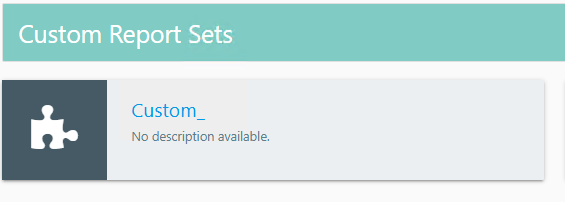

# Reports Not Visible or Name Truncated After Publishing in Custom Job or Group

## Symptoms

When creating a report for a custom job or group, the following issues are present in your environment:

- The custom job or group name appears normally in the **Netwrix Access Analyzer** console.  
  
- After publishing the report, it does not appear in the reporting web interface.
- The custom job or group name is truncated in the reporting web interface.  
  

## Cause

Netwrix Access Analyzer truncates `Jobs` or `_Jobs` from the end of all job and/or group names. The truncated name then gets displayed in the Reporting console, and settings for published reports in this group may be unpredictably affected.

## Resolution

To correct the issue, rename any custom job or group currently using the word `Jobs` to something that does not include the word `Jobs` to prevent truncation.

1. In the **Netwrix Access Analyzer** console, locate the custom job or group whose name ends with `Jobs` or `_Jobs`.
2. Rename the job or group so the name does not include `Jobs` (for example, change `Accounting Jobs` to `Accounting Tasks`).
3. Republish the report and verify the report appears and the name displays correctly in the reporting web interface.
