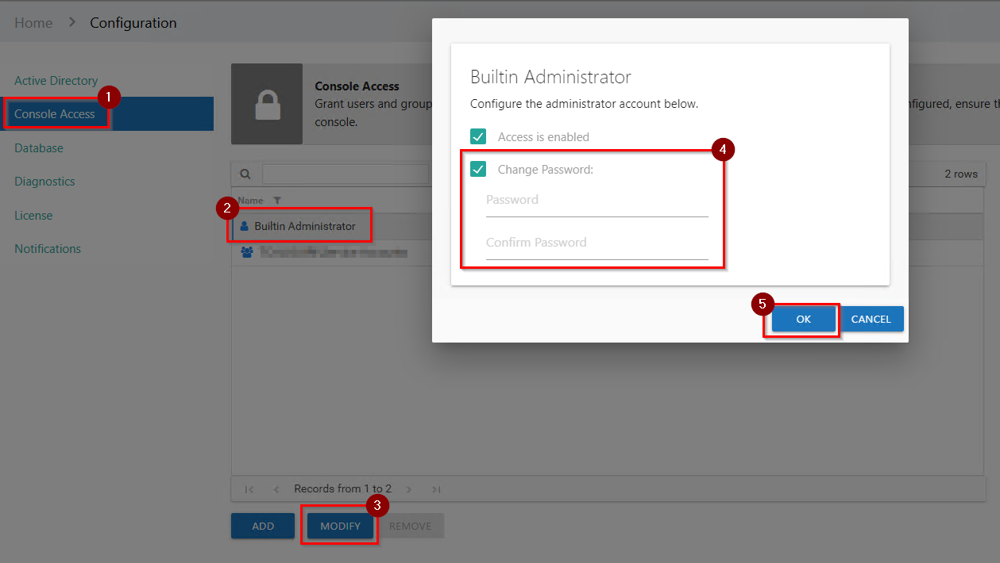
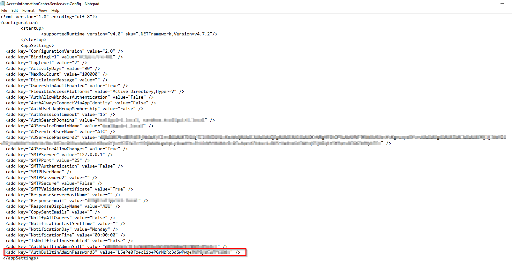

# Resetting the AIC Administrator Password

## Question

How can you reset the password for the Access Information Center (AIC) Built-In Administrator account?

## Answer

### With Access to Another Administrator in AIC

If you have access to another Administrator within the AIC, follow the steps below to reset the Built-In Administrator password:

1. Log in to the AIC.
2. Navigate to **Configure Console**.
3. Modify the Built-In Administrator, as shown below:

### Without Access to Another Administrator in AIC

If you do not have access to another AIC Administrator account, perform the following steps to reset the password using the AIC configuration file:

> **NOTE:** The default AIC Configuration file path is `\Program Files\STEALTHbits\Access Information Center\AccessInformationCenter.Service.exe.Config`.

1. Open the file as an administrator and remove the hash between " " for the **AuthBuiltinAdminPassword3 key**:

   

2. Restart the Netwrix AIC service in `Services.msc`.

3. Open the AIC and log in using the default AIC Built-in Administrator credentials:
   - **Username**: `Admin`
   - **Password**: `sb`

4. You will then be prompted to enter a new password for the AIC Built-in Administrator.

> **NOTE:** Prior to v11.6, a password reset will not be prompted. It is recommended that you change the password or disable this account.
