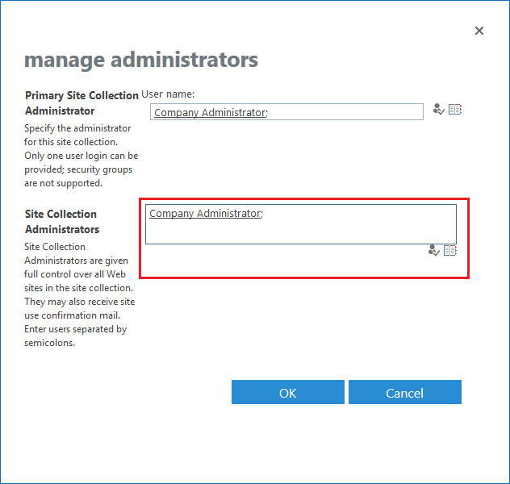

# How to Add Site Collection Administrators for SharePoint Online

## Overview

This article describes how to configure site collection permissions so you can run SharePoint (SPAA) scans. Without the proper site collection permission, the scan will fail with the `401: Unauthorized` error.

## Instructions

1. Establish the account used to scan SharePoint sites. Alternatively, establish the account to be used for scans.
2. Sign in to Microsoft 365 with an account that can access the Microsoft 365 admin center.
3. In the left navigation pane, under **Admin Centers**, select **SharePoint**.
4. Select the checkboxes for the sites you'd like to grant access.

   > **NOTE:** You can only add the account to one site at a time.

5. Click **Owners** > **Manage Administrators**.
6. Add the account configured in the SPAA scan job to access sites to the **Site Collection Administrators** field.

   

7. Click **OK** to save changes.
