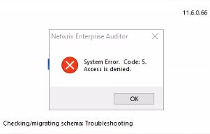

# Error: Code: 5 Access is Denied When Opening the C

## Symptom

When opening the Netwrix Access Analyzer console, you receive the following error message while checking schemas:

```text
System Error. Code: 5. Access is denied.
```



## Cause

The current user does not have sufficient permissions to the ` %SAInstallDir%` folder. The user must have at least **Modify** permission access to the folder and all child objects.

## Resolution

1. Add the user or group to the security permissions on the ` %SAInstallDir%` folder.
2. Ensure that they have at least **Modify** permission access to the folder and all child objects.
