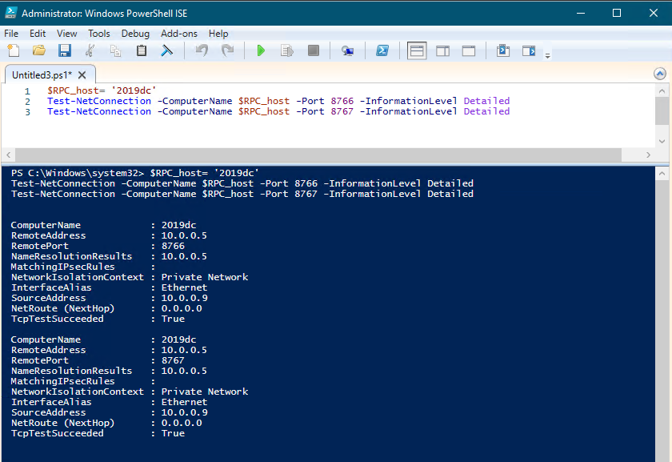

# Error: Connection Attempt Failed Because Connected Party Did Not Properly Respond

## Symptom

The File System Scan completes with the following error message:

```
Error: A connection attempt failed because the connected party did not properly respond after a period of time, or the established connection failed because connected host 
has failed to respond IP:87xx
```

## Cause

A third-party security tool or firewall rule is blocking the needed ports (`8767` and `8766`) for the File System Scan to function correctly.

## Resolution

Netwrix Access Analyzer server needs to communicate with the audited host via ports `8767` and `8766` as shown below. You may refer to the following PowerShell commands, but ensure to replace `2019dc` with your needed host name:

1. Run these PowerShell commands to test connectivity:

```powershell
$RPC_host= 'REPLACE-WITH-YOUR-PROXY-HOST'
Test-NetConnection -ComputerName $RPC_host -Port 8766 -InformationLevel Detailed
Test-NetConnection -ComputerName $RPC_host -Port 8767 -InformationLevel Detailed
```



2. If the test connections are successful on both ports, then the error should not appear.

3. If the test connections fail, verify that the proxy is installed and running at that location.
   - If the proxy is not installed, then ensure it is installed and running following these steps: Netwrix Access Analyzer v12.0 > **File System Proxy Service Installation**.
   - If the proxy is installed and running, then the environment must either have a firewall or other security software preventing communication on ports `8767` and `8766`.

## Related Articles

For more information on port requirements, please see the various guides for each scan mode below:

- Netwrix Access Analyzer v12.0 > **File System Proxy Service Installation**
- Netwrix Access Analyzer v12.0 > **Applet Mode Port Requirements**
- Netwrix Access Analyzer v12.0 > **Proxy Mode with Applet Port Requirements**
- Netwrix Access Analyzer v12.0 > **Proxy Mode as a Service Port Requirements**
- Netwrix Access Analyzer v12.0 > **Local Mode Port Requirements**
