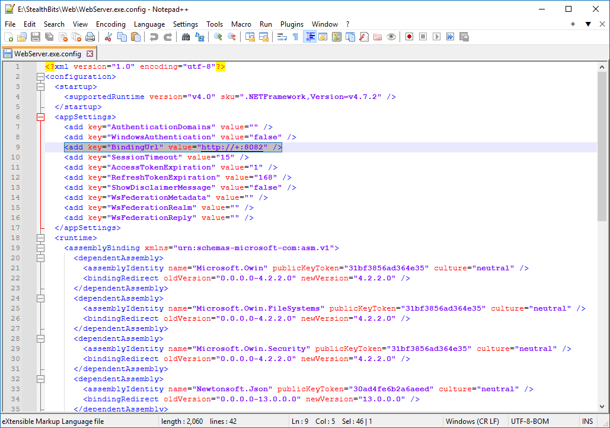

# Error: Refused to Connect in Web Console

## Symptoms

Refer to the following symptoms present in your Netwrix Access Analyzer environment:

- When you attempt to access reports via Web Reports, the following error appears:

```
Refused to connect
```

- The ` %sainstalldir%SADatabase\Logs\Web\Service.log` file in Netwrix Access Analyzer contains the following entry:

```text
%time_stamp% ERROR - Inner Exception
%time_stamp% ERROR - System.Net.HttpListenerException (0x80004005): Failed to listen on prefix 'https://+:8082/' 
because it conflicts with an existing registration on the machine.
```

> **NOTE:** The prefix may differ in your environment. Alter the prefix as necessary in the following instruction steps.

## Cause

An existing application on the Netwrix Access Analyzer host is actively listening on the affected port. Web Reports cannot be bound to the same port.

## Resolution

> **NOTE:** If the `BindingURL` node does not contain a port, refer to the default values of `80` and `443` for HTTP and HTTPS correspondingly.

Unbind the port from the application. Refer to the following steps:

1. Verify the Web Reports port—review the `BindingURL` node contents in the following document:

    ```text
    %sainstalldir%Web\WebServer.exe.config
    ```

    The `BindingURL` includes the port number and the protocol (HTTP or HTTPS).

    

2. On your Netwrix Access Analyzer host, run the following line in an elevated Command Prompt instance to retrieve all reserved URLs:

    ```text
    netsh http show urlacl
    ```

3. Review the list to find the affected port. Run the following line to unbind the reserved URL:

    ```text
    netsh http delete urlacl url="%Reserved_URL_value%"
    ```

    The output should read `URL reservation successfully deleted`.

4. Run the following line to verify that the affected port has a bound SSL certificate:

    ```text
    netsh http show sslcert
    ```

    If the output does not include the affected port, refer to the following article to learn more about the SSL binding: https://docs.netwrix.com/docs/auditor/10_8

## Related Link

- https://docs.netwrix.com/docs/auditor/10_8 (Reports via the Web Console — Securing the Web Console · v11.6)
