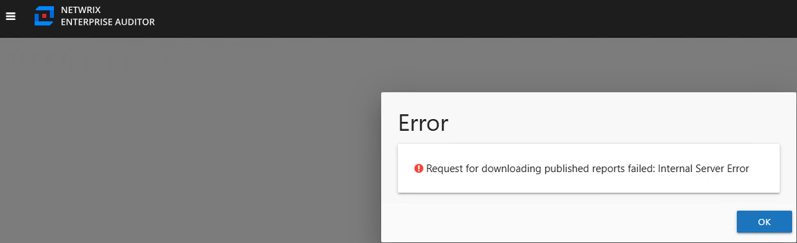
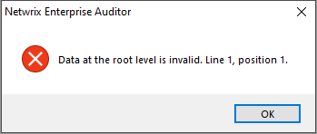
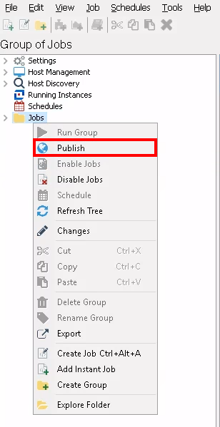
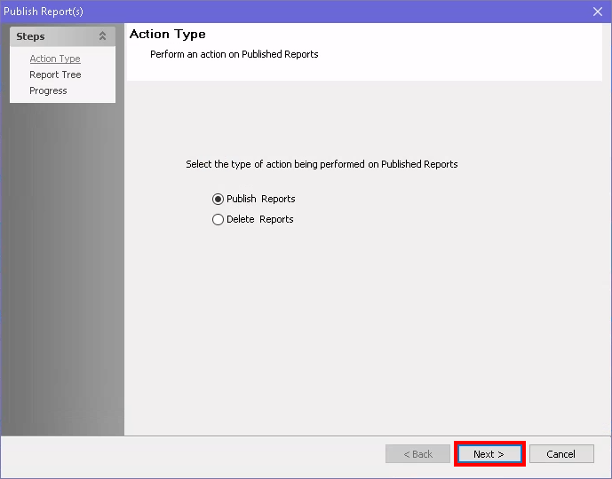
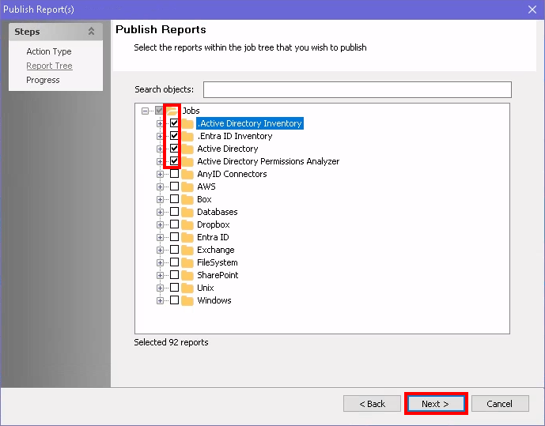
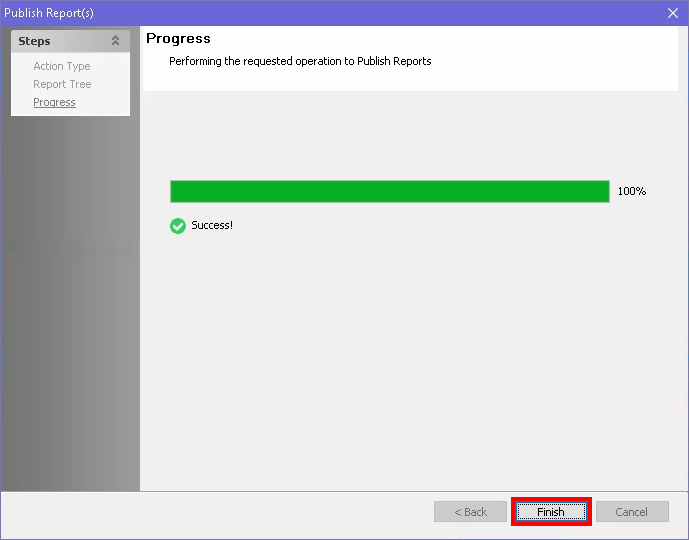

# Error: Request for Downloading Published Reports Failed

## Symptoms

Either of the following symptoms is present in your environment:

- Upon opening the Reporting web page, you receive the following error:

```
! Request for downloading published reports failed: Internal Server Error
```



- If the file is corrupted, the following error could appear when opening the Netwrix Access Analyzer console.



  - Log entry example:

```text
DEBUG Netwrix Enterprise Auditor IsGroupPublished "Data at the root level is invalid. Line 1, position 1."
%sainstalldir%\SADatabase\Logs\Application\SADebug-20250306124900-10776.TSV
```

## Cause

The issue is caused by a corrupted `Reports.xml`.

## Resolution

To resolve these errors, follow the steps below.

1. Rebuild the Reports folder under the install path. If you want to back up the folder, archive it prior to deleting the original.

   > **NOTE:** To find the install path, enter the following environmental variable into the application server's Windows File Explorer: ` %sainstalldir%`. Then, right-click the **Reports** folder to archive and/or delete it.

2. Close and reopen the **Access Analyzer** Console to rebuild the folder.

3. To publish the report(s) again, right-click a needed Job Group (for example, **Jobs**), and select **Publish** to publish the reports from the selected job group or job without regenerating the report.



4. Select **Publish Reports** and click **Next**.



5. Select objects as needed. Then, click **Next** to run the report.



6. Once the report has run successfully, click **Finish** to close out of the Reporting web page.



> **NOTE:** Additionally, reports will be rebuilt when the related job completes its next run.
