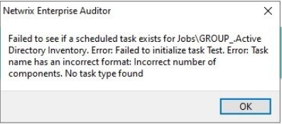

# Error: Task Name Has an Incorrect Format: Incorrect Number of Components

## Symptom

When selecting **Schedules** or any **Job**, the following pop-up task format error message appears:

## Cause

A job exists in the Windows Task Scheduler that references the Netwrix Auditor executable `StealthAUDIT.exe` but does not have all the required fields.

## Resolution

1. Delete the failed task from the Windows Task Scheduler.

> **NOTE:** The faulting task can be identified from the following part of the pop-up error message:
>
> `Error: Failed to initialize task <Faulting Task Name>`
