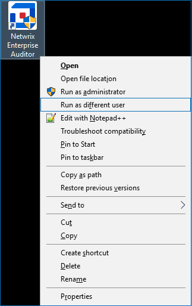

# Error: The Default Schema Name Is Incorrect

## Symptom

You see the following error when you open or close Netwrix Access Analyzer (NEA):

```
FAILED: the default schema name is incorrect
```

## Causes

Refer to the following possible causes:

1. You (the user working in NEA) do not have sufficient permissions to access the NEA database.
2. When using the Windows authentication method for the database service account, the account has insufficient permissions to access the database.

## Resolutions

Refer to the corresponding resolution:

1. Log in to Netwrix Access Analyzer (NEA) with a user account that has properly provisioned permissions to the SQL database. Hold **Shift** and right-click the **Netwrix Access Analyzer** icon. Select **Run as different user**.

   

2. Grant the correct SQL DB permissions to the current user via the SQL Server Management Studio (SSMS) application. Refer to the following article for additional information on required permissions: Netwrix Access Analyzer Database — Database Creation & First Level of Security · v11.6.

## Related Articles

- Netwrix Access Analyzer Database — Database Creation & First Level of Security · v11.6
