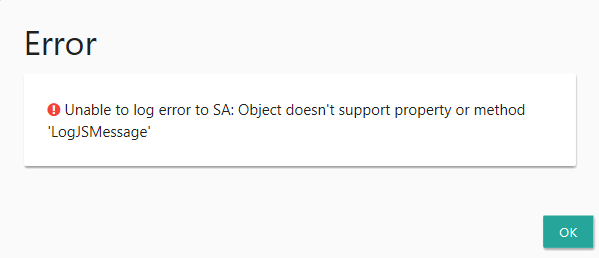
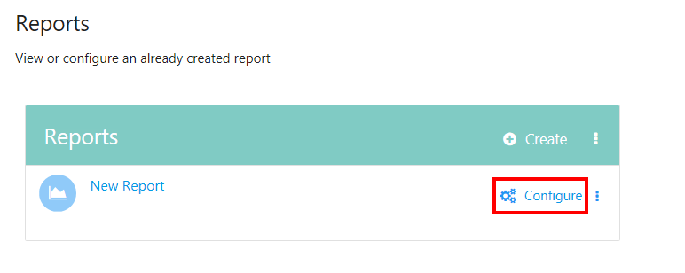
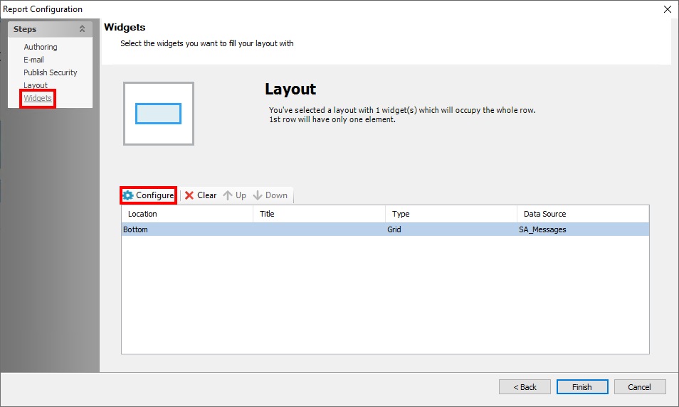
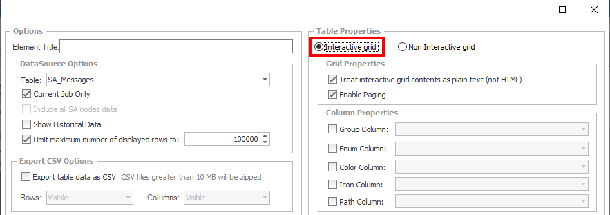
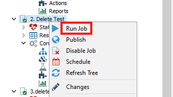
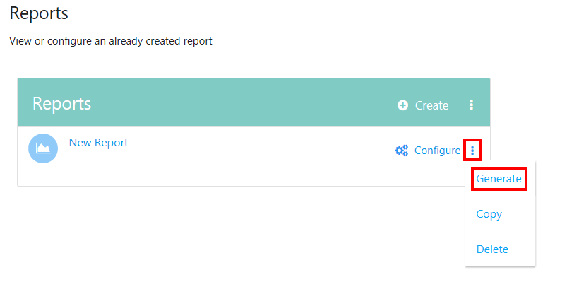

# File Not Found Reports Error: Unable to Log Error to Access Analyzer

## Symptom

When the report grid settings are configured for a non-interactive grid on the AD Group Members View table of the report, and you are attempting to download an exported report as a CSV file, the system generates the following error message:

```text
(File not found error)

Unable to log error to Access Analyzer: Object doesn't support property or method 'LogJSMessage'.
```



## Cause

This error message is caused by setting the report grid configuration to Non Interactive grid.

## Resolution

To resolve this error, refer to the following steps:

1. Click **Configure** to access the report settings.  
   

2. Navigate to the **Widgets** node and select **Configure** on the layout location of the report.  
   

3. After clicking **Configure**, select the **Interactive grid** option in the top-right corner under Table Properties.  
   

4. Ensure that you have the **Export table data as CSV** box checked.  
   

5. Confirm that the error has been resolved using either of the following methods:
   - Right-click the **Job** itself and select **Run Job**.  
     
   - In the Reports pane, click the **Kebab menu** (three vertical dots) next to **Configure** and select **Generate**.  
     
