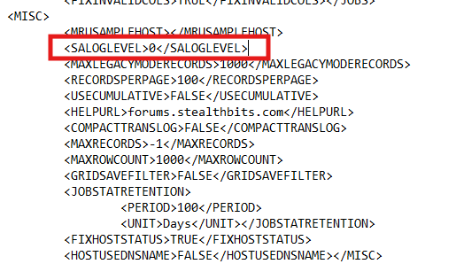

# How to Enable Debug Logging Manually

## Question

How can you manually enable the debug logging mode in Netwrix Access Analyzer?

## Answer

Refer to the following steps to manually enable the debug mode in Netwrix Access Analyzer:

1. Locate the `GlobalOptionsconfig.xml` file in the Netwrix Access Analyzer installation folder. Use the following variable to locate the folder:

   ```text
   %sainstalldir%
   ```

2. In the `GlobalOptionsconfig.xml` file, change the `<LOGLEVEL>` value to `0` to enable debug logging. Save the changes.

3. Open the **Netwrix Access Analyzer console** to access the application logs.

Refer to the example of the value in the configuration file that must be changed to `0`:


