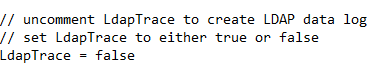

# Netwrix Threat Prevention Agent Not Processing Events

## Related Query

- At 6:13 am Monday, around 10,000 computers got deleted. SI is not showing these events, but Netwrix Access Analyzer (NEA) is showing them.  
  Then, on Jan 2nd, they deleted another 5,300 computers at around 10:37 am, and a lot of those are not showing up either, but NEA is able to see them.

## Symptoms

The following symptoms are present in your environment:

- An influx of events occurs during high event traffic hours on any given Netwrix Threat Prevention (NTP) agent causing adverse performance issues.
- This results in the NTP agent not responding, leading to the agent either processing some events and losing others, or completely failing to process events altogether.
- You may also discover **Agent Heartbeat** alerts generating on the affected agent under the Alerts node in the NTP admin console.

## Cause

This issue may be caused by any one of the following:

- Large LDAP Trace logs
- Agents/Admin console left in Debug Mode
- A large quantity of events and types of events being captured by the NTP agent
- Machine performance and other operational loads occurring on the target machine
- Unfiltered LDAP Policies or other high event count generating policies, such as unfiltered Logon policies
- EM/SQL server performance that can hinder the events from being processed and cause events to pile up on the agent, leading to an agent queue overflow

> NOTE: If the agent is generating large LDAP Trace Logs, verify that the `LdapTrace` is set to **False**. This can be found in the `logging.ini` file at this file path:
>
> `C:\Program Files\Netwrix\Netwrix Threat Prevention\SIWindowsAgent`
>
> 

## Resolution

To resolve this issue, refer to the following steps:

1. Tune the NTP policies to collect and monitor only data that is considered important, while excluding anything that is not. Begin by following the Best Practices documentation:
   - https://docs.netwrix.com/docs/threatprevention/7_5
2. Perform mass deletion of AD objects in batches to mitigate the probability of an agent not responding or entering into an event queue overflow.
3. Schedule tasks that result in an abnormal amount of event traffic to be performed during off hours or low traffic periods.
4. Verify that the EM and agent log settings are set to **WARN**.
5. Verify that the `LdapTrace` is set to **False**.

## Related Article

- Best Practices and Troubleshooting  
  https://docs.netwrix.com/docs/threatprevention/7_5
