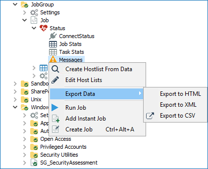

# Opening a Ticket

## Overview

This article provides guidance on collecting logs and other relevant information when submitting a support ticket for Netwrix Auditor (NEA).

## Instructions

Follow the steps below to gather the necessary logs and details required for troubleshooting your NEA instance.

### Logs

Follow these steps to gather logs:

- Depending on your current **AIC** version, refer to one of the following default paths:

  - AIC v11.5:

    ```text
    C:\inetpub\wwwroot\StealthAUDIT Compliance\
    ```

  - AIC v11.6:

    ```text
    C:\Program Files\STEALTHbits\Access Information Center
    ```

- Navigate to the following path to collect the **NEA Console logs**:

  ```text
  %SAInstallDir%SADatabase\Logs\Application
  ```

- Gather the **Published Reports logs** from the following path:

  ```text
  %SAInstallDir%SADatabase\Logs\Web
  ```

- Collect the **job logs** using one of the following methods:

  - On the home page of the job, click **View Log**, and save the log file.

    

  - Locate the **job logs** using the following path:

    ```text
    %SAInstallDir%Jobs\%GROUP%\%JOB%\OUTPUT
    ```

    > **NOTE:** Replace `%GROUP%` and `%JOB%` with the appropriate values. For example, to locate logs for the `1-AD_Scan` job, use the following path:
    >
    > ```text
    > %SAInstallDir%\Jobs\GROUP_.Active Directory Inventory\JOB_1-AD_Scan\OUTPUT
    > ```

  - In the **Navigation Pane**, right-click the job and select **Export**. In the new window, specify the components to export and proceed with the export.

    

## Messages Table

To export job errors and warnings from the **Messages table**, proceed to the **Navigation Pane**, right-click **%JOB%**\**Status**\**Messages** and select **Export** > **Export to XML**.

## Product Build Number

> **IMPORTANT:** Identifying your current NEA build helps determine whether the issue has already been addressed in a newer version. Follow the steps below to establish the build number in your NEA instance.

- In NEA v11.5:

  - In **Control Panel**, open the **Programs and Features** menu. Locate the NEA line and review the **Version** column value.
  - In the **Apps & Features** menu, highlight the NEA entry and review the version.

- In NEA v11.6:

  - Navigate to **Help** > **About** in the top toolbar.
