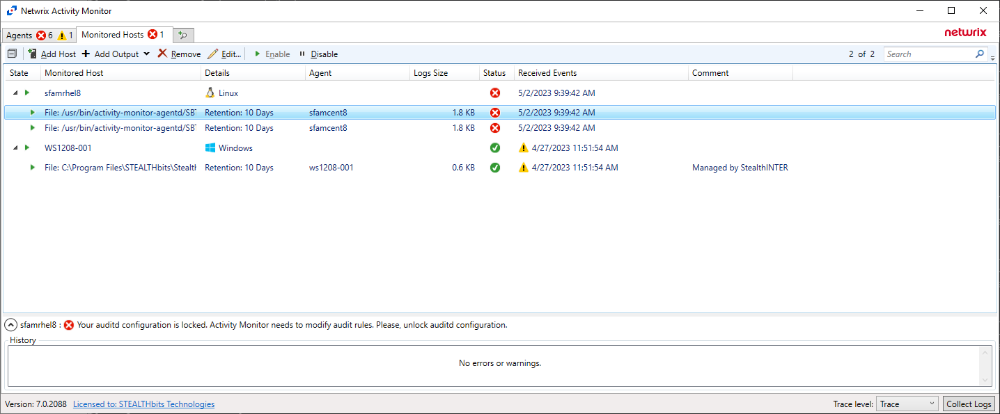

# NAM Linux Agent - How to handle locked auditd config

### Your auditd configuration is locked. Netwrix Activity Monitor needs to modify audit rules. Please, unlock auditd configuration.



This KB article explains why the user can receive such error message and how to handle it.

Activity monitoring for Linux is based on auditd, a part of the built-in Linux Auditing System. Netwrix Activity Monitor uses auditd and needs to be able to control it. Therefore Netwrix Activity Monitor requires write access to auditd configuration (`auditctl`) and specifically to auditing rules (`audit.rules`).

There is an `enabled` flag in `auditctl` that can lock the rules. When locked, it prevents the rules from being changed until the system is rebooted.  
When auditd configuration is locked Netwrix Activity Monitor is not able to control auditing and set up audit rules and therefore activity monitoring cannot be correctly configured. Netwrix Activity Monitor is able to detect the lock and show an appropriate error message to the user (Figure 1).

The current version of Netwrix Activity Monitor (7.0) does not automatically handle the locked auditd configuration.  
When you receive such an error you need to manually remove the lock in order to have activity monitoring enabled. Automatic handling of auditd lock is planned in the next version of Netwrix Activity Monitor.

The following commands may be helpful to identify the rule that locks the configuration and disable it:

1. Show current status
   ```
   auditctl -s
   ```
   Example output:
   ```
   enabled 2
   failure 1
   pid 1006
   rate_limit 0
   backlog_limit 8192
   lost 0
   backlog 0
   backlog_wait_time 60000
   backlog_wait_time_actual 0
   loginuid_immutable 0 unlocked
   ```

   Note: `enabled 2` indicates the locked flag.

2. List currently loaded rules
   ```
   cat /etc/audit/audit.rules
   ```
   Example output:
   ```
   -a always,exit -F dir=/home/maxim/3 -F perm=w -F filetype=dir -k xsfam_000_003_d_w
   -a always,exit -F dir=/home/maxim/3 -F perm=a -F filetype=dir -k xxfam_000_003_d_a
   --backlog_wait_time 60000
   -e 2
   ```

   Note: `-e 2` is the line that sets the locked flag.

3. Find the rule that enables the lock
   ```
   grep -R "\-e 2" /etc/audit/rules.d
   ```
   Example output:
   ```
   /etc/audit/rules.d/x002.rules:-e 2
   ```
   `/etc/audit/rules.d/x002.rules` is the path to the file containing the locking rule.

4. Edit the file and remove the locking rule (for example replace `-e 2` with `-e 1`), then reboot the system in order to have the changes applied.
