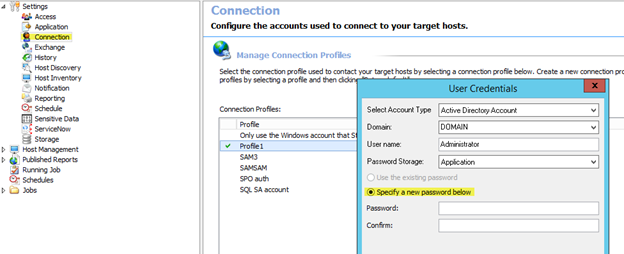
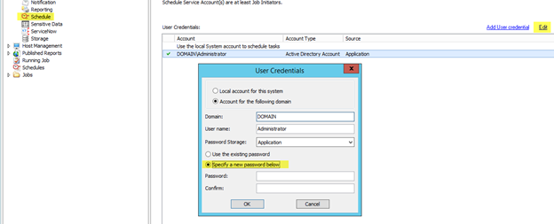
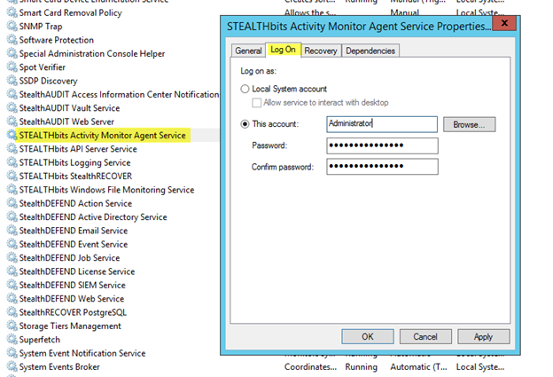
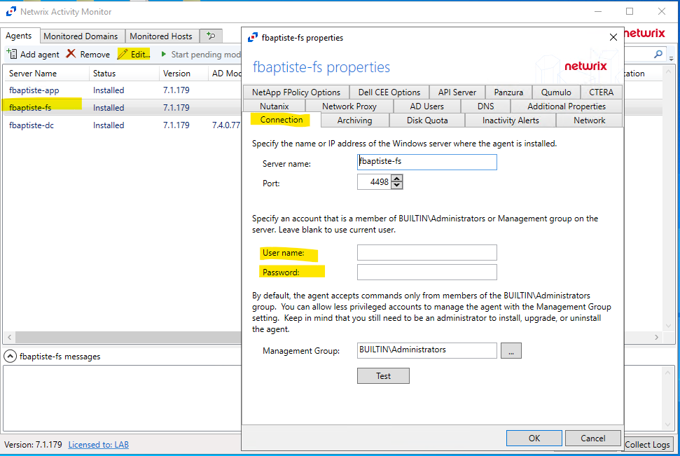
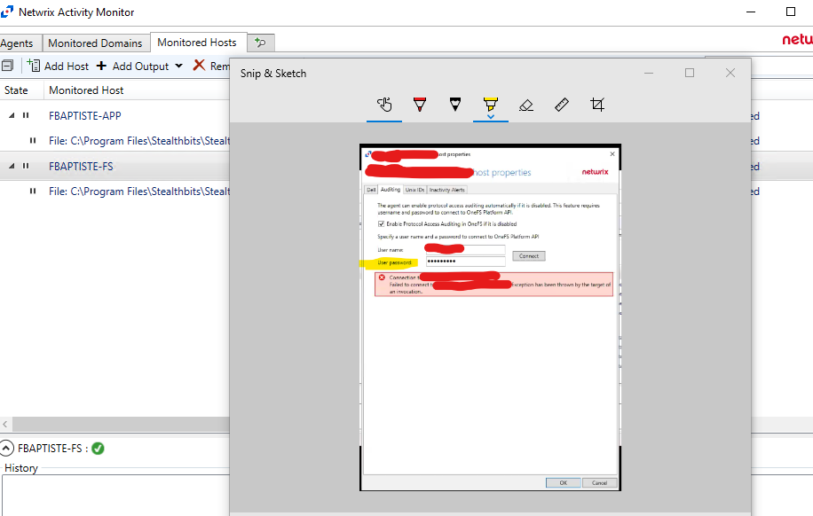
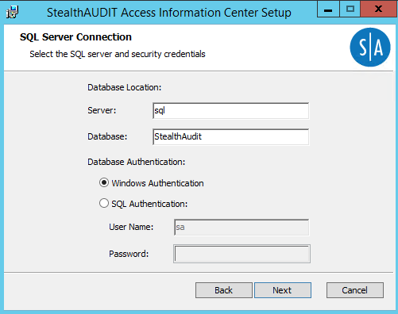
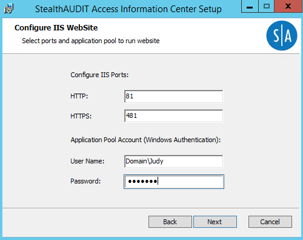
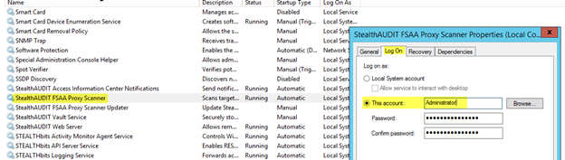
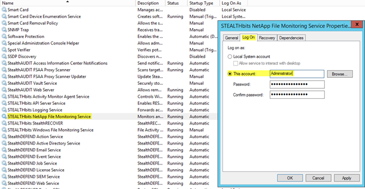

# Update Service Account Password Upon Password Change in Active Directory (AD)

## Overview

When passwords for service accounts get reset in Active Directory (AD), the passwords do not update and propagate automatically − they should be updated manually.

## Instructions

> **NOTE:** In case Windows auth is used for the SQL database connection, no changes to the Netwrix Access Analyzer connection settings are required. The Windows auth method allows you to connect to your SQL Server using the currently logged-in Windows user credentials when the Netwrix Access Analyzer console is opened. If the credentials are valid, the SQL database connection will be established.

### Netwrix Access Analyzer

- Change the service account password in **Netwrix Access Analyzer** > **Settings** > **Connection**.
  

- Change the service account password in **Netwrix Access Analyzer** > **Settings** > **Schedule**.
  

### Netwrix Activity Monitor

- If a Netwrix Activity Monitor (NAM) agent runs the agent service with the service account, the password in NAM should also be updated. While the service may run using the Local System account, make sure to confirm it is. If you need to change the password, right-click the NAM agent service (in Windows Services), and navigate to **Properties** > **Logon** tab.
  

Agent settings

- Select the agent and click **Edit**. Under the **Connection** tab, update the password if a specific account was used.
  

Monitored Host (NAS devices)

- Select the Host and click **Edit**. Under the **Auditing** tab, update the user's password to connect to the OneFS Platform API.
  

### Access Information Center

- Reinstall Access Information Center (AIC) in case the service account is used to establish the connection to the SQL database for Windows authentication. The repair option will not reset the database connection.
  
  

> **NOTE:** If any customizations have been made to the AIC (enabling SSL, SSO, ownership workflow, etc.), then it is advised to make a backup of the Netwrix Access Analyzer compliance folder so the customizations can be restored after the AIC reinstall. Refer to the default location:

```text
C:\inetpub\wwwroot\StealthAUDIT Compliance
```

### FSAA Proxy

- If using the FSAA Proxy stand-alone application, you will need to change the password in the **Properties** > **Log On** tab in Windows Services for the service (`StealthAUDIT FSAA Proxy Scanner`).
  

### Netwrix Activity Monitor (NetApp NAS monitoring)

- If using a NAM agent to monitor a NetApp NAS with this service account, it may also be necessary to update the credentials for the `Stealthbits NetApp File Monitoring Service` (in Windows Services):
  
