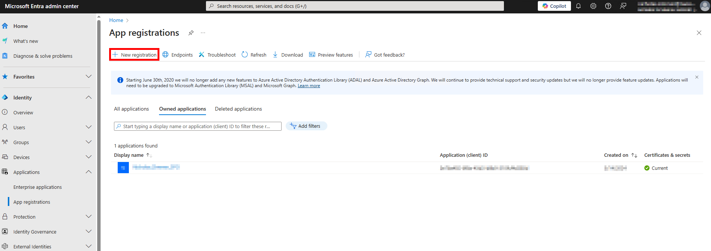
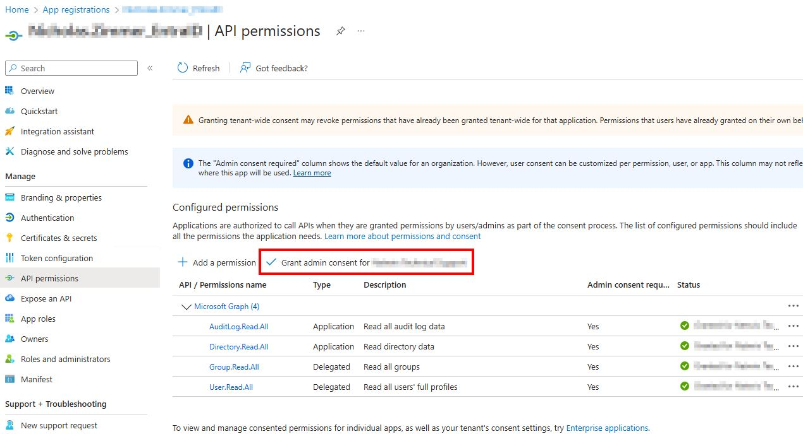
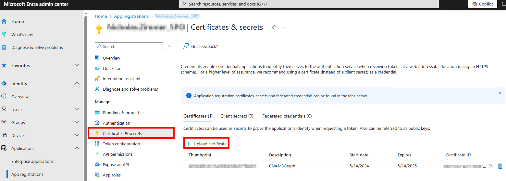
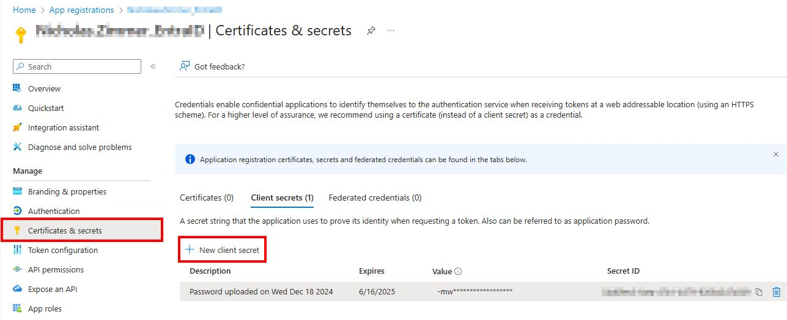
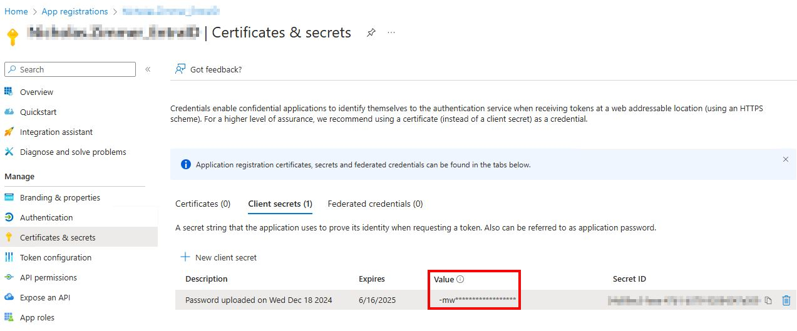
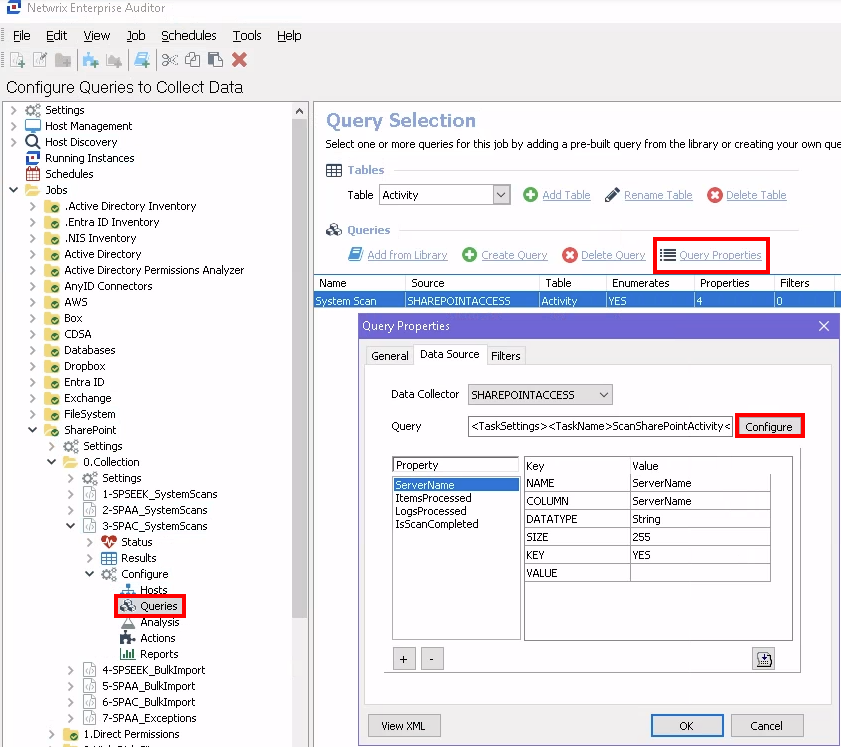
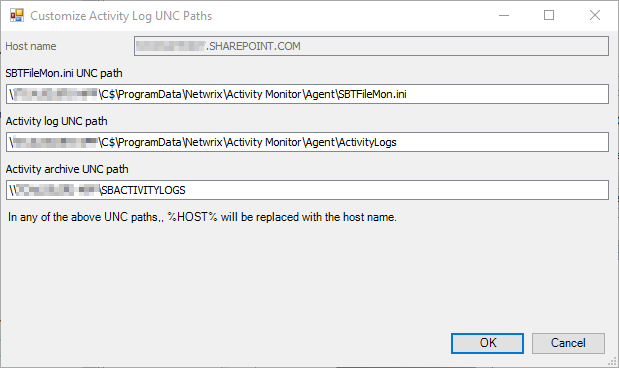
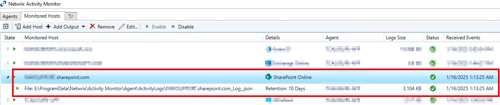

# Manually Setting Up SharePoint Online Auditing

## Question

How do I set up SharePoint Online auditing without using the `SP_RegisterAzureAppAuth` instant job?

## Answer

It is always recommended to use the `SP_RegisterAzureAppAuth` instant job to set up the Entra app for auditing.  
However, the process can be completed manually if necessary, such as if MFA cannot be temporarily disabled for a Global Admin account.

### SPAA/SPSEEK Scans

1. Open the Microsoft Entra admin center: https://entra.microsoft.com/#home.
2. Navigate to **Identity > Applications > App registrations**.
3. Select **+ New registration**.  
   
4. On the Register an application page, set the following:
   - **Name:** Enter a meaningful name, such as `NetwrixAccessAnalyzer_SharePoint`.
   - **Supported account types:** Choose **Accounts in this organizational directory only**.
5. From the Application Overview page, navigate to **Manage > API Permissions** and select **Add a permission**.  
   
6. From the Request API permissions page, select **Microsoft Graph** and add the following permissions:  
   

   - Delegated Permissions:
     - `Group.Read.All` – Read all groups
     - `User.Read.All` – Read all users' full profiles
   - Application Permissions:
     - `Application.Read.All` – Read all applications
     - `AuditLog.Read.All` – Read all audit log data
     - `Directory.Read.All` – Read directory data
     - `Files.Read.All` – Read files in all site collections
7. From the Request API permissions page, select **Office 365 Management APIs** and add the following permissions:
   - `ActivityFeed.Read` – Read activity data for your organization
   - `ActivityFeed.ReadDlp` – Read DLP policy events, including detected sensitive data
   - `ServiceHealth.Read` – Read service health information for your organization
8. From the Request API permissions page, select **SharePoint** and add the following permissions:
   - `Sites.FullControl.All` – Have full control of all site collections
   - `Sites.Read.All` – Read items in all site collections
   - `TermStore.Read.All` – Read managed metadata
   - `User.Read.All` – Read user profiles
9. After adding the permissions, grant admin consent by selecting **Grant admin consent for \{TENANT NAME\}**.  
   
10. On the Netwrix Access Analyzer server, import a certificate and PFX file to the ` %SAInstallDir%PrivateAssemblies` location:

    - If necessary, create a self-signed certificate with the following PowerShell commands:

      ```powershell
      $cert=New-SelfSignedCertificate -CertStoreLocation Cert:\CurrentUser\My -DnsName stealthbits.com -Subject "CN=StealthAUDIT SharePoint Auditor" -FriendlyName "StealthAUDIT SharePoint Auditor" -KeyAlgorithm RSA -KeyLength 2048 -KeyExportPolicy Exportable -Provider "Microsoft Enhanced RSA and AES Cryptographic Provider" -NotAfter (Get-Date).AddYears(11)
      ```

      - Change the DNS Name to match your domain.
      - Change the Subject and FriendlyName to match the App Registration name in Entra (formerly Azure).

      ```powershell
      Export-Certificate -Cert $cert -FilePath "$($env:SAINSTALLDIR)PrivateAssemblies\spaa_cert_domain.cer" -Type CERT
      ```

      - Ensure the certificate name includes the domain (e.g., `spaa_cert_NWXSUPPORT.cer`).

      ```powershell
      Export-PfxCertificate -Cert $cert -FilePath "$($env:SAINSTALLDIR)PrivateAssemblies\spaa_cert_domain.pfx" -Password (ConvertTo-SecureString -String "PasswordGoesHere" -Force -AsPlainText)
      ```

      - Ensure the PFX file name includes the domain (e.g., `spaa_cert_NWXSUPPORT.pfx`).
      - Replace `PasswordGoesHere` with a secure password.

11. Navigate back to the SharePoint App registrations page, and on the **Certificates & Secrets** page, click **↑ Upload certificate** to upload the `spaa_cert_domain.cert` file.  
    
12. Navigate to the **Overview** tab and copy the **Application (client) ID**. This will be used for the Access Analyzer connection profile.
13. In Netwrix Access Analyzer, navigate to **Global Options > Connection** and create a connection profile with the same name as the SharePoint app registration, using the following:
    - **Account Type:** Azure Active Directory
    - **Client ID:** Application (client) ID from SharePoint App Registration
    - **Key:** CertLocation, CertPassword, NumericDesignator
      - **Numeric Designator:** `0` is the default. Other options are:
        - `1` for pre-production environments
        - `2` for China
        - `3` for Germany
        - `4` for USGovernment
      - Example: `C:\Program Files (x86)\STEALTHbits\StealthAUDIT\PrivateAssemblies\spaa_cert_domain.pfx,YourPasswordHere,0`
14. Create a host list with the SharePoint site, for example: `YourOrganization.SharePoint.com`.
15. Set the SharePoint job group to run against the SharePoint host list.
16. Set the SharePoint job group to use the new SharePoint Connection Profile, and SPAA/SPSEEK is now configured for auditing.

### SPAC Scans

The SPAC scan can utilize the same app registration as SPAA/SPSEEK. Follow steps 1–4 from the instructions above if an app has not already been created.

1. From the Application Overview page, navigate to **Manage > API Permissions** and select **Add a permission**.  
   
2. From the Request API permissions page, select **Microsoft Graph**.  
     
   Add the following Application Permissions:
   - `Directory.Read.All` – Read directory data
   - `Sites.Read.All` – Read items in all site collections
   - `User.Read.All` – Read all users' full profiles
3. From the Request API permissions page, select **Office 365 Management APIs**.  
   Add the following Application Permissions:
   - `ActivityFeed.Read` – Read activity data for your organization
   - `ActivityFeed.ReadDlp` – Read DLP policy events, including detected sensitive data
4. After adding these permissions, grant admin consent by selecting **Grant admin consent for \{TENANT NAME\}**.  
   
5. Navigate to **Manage > Certificates & Secrets** and select **+ New client secret**.  
   
6. On the Add a client secret page, set the following:
   - **Description:** Enter something meaningful, for example: `NAM SharePoint.`
   - **Expires:** Set this to the longest option or per your organization's internal policy.
7. After creating the client secret, copy the **Secret Value** to a secure location.

   > **NOTE:** This value will obfuscate. Make sure you copy it immediately or you will need to create a new client secret.  
   > 

8. In Netwrix Activity Monitor, navigate to the **Monitored Hosts** tab and select **Add Host**.
   - **Choose Agent:** Specify the agent you would like to use for collecting SharePoint activity logs.
   - **Add Host:** Select SharePoint Online and add the SharePoint site as the Domain Name, for example: `YourOrganization.SharePoint.com`.
   - **Entra AD / Azure ID Connection:**
     - **Domain:** Use the same domain name as before (if it does not auto-populate).
     - **Azure Cloud:** Leave set to **Azure** unless it is a government organization.
     - **Client ID:** Entra Application (client) ID from the manually created app.
     - **Client Secret:** This is the **Secret Value** copied earlier.
     - **Region:** Optional – leave blank if not applicable.
   - **SharePoint Online Operations:** Select what SharePoint activity is to be collected (all options are selected by default).
   - **Users to Exclude:** Add any users you do not want to collect SharePoint activity for.
   - **Where to log the activity:** Select **Log File**.
   - **File Output:** Select a log file path, set the retention period for activity logs, and ensure the box for **This log file is for Netwrix Access Analyzer** is checked.
9. After completing the above steps, you should see the SharePoint Online host added to the Monitored Hosts tab with green checkmarks, indicating successful connection and setup.
10. In Netwrix Access Analyzer, navigate to **SharePoint > 0.Collection > 3-SPAC_SystemScans > Configure > Queries > Query Properties > Configure**.  
    
11. On the **Activity Date Scope**, set how long to retain the SharePoint activity in the Access Analyzer database.
12. On the **Activity Log Locations**, select **Add** and configure the following:  
    

    - **Host name:** This should match the monitored host name in Activity Monitor, e.g., `YourOrganization.SharePoint.com`.
    - **Activity log UNC path:** This is the file output path in UNC format, e.g., `\AgentHost\C$\ProgramData\Netwrix\Activity Monitor\Agent\ActivityLogs`.

      - This value can be found by converting the file output path from the SharePoint monitored host in Activity Monitor to UNC format.  
        

    - **Activity archive UNC path:** UNC Path of agent's archive (on the Agents tab), if applicable.
