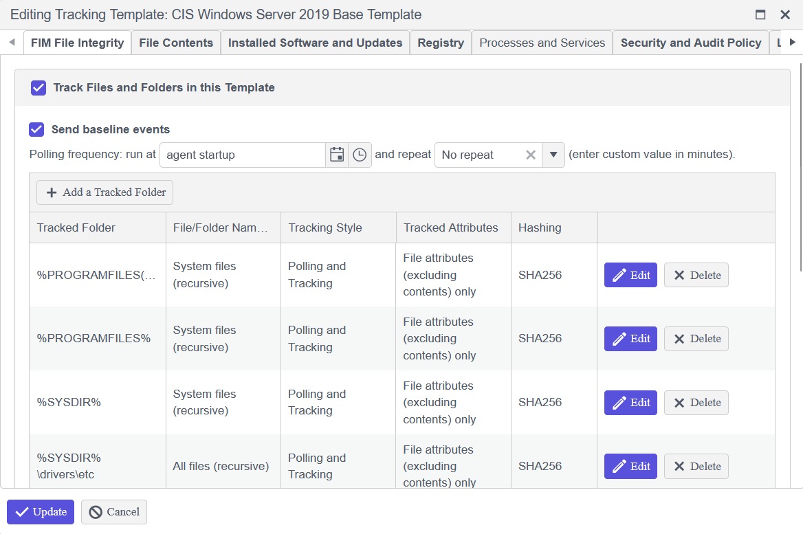
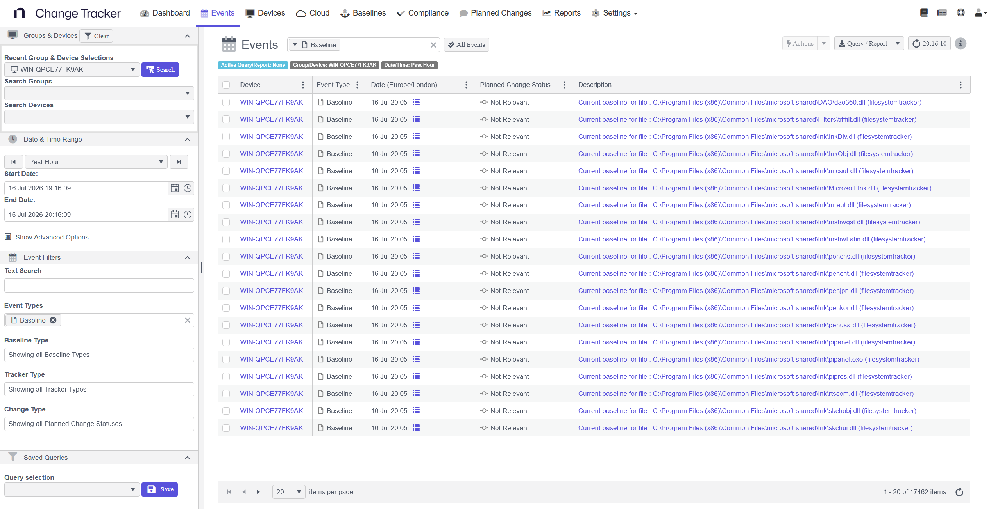
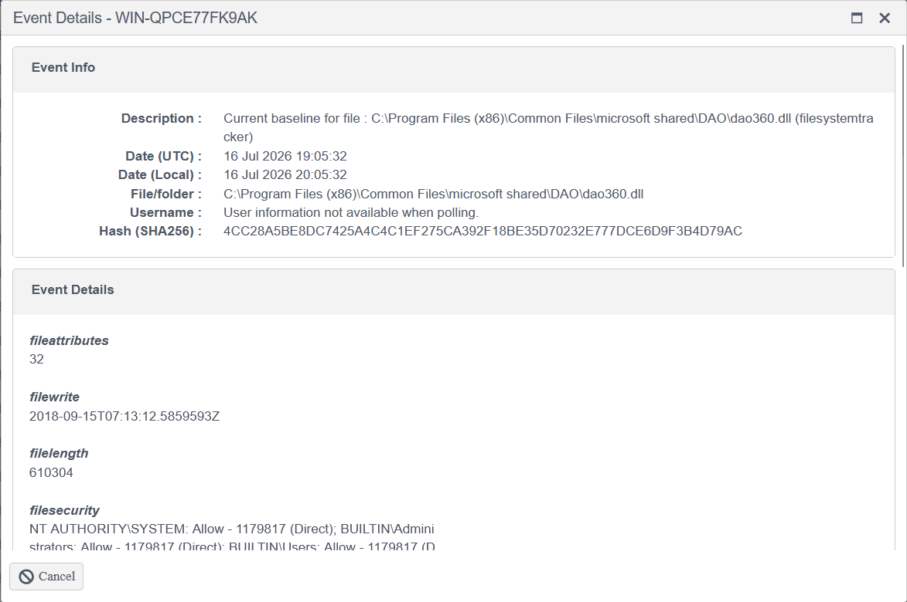
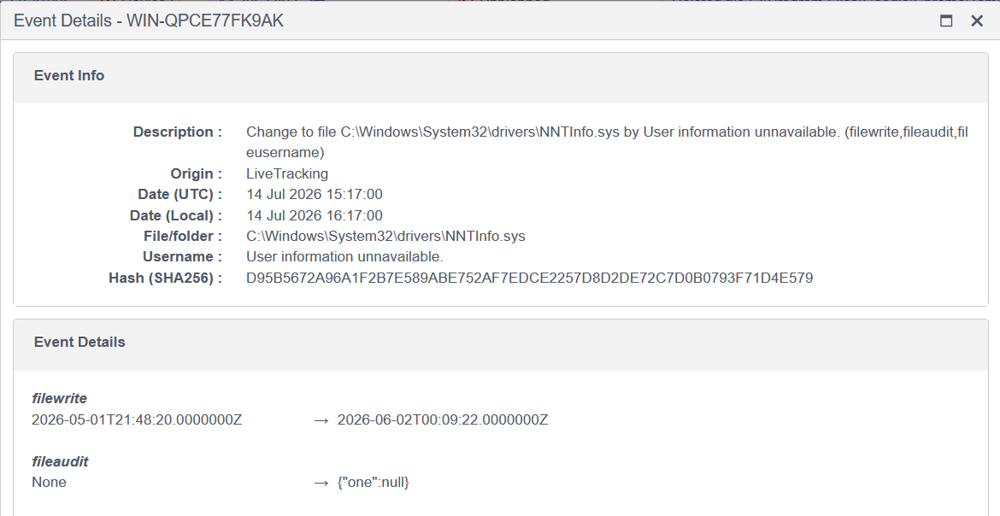

# Enabling Baseline Events on Monitored Folders

## Overview

This example uses the Netwrix Change Tracker File Integrity Monitoring (FIM) tracker. All paths listed as a tracked folder within a configuration template are baselined.

Enabling the **Send baseline events** option on the FIM tracker (or any tracker that supports it) causes the agent to send an event to the hub when a baseline scan completes. The event lets you see the files and folders captured as part of the baseline and the state of each file or folder (that is, its attributes).

## Instructions

### Enable Send Baseline Events

1. In the configuration template, open the FIM tracker.
2. Enable the **Send baseline events** option for the tracked folder.

## Reviewing Baseline Events

After baselining completes, the agent sends baseline events to the hub, which you can review to see what the baseline captured.

- **Event list:** The hub's event list shows baseline events for the monitored device once baselining completes.

  

- **File attributes:** Opening a baseline event shows the attributes captured for that file, such as size, timestamps, and security details.

  

- **Historical and current baselines:** Whenever changes occur to the files or folders, the baseline updates and sends additional baseline events. These events show the original baseline as **Historical** and the updated baseline as **Current**.

  

