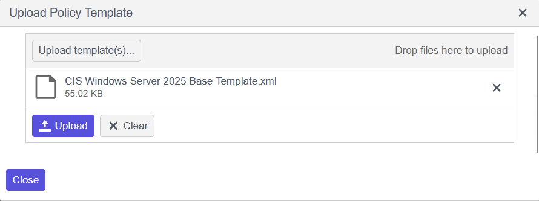
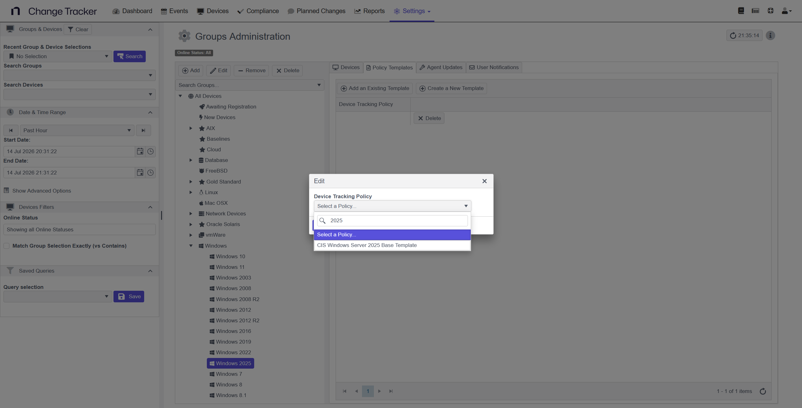
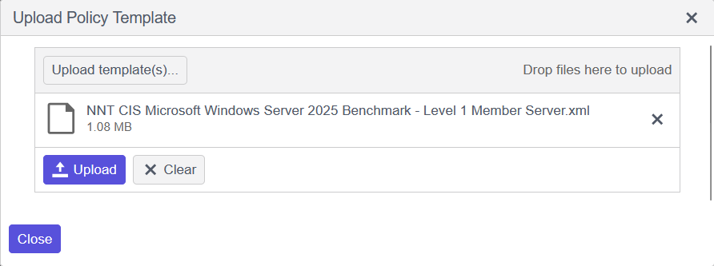
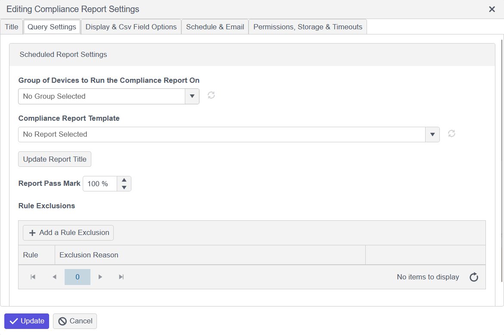
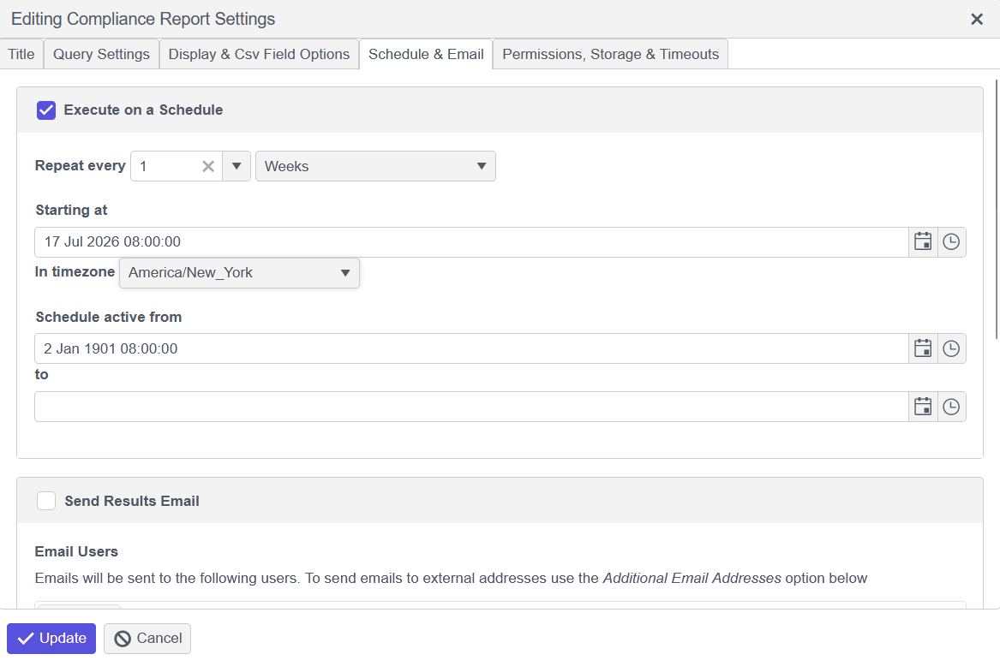

# Adding or Replacing Configuration and Compliance Report Templates

## Overview

Netwrix Change Tracker uses two types of templates:

1. Configuration templates, which define the file, folder, and registry monitoring policy.
2. Compliance report templates, which map to CIS Benchmarks and score devices against a hardened build standard.

This article describes how to upload a new template of either type, overwrite an existing default template, and assign the template to a device group.

## Instructions

### Configuration Template

1. Go to **Settings** > **Policy Templates**, then click **Upload Templates**.
2. Browse your local files and select the template you want to upload.

   For example, `CIS Windows Server 2025 Base Template`.

#### Replacing a Default Template

1. Uploading a new template with the same name will overwrite the existing template present within the system.

#### Not Replacing a Default Template

1. Click **Upload files**.
2. Go to **Settings** > **Groups**.
3. Select the group of devices and click **Policy Templates**.
4. Delete the **Default Template**.
5. Click **Add an Existing Template**.
6. In the pop-up window, select the template you uploaded and click **Update**.

### Compliance Report Template

1. Go to **Settings** > **Policy Templates**, then click **Upload Templates**.
2. Browse your local files and select the template you want to upload.

   For example, `NNT CIS Microsoft Windows Server 2025 Benchmark - Level 1 Member Server`.

#### Replacing a Default Template

1. Uploading a new template with the same name will overwrite the existing template present within the system.

#### Not Replacing a Default Template

1. Click **Upload files**.
2. Go to **Reports** > **Actions** > **Add Compliance Report**.
3. Go to **Query Settings**, then select the device group and template.

4. Go to **Schedule & Email** and configure the preferred settings. See the sample below.

